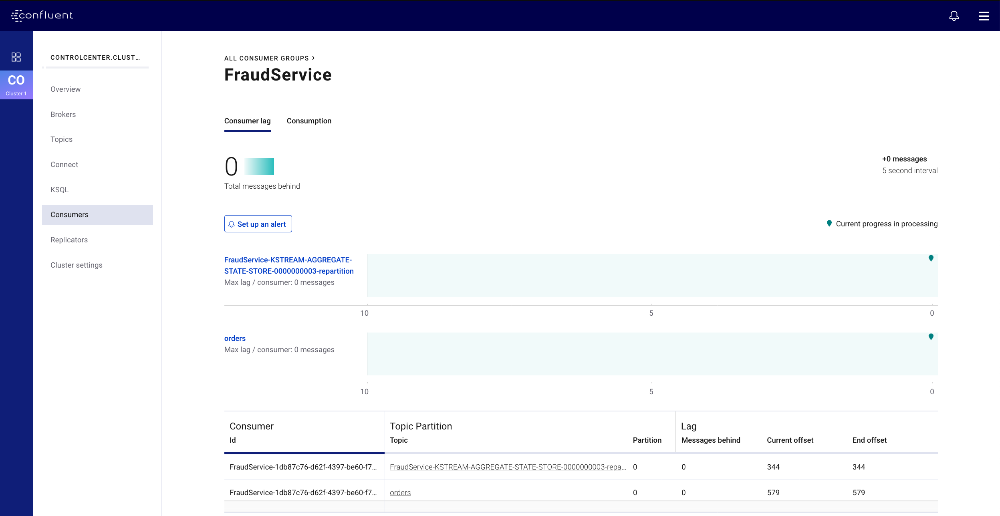
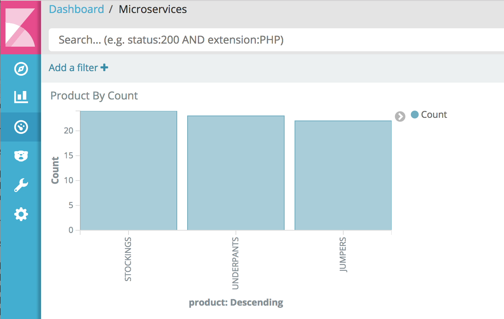

.. _microservices-orders:

Developing Streaming Applications
=================================

This self-paced tutorial teaches developers basic principles of streaming applications.

========
Overview
========

This demo is based on the `Microservices Orders Demo Application <https://github.com/confluentinc/kafka-streams-examples/tree/5.0.1-post/src/main/java/io/confluent/examples/streams/microservices>`__, and augments it by fully integrating it into streaming ETL built on Confluent Platform.

This demo adds:

* JDBC source connector: reads from a sqlite database that has a table of customers information and writes the data to a Kafka topic, using Connect transforms to add a key to each message
* Elasticsearch sink connector: pushes data from a Kafka topic to Elasticsearch
* KSQL: creates streams and tables and joins data from a STREAM of orders with a TABLE of customer data

.. figure:: images/microservices-demo.jpg
    :alt: image

==============
Pre-requisites
==============

#. Read Ben Stopford's book `Designing Event-Driven Systems <https://www.confluent.io/designing-event-driven-systems>`__.
It explains how service-based architectures and stream processing tools such as Apache Kafka® can help you build business-critical systems.
The concepts discussed in that book are the foundation for this playbook.

#. Familiarize yourself with the scenario in the `Microservices Orders Demo Application <https://github.com/confluentinc/kafka-streams-examples/tree/5.0.1-post/src/main/java/io/confluent/examples/streams/microservices>`__.

#. Setup your environment, depending on whether you are running |cp| locally or in Docker:

Local
~~~~~

* `Confluent Platform 5.0 <https://www.confluent.io/download/>`__: download specifically Confluent Enterprise to use topic management, KSQL and Confluent Schema Registry integration, and streams monitoring capabilities
* Java 1.8 to run the demo application
* Maven to compile the demo application
* `Elasticsearch 5.6.5 <https://www.elastic.co/downloads/past-releases/elasticsearch-5-6-5>`__ to export data from Kafka
  * If you do not want to use Elasticsearch, comment out ``check_running_elasticsearch`` in the ``start.sh`` script
* `Kibana 5.5.2 <https://www.elastic.co/downloads/past-releases/kibana-5-5-2>`__ to visualize data
  * If you do not want to use Kibana, comment out ``check_running_kibana`` in the ``start.sh`` script

Docker
~~~~~~

* Docker version 17.06.1-ce
* Docker Compose version 1.14.0 with Docker Compose file format 2.1

=====================
Run the Full Solution
=====================

We recommend that you first run the full solution to understand what a successful run looks like.
Without writing any code, you can run the end-to-end demo to showcase a customer-representative deployment of a streaming application.

Start the demo
--------------

If you are running |cp| locally, then run the full solution:

   .. sourcecode:: bash

      ./start.sh

If you are running Docker, then run the full solution:

   .. sourcecode:: bash

      docker-compose up -d

Dataflow
--------

Here is a description of which microservices and clients are producing to and reading from which topics (excludes internal topics).

Microservices
~~~~~~~~~~~~~

+-------------------------------------+-----------------------------------+-----------------------|
| Service                             | Consuming From                    | Producing To          |
+=====================================+===================================+=======================+
| InventoryService                    | `orders`, `warehouse-inventory`   | `order-validations`   |
| FraudService                        | `orders`                          | `order-validations`   |
| OrderDetailsService                 | `orders`                          | `order-validations`   |
| ValidationsAggregatorService        | `order-validations`, `orders`     | `orders`              |
| EmailService                        | `orders`, `payments`, `customers` | -                     |
+-------------------------------------+-----------------------------------+-----------------------|

Other clients
~~~~~~~~~~~~~

+-------------------------------------+-----------------------+-------------------------|
| Other Clients                       | Consuming From        | Producing To            |
+=====================================+=======================+=========================+
| OrdersService                       | -                     | `orders`                |
| PostOrdersAndPayments               | -                     | `payments`              |
| AddInventory                        | -                     | `warehouse-inventory`   |
| KSQL                                | `orders`, `customers` | KSQL streams and tables |
| JDBC source connector               | DB                    | `customers`             |
| Elasticsearch sink connector        | `orders`              | ES                      |
+-------------------------------------+-----------------------+-------------------------|

What You Should See
-------------------

After running the end-to-end demo:

* (Confluent Enterprise) Use Confluent Control Center to navigate to the `KSQL tab <http://localhost:9021/development/ksql/localhost%3A8088/streams>`__ to view KSQL streams and tables, and to create KSQL queries. Otherwise, run the KSQL CLI `ksql http://localhost:8088`. To get started, run the query `SELECT * FROM ORDERS;`
* (Confluent Enterprise) Use Confluent Control Center to navigate to the `Streams monitoring tab <http://localhost:9021/monitoring/streams>`__ to view the throughput and latency performance of the microservices

* (Confluent Enterprise) Use Confluent Control Center to navigate to the `Kafka Connect tab <http://localhost:9021/management/connect/>`__ to view the JDCB source connector and Elasticsearch sink connector.
* View the Kibana dashboard at http://localhost:5601/app/kibana#/dashboard/Microservices

========
Playbook
========

After you have run the full solution successfully, we recommend that you run through the playbook to learn the basic principles of streaming applications.

How to use the playbook
-----------------------

#. Go to the appropriate section of each playbook
#. Find the relevant files
#. Fill in the missing code
#. Compile the code
#. Run the unit test for the code

Lab 1: Capture event
--------------------

Concept
~~~~~~~

// YEVA: concepts

Exercise
~~~~~~~~

// YEVA: description

Instructions: implement the `TODO` lines of the file `labs/OrdersService.java <https://github.com/confluentinc/examples/tree/5.0.1-post/microservices-orders/labs/OrdersService.java>`

#. TODO 1.1: create a new `ProducerRecord` with a key specified by `bean.getId()` and value of the bean, to the orders topic whose name is specified by `ORDERS.name()`
#. TODO 1.2: produce the newly created record using the existing `producer` and pass use the `OrdersService#callback` function to send the `response` and the record key

If you get stuck, here is the `complete solution <https://github.com/confluentinc/kafka-streams-examples/blob/5.0.1-post/src/main/java/io/confluent/examples/streams/microservices/OrdersService.java>`__.

Test your code
~~~~~~~~~~~~~~

Save off the project's working solution, copy your version of the file to the main project, compile, and run the unit test.

   .. sourcecode:: bash

      cp kafka-streams-examples/src/main/java/io/confluent/examples/streams/microservices/OrdersService.java /tmp/.
      cp labs/OrdersService.java kafka-streams-examples/src/main/java/io/confluent/examples/streams/microservices/.
      mvn clean compile -DskipTests
      mvn compile -Dtest=io.confluent.examples.streams.microservices.OrdersServiceTest test

Lab 2: Request-driven vs Event-driven
-------------------------------------

Concept
~~~~~~~

Service-based architectures are often designed to be request-driven, which sends commands to other services to tell them what to do, awaits a response, or sends queries to get the resulting state.
In contrast, in an event-driven design, there an event stream is the inter-service communication which leads to less coupling and queries, enables services to cross deployment boundaries, and avoids synchronous execution.

// YEVA: add more around this

Exercise
~~~~~~~~

Write a service that validates customer orders.
Instead of using a series of synchronous calls to submit and validate orders, let the order event itself trigger the `OrderDetailsService`.
When a new order is created, it is written to the topic `orders`, from which `OrderDetailsService` has a consumer polling for new records. 

Instructions: implement the `TODO` lines of the file `labs/OrderDetailsService.java <https://github.com/confluentinc/examples/tree/5.0.1-post/microservices-orders/labs/OrderDetailsService.java>`

#. TODO 2.1: subscribe the existing `consumer` to a `Collections#singletonList` with the orders topic whose name is specified by `Topics.ORDERS.name()`
#. TODO 2.2: validate the order using `OrderDetailsService#isValid` and save the validation result to type `OrderValidationResult`
#. TODO 2.3: create a new record using `OrderDetailsService#result()` that takes the order and validation result
#. TODO 2.4: produce the newly created record using the existing `producer`

If you get stuck, here is the `complete solution <https://github.com/confluentinc/kafka-streams-examples/blob/5.0.1-post/src/main/java/io/confluent/examples/streams/microservices/OrderDetailsService.java>`__.

Test your code
~~~~~~~~~~~~~~

Save off the project's working solution, copy your version of the file to the main project, compile, and run the unit test.

   .. sourcecode:: bash

      cp kafka-streams-examples/src/main/java/io/confluent/examples/streams/microservices/OrderDetailsService.java /tmp/.
      cp labs/OrderDetailsService.java kafka-streams-examples/src/main/java/io/confluent/examples/streams/microservices/.
      mvn clean compile -DskipTests
      mvn compile -Dtest=io.confluent.examples.streams.microservices.OrderDetailsServiceTest test

Lab 3: YEVA:
-------------------------------------

Concept
~~~~~~~

Exercise
~~~~~~~~

// YEVA

Instructions: implement the `TODO` lines of the file `labs/EmailService.java <https://github.com/confluentinc/examples/tree/5.0.1-post/microservices-orders/labs/EmailService.java>`

#. TODO 3.1: create a new `KStream` called `payments` from `payments_original`, using `KStream#selectKey` to rekey on order id specified by `payment.getOrderId()` instead of payment id

If you get stuck, here is the `complete solution <https://github.com/confluentinc/kafka-streams-examples/blob/5.0.1-post/src/main/java/io/confluent/examples/streams/microservices/EmailService.java>`__.

Test your code
~~~~~~~~~~~~~~

