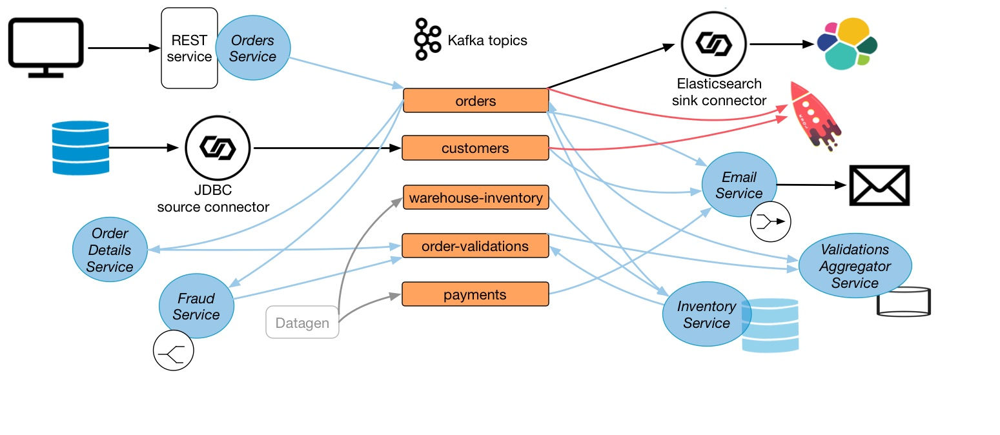
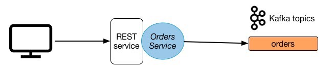
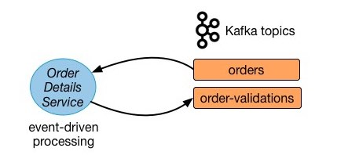
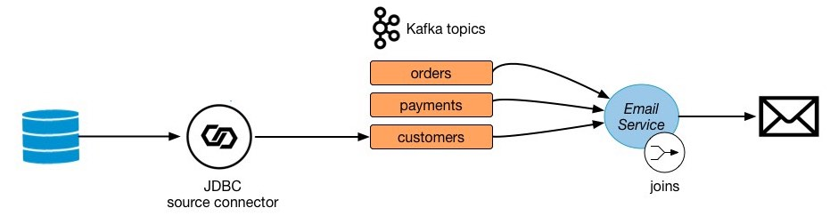
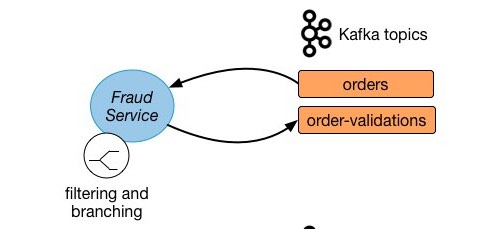
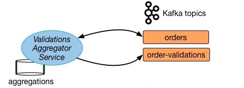
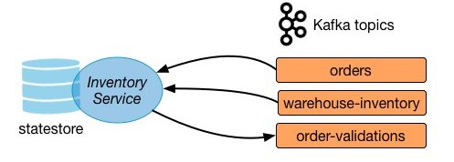

.. _tutorial-microservices-orders:

.. toctree:: 
    :maxdepth: 2

Tutorial: Introduction to Streaming Application Development
===========================================================

This self-paced tutorial provides exercises for developers to apply the basic principles of streaming applications.

========
Overview
========

The tutorial is based on a small microservice ecosystem, showcasing an order management workflow such as you might find in retail and online shopping.
It is built using Kafka Streams, whereby  business events that describe the order management workflow propagate through this ecosystem.  
There is a related `blog post <https://www.confluent.io/blog/building-a-microservices-ecosystem-with-kafka-streams-and-ksql/>`__  that outlines the approach used.

.. figure:: images/microservices-demo.jpg
    :alt: image

Note: this is demo code, not a production system and certain elements are left for further work.

Microservices
~~~~~~~~~~~~~

In this example, the system centers on an Orders Service which exposes a REST interface to POST and GET Orders.
Posting an Order creates an event in Kafka that is recorded in the topic `orders`.
This is picked up by three different validation engines (Fraud Service, Inventory Service, Order Details Service) which validate the order in parallel, emitting a PASS or FAIL based on whether each validation succeeds.
The result of each validation is pushed through a separate topic, Order Validations, so that we retain the "single writer" status of the Orders Service —> Orders Topic (there are several options for managing consistency in event collaboration, discussed in Ben Stopford's `book <https://www.confluent.io/designing-event-driven-systems>`__).
The results of the various validation checks are aggregated in the Validation Aggregator Service, which then moves the order to a Validated or Failed state, based on the combined result.

To allow users to GET any order, the Orders Service creates a queryable materialized view (embedded inside the Orders Service), using a state store in each instance of the service, so any Order can be requested historically. Note also that the Orders Service can be scaled out over a number of nodes, so GET requests must be routed to the correct node to get a certain key. This is handled automatically using the Interactive Queries functionality in Kafka Streams.

The Orders Service also includes a blocking HTTP GET so that clients can read their own writes. In this way we bridge the synchronous, blocking paradigm of a Restful interface with the asynchronous, non-blocking processing performed server-side.

Finally there is a simple service that sends emails and another that collates orders and makes them available in a search index using Elasticsearch. 

All the services are client applications written in Java, and they use the Kafka Streams API.
The java source code for these microservices are in the :cp-examples:`kafka-streams-examples repo|src/main/java/io/confluent/examples/streams/microservices`.

Summary of services and the topics they consume from and produce to:

+-------------------------------------+-----------------------------------+-----------------------+
| Service                             | Consumes From                     | Produces To           |
+=====================================+===================================+=======================+
| InventoryService                    | `orders`, `warehouse-inventory`   | `order-validations`   |
+-------------------------------------+-----------------------------------+-----------------------+
| FraudService                        | `orders`                          | `order-validations`   |
+-------------------------------------+-----------------------------------+-----------------------+
| OrderDetailsService                 | `orders`                          | `order-validations`   |
+-------------------------------------+-----------------------------------+-----------------------+
| ValidationsAggregatorService        | `order-validations`, `orders`     | `orders`              |
+-------------------------------------+-----------------------------------+-----------------------+
| EmailService                        | `orders`, `payments`, `customers` | -                     |
+-------------------------------------+-----------------------------------+-----------------------+
| OrdersService                       | -                                 | `orders`              |
+-------------------------------------+-----------------------------------+-----------------------+

End-to-end Streaming ETL
~~~~~~~~~~~~~~~~~~~~~~~~

This demo showcases an entire end-to-end streaming ETL deployment, built around the microservices described above.
It is build on the |cp|, including:

* JDBC source connector: reads from a sqlite database that has a table of customers information and writes the data to a Kafka topic, using Connect transforms to add a key to each message
* Elasticsearch sink connector: pushes data from a Kafka topic to Elasticsearch
* KSQL: creates streams and tables and joins data from a STREAM of orders with a TABLE of customer data

+-------------------------------------+-----------------------+-------------------------+
| Other Clients                       | Consumes From         | Produces To             |
+=====================================+=======================+=========================+
| JDBC source connector               | DB                    | `customers`             |
+-------------------------------------+-----------------------+-------------------------+
| Elasticsearch sink connector        | `orders`              | ES                      |
+-------------------------------------+-----------------------+-------------------------+
| KSQL                                | `orders`, `customers` | KSQL streams and tables |
+-------------------------------------+-----------------------+-------------------------+

For the end-to-end demo, the code that creates the order events via REST calls to the Orders Service and generates the initial inventory is provided by the following applications:

+-------------------------------------+-----------------------------------+-----------------------+
| Application                         | Consumes From                     | Produces To           |
+=====================================+===================================+=======================+
| PostOrdersAndPayments               | -                                 | `payments`            |
+-------------------------------------+-----------------------------------+-----------------------+
| AddInventory                        | -                                 | `warehouse-inventory` |
+-------------------------------------+-----------------------------------+-----------------------+

==============
Pre-requisites
==============

Reading
~~~~~~~

You will get a lot more out of this tutorial if you have first learned the concepts which are foundational for this tutorial.
To learn how service-based architectures and stream processing tools such as Apache Kafka® can help you build business-critical systems, we recommend:

* If you have lots of time: `Designing Event-Driven Systems <https://www.confluent.io/designing-event-driven-systems>`__, a book by Ben Stopford.
* If you do not have lots of time: `Building a Microservices Ecosystem with Kafka Streams and KSQL <https://www.confluent.io/blog/building-a-microservices-ecosystem-with-kafka-streams-and-ksql/>`__ or `Build Services on a Backbone of Events <https://www.confluent.io/blog/build-services-backbone-events/>`__.

For more learning on Kafka Streams API that you can use as a reference while working through this tutorial, we recommend:

* `Kafka Streams documentation <https://docs.confluent.io/current/streams/index.html>`__

Environment Setup
~~~~~~~~~~~~~~~~~

To setup your environment, make sure you have the following pre-requisites, depending on whether you are running |cp| locally or in Docker

Local:

* `Confluent Platform 5.0 <https://www.confluent.io/download/>`__: download specifically |cpe| to use topic management, KSQL and |sr-long| integration, and streams monitoring capabilities
* Java 1.8 to run the demo application
* Maven to compile the demo application
* (optional) `Elasticsearch 5.6.5 <https://www.elastic.co/downloads/past-releases/elasticsearch-5-6-5>`__ to export data from Kafka

  * If you do not want to use Elasticsearch, comment out ``check_running_elasticsearch`` in the ``start.sh`` script

* (optional) `Kibana 5.5.2 <https://www.elastic.co/downloads/past-releases/kibana-5-5-2>`__ to visualize data

  * If you do not want to use Kibana, comment out ``check_running_kibana`` in the ``start.sh`` script

Docker:

* Docker version 17.06.1-ce
* Docker Compose version 1.14.0 with Docker Compose file format 2.1
* In Docker's advanced `settings <https://docs.docker.com/docker-for-mac/#advanced>`__, increase the memory dedicated to Docker to at least 8GB (default is 2GB)

========
Tutorial
========

How to use the tutorial
~~~~~~~~~~~~~~~~~~~~~~~

First run the full end-to-end working solution, which requires no code development, to see a customer-representative deployment of a streaming application..
This provides context for each of the exercises in which you will develop pieces of the microservices.

After you have successfully run the full solution, then go through the execises in the tutorial to gain a better understanding of the basic principles of streaming applications:

* Exercise 1: Persist Events 
* Exercise 2: Event-driven Applications
* Exercise 3: Enriching Streams with Joins
* Exercise 4: Filtering and Branching
* Exercise 5: Stateful Operations
* Exercise 6: State Stores

For each exercise:

#. Read the description to understand the focus area for the exercise
#. Edit the file specified in each exercise and fill in the missing code
#. Copy the file to the project, then compile the project and run the test for the service to ensure it works

Exercise 0: Run End-to-End Demo
~~~~~~~~~~~~~~~~~~~~~~~~~~~~~~~

Running the fully working demo end-to-end provides context for each of the later exercises.

1. Clone the `examples GitHub repository <https://github.com/confluentinc/examples>`__:

.. sourcecode:: bash

   git clone https://github.com/confluentinc/examples

2. Start the demo

   * If you are have |cp| downloaded locally, then run the full solution (this also starts a local |cp| cluster using Confluent CLI):

     .. sourcecode:: bash

        ./start.sh

   * If you are running Docker, then run the full solution (this also starts a local |cp| cluster in Docker containers).

     .. sourcecode:: bash

        docker-compose up -d

3. After starting the demo with one of the above two commands, the microservices applications will be running and Kafka topics will have data in them.

   .. figure:: images/microservices-exercises-combined.jpg
       :alt: image

   * If you are running locally, you can sample topic data by running:

   .. sourcecode:: bash

      ./read-topics.sh

   * If you are running Docker, you can sample topic data by running:

   .. sourcecode:: bash

      ./read-topics-docker.sh

4. The Kibana dashboard is populated by Elasticsearch.

   .. figure:: images/elastic-search-kafka.png
       :alt: image
       :width: 600px

   Full-text search is added via an Elasticsearch database connected through Kafka’s Connect API (`source <https://www.confluent.io/designing-event-driven-systems>`__). View the Kibana dashboard at http://localhost:5601/app/kibana#/dashboard/Microservices

   .. figure:: images/kibana_microservices.png
       :alt: image
       :width: 600px

5. If you are running |cpe| (local or Docker) you can see a lot more information in Confluent Control Center:

   * `KSQL tab <http://localhost:9021/development/ksql/localhost%3A8088/streams>`__ : view KSQL streams and tables, and to create KSQL queries. Otherwise, run the KSQL CLI `ksql http://localhost:8088`. To get started, run the query `SELECT * FROM ORDERS;`
   * `Kafka Connect tab <http://localhost:9021/management/connect/>`__ : view the JDCB source connector and Elasticsearch sink connector.
   * `Streams monitoring tab <http://localhost:9021/monitoring/streams>`__ : view the throughput and latency performance of the microservices

   .. figure:: images/streams-monitoring.png
       :alt: image
       :width: 600px

6. When you are done, make sure to stop the demo before proceeding to the exercises.

   * If you are running |cp| locally:

     .. sourcecode:: bash

        ./stop.sh

   * If you are running Docker:

     .. sourcecode:: bash

        docker-compose down

Exercise 1: Persist Events 
~~~~~~~~~~~~~~~~~~~~~~~~~~

An "event" is simply a thing that happened or occurred.
An event in a business is some fact that occurred, such as a sale, an invoice, a trade, a customer experience, etc, and it is the source of truth.
In event-oriented architectures, events are first class citizens and constantly push data into applications.
Client applications can then react to these streams of events in real-time, and decide what to do next.

In this exercise, you will persist events into Kafka by producing records that represent customer orders.
This event happens in the Orders Service which provides a REST interface to POST and GET Orders.
Posting an Order is essentially a REST call, and it creates the event in Kafka. 

Implement the `TODO` lines of the file :devx-examples:`exercises/OrdersService.java|microservices-orders/exercises/OrdersService.java`

#. TODO 1.1: create a new `ProducerRecord` with a key specified by `bean.getId()` and value of the bean, to the orders topic whose name is specified by `ORDERS.name()`
#. TODO 1.2: produce the newly created record using the existing `producer` and pass use the `OrdersService#callback` function to send the `response` and the record key

.. tip::

   The following APIs will be helpful:

   * https://kafka.apache.org/20/javadoc/org/apache/kafka/clients/producer/ProducerRecord.html#ProducerRecord-java.lang.String-K-V-
   * https://kafka.apache.org/20/javadoc/org/apache/kafka/clients/producer/KafkaProducer.html#send-org.apache.kafka.clients.producer.ProducerRecord-org.apache.kafka.clients.producer.Callback-
   * :cp-examples:`kafka-streams-examples/src/main/java/io/confluent/examples/streams/microservices/domain/Schemas.java|src/main/java/io/confluent/examples/streams/microservices/domain/Schemas.java`
   * :cp-examples:`kafka-streams-examples/src/main/java/io/confluent/examples/streams/microservices/domain/beans/OrderBean.java|src/main/java/io/confluent/examples/streams/microservices/domain/beans/OrderBean.java`
   
   If you get stuck, here is the :cp-examples:`complete solution|src/main/java/io/confluent/examples/streams/microservices/OrdersService.java`.

To test your code, save off the project's working solution, copy your version of the file to the main project, compile, and run the unit test.

.. sourcecode:: bash

      # Clone and compile kafka-streams-examples
      ./get-kafka-streams-examples.sh

      # Save off the working microservices client application to /tmp/
      cp kafka-streams-examples/src/main/java/io/confluent/examples/streams/microservices/OrdersService.java /tmp/.

      # Copy your exercise client application to the project
      cp exercises/OrdersService.java kafka-streams-examples/src/main/java/io/confluent/examples/streams/microservices/.

      # Compile the project and resolve any compilation errors
      mvn clean compile -DskipTests -f kafka-streams-examples/pom.xml

      # Run the test and validate that it passes
      mvn compile -Dtest=io.confluent.examples.streams.microservices.OrdersServiceTest test -f kafka-streams-examples/pom.xml

Exercise 2: Event-driven Applications
~~~~~~~~~~~~~~~~~~~~~~~~~~~~~~~~~~~~~

Service-based architectures are often designed to be request-driven, which sends commands to other services to tell them what to do, awaits a response, or sends queries to get the resulting state.

.. figure:: images/event-driven.png
    :alt: image

    A visual summary of commands, events, and queries (`source <https://www.confluent.io/designing-event-driven-systems>`__)

In contrast, in an event-driven design, there an event stream is the inter-service communication which leads to less coupling and queries, enables services to cross deployment boundaries, and avoids synchronous execution.

In this exercise, you will write a service that validates customer orders.
Instead of using a series of synchronous calls to submit and validate orders, let the order event itself trigger the `OrderDetailsService`.
When a new order is created, it is written to the topic `orders`, from which `OrderDetailsService` has a consumer polling for new records. 

Implement the `TODO` lines of the file :devx-examples:`exercises/OrdersService.java|microservices-orders/exercises/OrderDetailsService.java`

#. TODO 2.1: subscribe the existing `consumer` to a `Collections#singletonList` with the orders topic whose name is specified by `Topics.ORDERS.name()`
#. TODO 2.2: validate the order using `OrderDetailsService#isValid` and save the validation result to type `OrderValidationResult`
#. TODO 2.3: create a new record using `OrderDetailsService#result()` that takes the order and validation result
#. TODO 2.4: produce the newly created record using the existing `producer`

.. tip::

   The following APIs will be helpful:

   * https://kafka.apache.org/20/javadoc/org/apache/kafka/clients/producer/KafkaProducer.html#send-org.apache.kafka.clients.producer.ProducerRecord-
   * https://kafka.apache.org/20/javadoc/org/apache/kafka/clients/consumer/KafkaConsumer.html#subscribe-java.util.Collection-
   * https://docs.oracle.com/javase/8/docs/api/java/util/Collections.html#singletonList-T-
   * :cp-examples:`kafka-streams-examples/src/main/java/io/confluent/examples/streams/microservices/domain/Schemas.java|src/main/java/io/confluent/examples/streams/microservices/domain/Schemas.java`
   
   If you get stuck, here is the :cp-examples:`complete solution|src/main/java/io/confluent/examples/streams/microservices/OrderDetailsService.java`.

To test your code, save off the project's working solution, copy your version of the file to the main project, compile, and run the unit test.

.. sourcecode:: bash

      # Clone and compile kafka-streams-examples
      ./get-kafka-streams-examples.sh

      # Save off the working microservices client application to /tmp/
      cp kafka-streams-examples/src/main/java/io/confluent/examples/streams/microservices/OrderDetailsService.java /tmp/.

      # Copy your exercise client application to the project
      cp exercises/OrderDetailsService.java kafka-streams-examples/src/main/java/io/confluent/examples/streams/microservices/.

      # Compile the project and resolve any compilation errors
      mvn clean compile -DskipTests -f kafka-streams-examples/pom.xml

      # Run the test and validate that it passes
      mvn compile -Dtest=io.confluent.examples.streams.microservices.OrderDetailsService test -f kafka-streams-examples/pom.xml

Exercise 3: Enriching Streams with Joins
~~~~~~~~~~~~~~~~~~~~~~~~~~~~~~~~~~~~~~~~

Streams can be enriched with data from other streams or tables, through joins.
Many stream processing applications in practice are coded as streaming joins.
For example, applications backing an online shop might need to access multiple, updating database tables (e.g. sales prices, inventory, customer information) in order to enrich a new data record (e.g. customer transaction) with context information.
That is, scenarios where you need to perform table lookups at very large scale and with a low processing latency.

.. figure:: images/state-stores-kafka-streams.png
    :alt: image

    A stateful streaming service that joins two streams at runtime (`source <https://www.confluent.io/designing-event-driven-systems>`__)

A popular pattern is to make the information in the databases available in Kafka through so-called change data capture in combination with Kafka’s Connect API to pull in the data from the database.
Once the data is in Kafka, client applications can perform very fast and efficient joins of such tables and streams, rather than requiring the application to make a query to a remote database over the network for each record.

In this exercise, you will write a service that joins streaming order information with streaming payment information and with data from a customer database.
First the payment stream needs to be rekeyed to match the same key info as the order stream, then joined together.
Then the resulting stream is joined with the customer information that was read into Kafka by a JDBC source from a customer database.

Implement the `TODO` lines of the file :devx-examples:`exercises/OrdersService.java|microservices-orders/exercises/EmailService.java`

#. TODO 3.1: create a new `KStream` called `payments` from `payments_original`, using `KStream#selectKey` to rekey on order id specified by `payment.getOrderId()` instead of payment id
#. TODO 3.2: do a stream-table join with the customers table, which requires three arguments:

   #. the GlobalKTable for the stream-table join
   #. customer Id, specified by `order.getCustomerId()`, using a KeyValueMapper that gets the customer id from the tuple in the record's value
   #. method that computes a value for the result record, in this case `EmailTuple::setCustomer`

.. tip::

   The following APIs will be helpful:

   * https://kafka.apache.org/20/javadoc/org/apache/kafka/streams/kstream/Consumed.html#with-org.apache.kafka.common.serialization.Serde-org.apache.kafka.common.serialization.Serde-
   * https://kafka.apache.org/20/javadoc/org/apache/kafka/streams/StreamsBuilder.html#stream-java.lang.String-org.apache.kafka.streams.kstream.Consumed-
   * https://kafka.apache.org/20/javadoc/org/apache/kafka/streams/kstream/KStream.html#selectKey-org.apache.kafka.streams.kstream.KeyValueMapper-
   * https://kafka.apache.org/20/javadoc/org/apache/kafka/streams/kstream/KStream.html#join-org.apache.kafka.streams.kstream.KTable-org.apache.kafka.streams.kstream.ValueJoiner-org.apache.kafka.streams.kstream.Joined-
   * :cp-examples:`kafka-streams-examples/src/main/java/io/confluent/examples/streams/microservices/domain/Schemas.java|src/main/java/io/confluent/examples/streams/microservices/domain/Schemas.java`
   
   If you get stuck, here is the :cp-examples:`complete solution|src/main/java/io/confluent/examples/streams/microservices/EmailService.java`.

To test your code, save off the project's working solution, copy your version of the file to the main project, compile, and run the unit test.

.. sourcecode:: bash

      # Clone and compile kafka-streams-examples
      ./get-kafka-streams-examples.sh

      # Save off the working microservices client application to /tmp/
      cp kafka-streams-examples/src/main/java/io/confluent/examples/streams/microservices/EmailService.java /tmp/.

      # Copy your exercise client application to the project
      cp exercises/EmailService.java kafka-streams-examples/src/main/java/io/confluent/examples/streams/microservices/.

      # Compile the project and resolve any compilation errors
      mvn clean compile -DskipTests -f kafka-streams-examples/pom.xml

      # Run the test and validate that it passes
      mvn compile -Dtest=io.confluent.examples.streams.microservices.EmailService test -f kafka-streams-examples/pom.xml

Exercise 4: Filtering and Branching
~~~~~~~~~~~~~~~~~~~~~~~~~~~~~~~~~~~

Kafka can capture a lot of information related to an event.
This information can be captured in a single Kafka topic.
Client applications can then manipulate that data, based on some user-defined criteria, to create new streams of data that they can act on.

In this exercise, you will define one set of criteria to filter records in a stream based on some criteria.
Then you will define define another set of criteria to branch records into two different streams.

Implement the `TODO` lines of the file :devx-examples:`exercises/OrdersService.java|microservices-orders/exercises/FraudService.java`

#. TODO 4.1: filter this stream to include only orders in "CREATED" state, i.e., it should satisfy the predicate `OrderState.CREATED.equals(order.getState())`
#. TODO 4.2: create a `KStream<String, OrderValue>` array from the `ordersWithTotals` stream by branching the records based on `OrderValue#getValue`

   #. First branched stream: FRAUD_CHECK will fail for predicate where order value >= FRAUD_LIMIT
   #. Second branched stream: FRAUD_CHECK will pass for predicate where order value < FRAUD_LIMIT

.. tip::

   The following APIs will be helpful:

   * https://kafka.apache.org/20/javadoc/org/apache/kafka/streams/kstream/KStream.html#filter-org.apache.kafka.streams.kstream.Predicate-
   * https://kafka.apache.org/20/javadoc/org/apache/kafka/streams/kstream/KStream.html#branch-org.apache.kafka.streams.kstream.Predicate...-
   * :cp-examples:`kafka-streams-examples/src/main/java/io/confluent/examples/streams/microservices/domain/beans/OrderBean.java|src/main/java/io/confluent/examples/streams/microservices/domain/beans/OrderBean.java`
   
   If you get stuck, here is the :cp-examples:`complete solution|src/main/java/io/confluent/examples/streams/microservices/FraudService.java`.

To test your code, save off the project's working solution, copy your version of the file to the main project, compile, and run the unit test.

.. sourcecode:: bash

      # Clone and compile kafka-streams-examples
      ./get-kafka-streams-examples.sh

      # Save off the working microservices client application to /tmp/
      cp kafka-streams-examples/src/main/java/io/confluent/examples/streams/microservices/FraudService.java /tmp/.

      # Copy your exercise client application to the project
      cp exercises/FraudService.java kafka-streams-examples/src/main/java/io/confluent/examples/streams/microservices/.

      # Compile the project and resolve any compilation errors
      mvn clean compile -DskipTests -f kafka-streams-examples/pom.xml

      # Run the test and validate that it passes
      mvn compile -Dtest=io.confluent.examples.streams.microservices.FraudService test -f kafka-streams-examples/pom.xml

Exercise 5: Stateful Operations
~~~~~~~~~~~~~~~~~~~~~~~~~~~~~~~

You can combine current record values with previous record values using aggregations.
They are stateful operations because they maintain data during processing.
Often these are combined with windowing capabilities in order to run computations in real-time over a window of time.

In this exercise, you will create a session window to define 5-minute windows for processing.
Additionally, you will use a stateful operation `reduce` to collapse duplicate records in a stream.
Before running `reduce`, you will group the records to repartition the data, which is generally required before using an aggregation operator.

Implement the `TODO` lines of the file :devx-examples:`exercises/OrdersService.java|microservices-orders/exercises/ValidationsAggregatorService.java`

#. TODO 5.1: window the data using `KGroupedStream#windowedBy`, specifically using `SessionWindows.with` to define 5-minute windows
#. TODO 5.2: group the records by key using `KStream#groupByKey`, providing the existing Serialized instance for ORDERS
#. TODO 5.3: use an aggregation operator `KTable#reduce` to collapse the records in this stream to a single order for a given key

.. tip::

   The following APIs will be helpful:

   * https://kafka.apache.org/20/javadoc/org/apache/kafka/streams/kstream/SessionWindows.html#with-long-
   * https://kafka.apache.org/20/javadoc/org/apache/kafka/streams/kstream/KGroupedStream.html#windowedBy-org.apache.kafka.streams.kstream.SessionWindows-
   * https://kafka.apache.org/20/javadoc/org/apache/kafka/streams/kstream/KStream.html#groupByKey-org.apache.kafka.streams.kstream.Serialized-
   * https://kafka.apache.org/20/javadoc/org/apache/kafka/streams/kstream/SessionWindowedKStream.html#reduce-org.apache.kafka.streams.kstream.Reducer-
   
   If you get stuck, here is the :cp-examples:`complete solution|src/main/java/io/confluent/examples/streams/microservices/ValidationsAggregatorService.java`.

To test your code, save off the project's working solution, copy your version of the file to the main project, compile, and run the unit test.

.. sourcecode:: bash

      # Clone and compile kafka-streams-examples
      ./get-kafka-streams-examples.sh

      # Save off the working microservices client application to /tmp/
      cp kafka-streams-examples/src/main/java/io/confluent/examples/streams/microservices/ValidationsAggregatorService.java /tmp/.

      # Copy your exercise client application to the project
      cp exercises/ValidationsAggregatorService.java kafka-streams-examples/src/main/java/io/confluent/examples/streams/microservices/.

      # Compile the project and resolve any compilation errors
      mvn clean compile -DskipTests -f kafka-streams-examples/pom.xml

      # Run the test and validate that it passes
      mvn compile -Dtest=io.confluent.examples.streams.microservices.ValidationsAggregatorService test -f kafka-streams-examples/pom.xml

Exercise 6: State Stores
~~~~~~~~~~~~~~~~~~~~~~~~

Kafka Streams provides so-called state stores, a disk-resident hash table, held inside the API for the client application.

.. figure:: images/state-stores-kafka-streams.png
    :alt: image

    State stores in Kafka Streams can be used to create use-case-specific views right inside the service (`source <https://www.confluent.io/designing-event-driven-systems>`__)

It can be used by stream processing applications to store and query data, which is an important capability when implementing stateful operations.
The state store is backed by a Kafka topic and comes with all the Kafka guarantees.

In this exercise, you will create a state store for the Inventory Service.
This state store is initialized with data from a Kafka topic before the service starts processing, and then it is updated as new orders are created.

Implement the `TODO` lines of the file :devx-examples:`exercises/OrdersService.java|microservices-orders/exercises/InventoryService.java`

#. TODO 6.1: create a state store called `RESERVED_STOCK_STORE_NAME`, using `Stores#keyValueStoreBuilder` and `Stores#persistentKeyValueStore`

   #. the key Serde is derived from the topic specified by `WAREHOUSE_INVENTORY`
   #. the value Serde is derived from `Serdes.Long()` because it represents a count

#. TODO 6.2: update the reserved stock in the KeyValueStore called `reservedStocksStore`

   #. the key is the product in the order, using `OrderBean#getProduct`
   #. the value is the sum of the current reserved stock and the quantity in the order, using `OrderBean#getQuantity`

.. tip::

   The following APIs will be helpful:
   
   * https://kafka.apache.org/20/javadoc/org/apache/kafka/streams/state/Stores.html#persistentKeyValueStore-java.lang.String-
   * https://kafka.apache.org/20/javadoc/org/apache/kafka/streams/state/Stores.html#keyValueStoreBuilder-org.apache.kafka.streams.state.KeyValueBytesStoreSupplier-org.apache.kafka.common.serialization.Serde-org.apache.kafka.common.serialization.Serde-
   * https://kafka.apache.org/20/javadoc/org/apache/kafka/streams/state/KeyValueStore.html#put-K-V-
   * :cp-examples:`kafka-streams-examples/src/main/java/io/confluent/examples/streams/microservices/domain/Schemas.java|src/main/java/io/confluent/examples/streams/microservices/domain/Schemas.java`
   
   If you get stuck, here is the :cp-examples:`complete solution|src/main/java/io/confluent/examples/streams/microservices/InventoryService.java`.

To test your code, save off the project's working solution, copy your version of the file to the main project, compile, and run the unit test.

.. sourcecode:: bash

      # Clone and compile kafka-streams-examples
      ./get-kafka-streams-examples.sh

      # Save off the working microservices client application to /tmp/
      cp kafka-streams-examples/src/main/java/io/confluent/examples/streams/microservices/InventoryService.java /tmp/.

      # Copy your exercise client application to the project
      cp exercises/InventoryService.java kafka-streams-examples/src/main/java/io/confluent/examples/streams/microservices/.

      # Compile the project and resolve any compilation errors
      mvn clean compile -DskipTests -f kafka-streams-examples/pom.xml

      # Run the test and validate that it passes
      mvn compile -Dtest=io.confluent.examples.streams.microservices.InventoryService test -f kafka-streams-examples/pom.xml

====================
Additional Resources
====================

* `Kafka Streams videos <https://www.youtube.com/watch?v=Z3JKCLG3VP4&list=PLa7VYi0yPIH1vDclVOB49xUruBAWkOCZD>`__
* `Kafka Streams documentation <https://docs.confluent.io/current/streams/index.html>`__
* `Designing Event-Driven Systems <https://www.confluent.io/designing-event-driven-systems>`__
* `Building a Microservices Ecosystem with Kafka Streams and KSQL <https://www.confluent.io/blog/building-a-microservices-ecosystem-with-kafka-streams-and-ksql/>`__
* `Build Services on a Backbone of Events <https://www.confluent.io/blog/build-services-backbone-events/>`__
* `No More Silos: How to Integrate your Databases with Apache Kafka and CDC <https://www.confluent.io/blog/no-more-silos-how-to-integrate-your-databases-with-apache-kafka-and-cdc>`__
