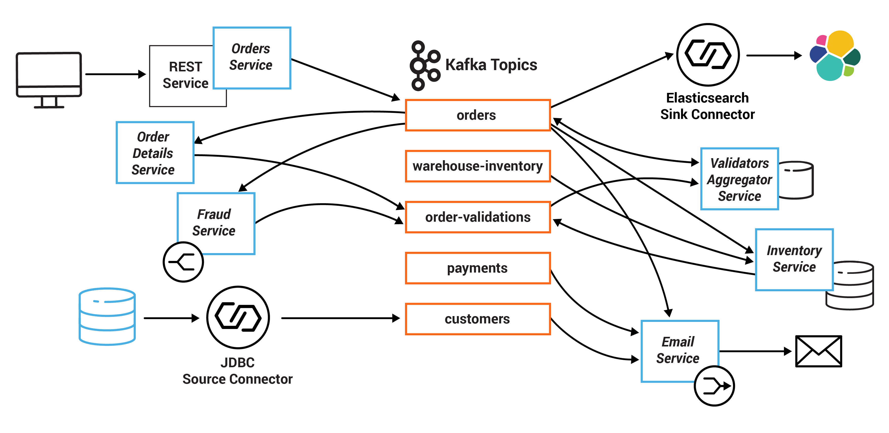
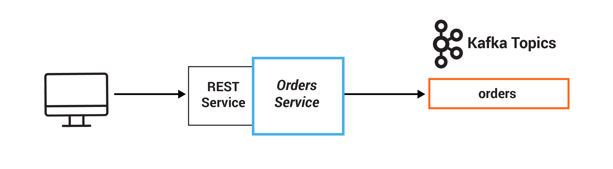
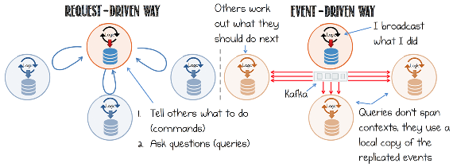
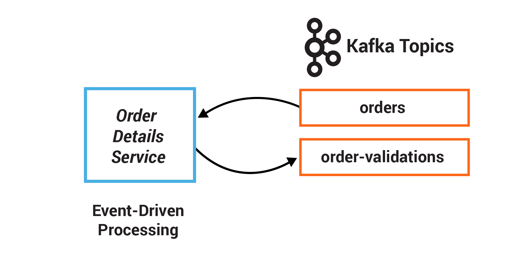
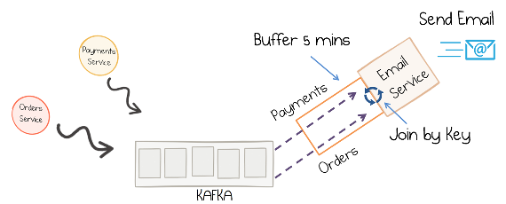
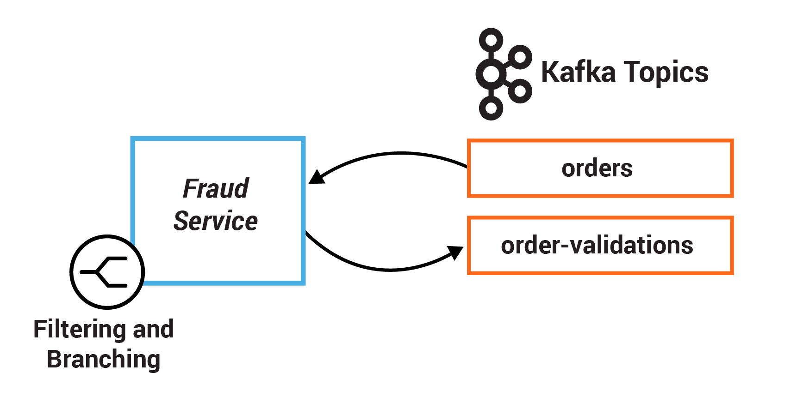
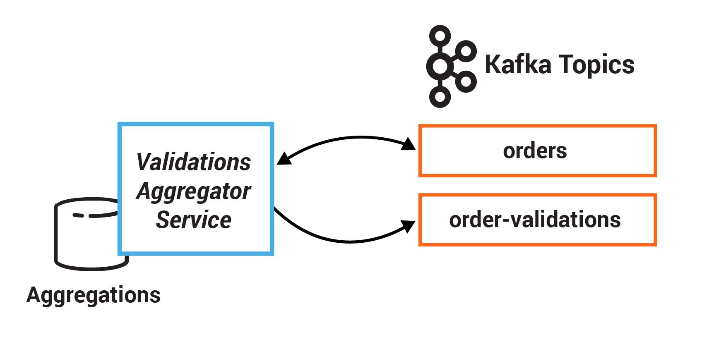
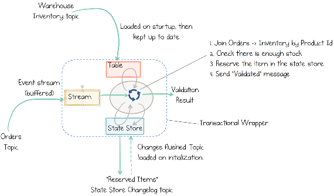
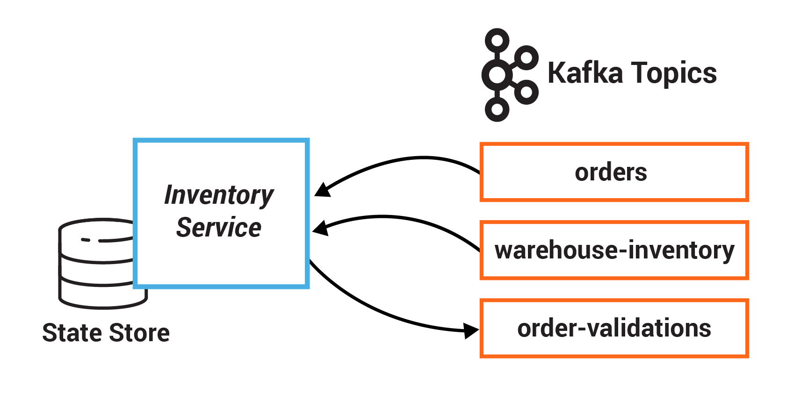
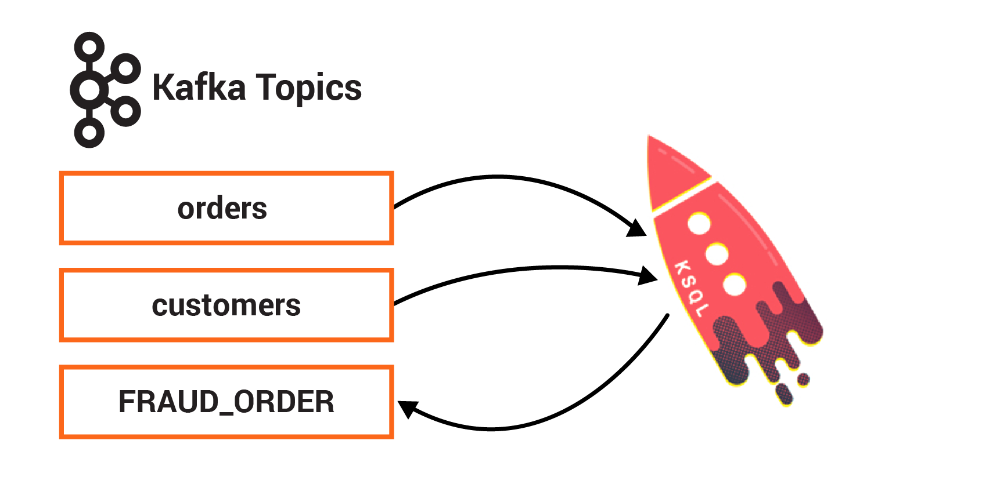

.. _tutorial-microservices-orders:

.. toctree:: 
    :maxdepth: 2

Tutorial: Introduction to Streaming Application Development
===========================================================

This self-paced tutorial provides exercises for developers to learn the basic principles of service-based architectures and streaming application development:

- Exercise 1: Persist events
- Exercise 2: Event-driven applications
- Exercise 3: Enriching streams with joins
- Exercise 4: Filtering and branching
- Exercise 5: Stateful operations
- Exercise 6: State stores
- Exercise 7: Enrichment with |ksqldb|

========
Overview
========

The tutorial is based on a small microservices ecosystem, showcasing an order management workflow, such as one might find in retail and online shopping.
It is built using |ak-tm|, whereby business events that describe the order management workflow propagate through this ecosystem.
The blog post `Building a Microservices Ecosystem with Kafka Streams and ksqlDB <https://www.confluent.io/blog/building-a-microservices-ecosystem-with-kafka-streams-and-ksql/>`__ outlines the approach used.

.. figure:: images/microservices-demo.png
    :alt: image

Note: this is example code, not a production system, and certain elements are left for further work.

Microservices
~~~~~~~~~~~~~

In this example, the system centers on an Orders Service which exposes a REST interface to POST and GET Orders.
Posting an Order creates an event in Kafka that is recorded in the topic `orders`.
This is picked up by different validation engines (Fraud Service, Inventory Service and Order Details Service), which validate the order in parallel, emitting a PASS or FAIL based on whether each validation succeeds.

The result of each validation is pushed through a separate topic, Order Validations, so that we retain the **single writer** status of the Orders Service —> Orders Topic (Ben Stopford's `book <https://www.confluent.io/designing-event-driven-systems>`__ discusses several options for managing consistency in event collaboration).

The results of the various validation checks are aggregated in the Validation Aggregator Service, which then moves the order to a Validated or Failed state, based on the combined result.

To allow users to GET any order, the Orders Service creates a queryable materialized view (embedded inside the Orders Service), using a state store in each instance of the service, so that any Order can be requested historically. Note also that the Orders Service can be scaled out over a number of nodes, in which case GET requests must be routed to the correct node to get a certain key. This is handled automatically using the interactive queries functionality in Kafka Streams.

The Orders Service also includes a blocking HTTP GET so that clients can read their own writes. In this way, we bridge the synchronous, blocking paradigm of a RESTful interface with the asynchronous, non-blocking processing performed server-side.

There is a simple service that sends emails, and another that collates orders and makes them available in a search index using Elasticsearch. 

Finally, |ksqldb| is running with persistent queries to enrich streams and to also check for fraudulent behavior.

Here is a diagram of the microservices and the related Kafka topics.

All the services are client applications written in Java, and they use the Kafka Streams API.
The java source code for these microservices are in the :cp-examples:`kafka-streams-examples repo|src/main/java/io/confluent/examples/streams/microservices`.

Summary of services and the topics they consume from and produce to:

+-------------------------------------+-----------------------------------+----------------------------------------+
| Service                             | Consumes From                     | Produces To                            |
+=====================================+===================================+========================================+
| InventoryService                    | `orders`, `warehouse-inventory`   | `order-validations`                    |
+-------------------------------------+-----------------------------------+----------------------------------------+
| FraudService                        | `orders`                          | `order-validations`                    |
+-------------------------------------+-----------------------------------+----------------------------------------+
| OrderDetailsService                 | `orders`                          | `order-validations`                    |
+-------------------------------------+-----------------------------------+----------------------------------------+
| ValidationsAggregatorService        | `order-validations`, `orders`     | `orders`                               |
+-------------------------------------+-----------------------------------+----------------------------------------+
| EmailService                        | `orders`, `payments`, `customers` | `platinum`, `gold`, `silver`, `bronze` |
+-------------------------------------+-----------------------------------+----------------------------------------+
| OrdersService                       | N/A                               | `orders`                               |
+-------------------------------------+-----------------------------------+----------------------------------------+

End-to-end Streaming ETL
~~~~~~~~~~~~~~~~~~~~~~~~

This example showcases an entire end-to-end streaming ETL deployment, built around the microservices described above.
It is built on the |cp|, including:

* JDBC source connector: reads from a sqlite database that has a table of customers information and writes the data to a Kafka topic, using Connect transforms to add a key to each message
* Elasticsearch sink connector: pushes data from a Kafka topic to Elasticsearch
* |ksqldb|: another variant of a fraud detection microservice

+-------------------------------------+-----------------------+---------------------------+
| Other Clients                       | Consumes From         | Produces To               |
+=====================================+=======================+===========================+
| JDBC source connector               | DB                    | `customers`               |
+-------------------------------------+-----------------------+---------------------------+
| Elasticsearch sink connector        | `orders`              | ES                        |
+-------------------------------------+-----------------------+---------------------------+
| ksqlDB                              | `orders`, `customers` | ksqlDB streams and tables |
+-------------------------------------+-----------------------+---------------------------+

For the end-to-end example, the code that creates the order events via REST calls to the Orders Service and generates the initial inventory is provided by the following applications:

+-------------------------------------+-----------------------------------+-----------------------+
| Application (Datagen)               | Consumes From                     | Produces To           |
+=====================================+===================================+=======================+
| PostOrdersAndPayments               | N/A                               | `payments`            |
+-------------------------------------+-----------------------------------+-----------------------+
| AddInventory                        | N/A                               | `warehouse-inventory` |
+-------------------------------------+-----------------------------------+-----------------------+

=============
Prerequisites
=============

Reading
~~~~~~~

You will get a lot more out of this tutorial if you have first learned the concepts which are foundational for this tutorial.
To learn how service-based architectures and stream processing platforms such as |ak-tm| can help you build business-critical systems, we recommend:

* If you have lots of time: `Designing Event-Driven Systems <https://www.confluent.io/designing-event-driven-systems>`__, a book by Ben Stopford.
* If you do not have lots of time: `Building a Microservices Ecosystem with Kafka Streams and ksqlDB <https://www.confluent.io/blog/building-a-microservices-ecosystem-with-kafka-streams-and-ksql/>`__ or `Build Services on a Backbone of Events <https://www.confluent.io/blog/build-services-backbone-events/>`__.

For more learning on Kafka Streams API that you can use as a reference while working through this tutorial, we recommend:

* `Kafka Streams documentation <https://docs.confluent.io/platform/current/streams/index.html>`__

Environment
~~~~~~~~~~~

* For compiling and running the applications:

  * Java 1.8 to run the demo application
  * Maven to compile the demo application

* For running the end-to-end example on |ccloud|, with connectors, Elasticsearch, and Kibana:

  * |ccloud| account. The `Confluent Cloud <https://www.confluent.io/confluent-cloud/>`__ home page can help you get setup with your own account if you do not yet have access
  * Local install of `Confluent Cloud CLI <https://docs.confluent.io/ccloud-cli/current/install.html>`__ v1.25.0 or later
  * Docker version >= 19.00.0
  * Docker Compose version >= 1.25.0 with Docker Compose file format 3
  * In Docker's advanced `settings <https://docs.docker.com/docker-for-mac/#advanced>`__, increase the memory dedicated to Docker to at least 6GB (default is 2GB)

========
Tutorial
========

Setup the Tutorial
~~~~~~~~~~~~~~~~~~

#. Clone the `confluentinc/examples <https://github.com/confluentinc/examples>`__ GitHub repository.

   .. codewithvars:: bash

      git clone https://github.com/confluentinc/examples

#. Navigate to the ``examples/microservices-orders`` directory and switch to the |cp| release branch:

   .. codewithvars:: bash

      cd examples/microservices-orders
      git checkout |release_post_branch|

Exercise 0: Run end-to-end example
~~~~~~~~~~~~~~~~~~~~~~~~~~~~~~~~~~

This exercise is optional but we suggest you run the full end-to-end working solution to see a customer-representative deployment of a streaming application.
This requires no code development; it just provides context for each of the exercises in which you will develop pieces of the microservices.
Running the fully working example end-to-end provides context for each of the later exercises.
The application code is run locally, and the |ak| cluster is in |ccloud|.

Cost to Run
-----------

The following cost applies only to Exercise 0 which is run with |ccloud|.
The other exercises have no cost because they are run locally.

.. include:: ../../ccloud/docs/includes/ccloud-examples-caution.rst

.. include:: ../../ccloud/docs/includes/ccloud-examples-promo-code.rst

Steps
-----

#. Log in to |ccloud| with the command ``ccloud login``, and use your |ccloud| username and password. To prevent being logged out, use the ``--save`` argument which saves your |ccloud| user login credentials or refresh token (in the case of SSO) to your home ``.netrc`` file. 

   .. sourcecode:: bash

      ccloud login --save

#. Start the end-to-end example by running the provided script.

   .. include:: ../../ccloud/docs/includes/ccloud-stack-advanced-options.rst

   .. sourcecode:: bash

      ./start-ccloud.sh

#. After starting the example, the microservices applications will be running localy and your |ccloud| instance will have Kafka topics with data in them.

   .. figure:: images/microservices-exercises-combined.png
       :alt: image

#. Sample topic data by running the following command, substituting your configuration file name with the file located in the ``stack-configs`` folder example (``java-service-account-12345.config``).

   .. sourcecode:: bash

      source delta_configs/env.delta; CONFIG_FILE=/opt/docker/stack-configs/java-service-account-<service-account-id>.config ./read-topics-ccloud.sh

#. Explore the data with Elasticsearch and Kibana

   .. figure:: images/elastic-search-kafka.png
       :alt: image
       :width: 600px

   Full-text search is added via an Elasticsearch database connected through Kafka’s Connect API (`source <https://www.confluent.io/designing-event-driven-systems>`__). View the Kibana dashboard at http://localhost:5601/app/kibana#/dashboard/Microservices

   .. figure:: images/kibana_microservices.png
       :alt: image
       :width: 600px

#. View and monitor the streaming applications. Use the |ccloud| web user interface (login at https://confluent.cloud/login) to explore topics, consumers, Data flow, and the |ksql-cloud| application.

   .. figure:: images/data-flow.png
       :alt: image
       :width: 600px

#. View the |ksqldb| flow screen for the ``ORDERS`` stream to observe events occurring and examine the streams schema. 
     
   .. figure:: images/ksqldb-orders-flow.png
       :alt: image
       :width: 600px

#. When you are done, make sure to stop the example before proceeding to the exercises. Run the command below, where the ``java-service-account-<service-account-id>.config`` file matches the file in your ``stack-configs`` folder.

   .. sourcecode:: bash

      ./stop-ccloud.sh stack-configs/java-service-account-12345.config

Exercise 1: Persist events 
~~~~~~~~~~~~~~~~~~~~~~~~~~

An `event` is simply a thing that happened or occurred.
An event in a business is some fact that occurred, such as a sale, an invoice, a trade, a customer experience, etc., and it is the source of truth.
In event-oriented architectures, events are first-class citizens that constantly push data into applications.
Client applications can then react to these streams of events in real time and decide what to do next.

In this exercise, you will persist events into Kafka by producing records that represent customer orders.
This event happens in the Orders Service, which provides a REST interface to POST and GET Orders.
Posting an Order is essentially a REST call, and it creates the event in Kafka. 

Implement the `TODO` lines of the file :devx-examples:`exercises/OrdersService.java|microservices-orders/exercises/OrdersService.java`

.. sourcecode:: bash

   ls exercises/OrdersService.java

#. TODO 1.1: create a new `ProducerRecord` with a key specified by `bean.getId()` and value of the bean, to the orders topic whose name is specified by `ORDERS.name()`
#. TODO 1.2: produce the newly created record using the existing `producer` and use the `OrdersService#callback` function to send the `response` and the record key

.. tip::

   The following APIs will be helpful:

   * https://docs.confluent.io/platform/current/clients/javadocs/org/apache/kafka/clients/producer/ProducerRecord.html#ProducerRecord-java.lang.String-K-V-
   * https://docs.confluent.io/platform/current/clients/javadocs/org/apache/kafka/clients/producer/Callback.html
   * :cp-examples:`kafka-streams-examples/src/main/java/io/confluent/examples/streams/microservices/domain/Schemas.java|src/main/java/io/confluent/examples/streams/microservices/domain/Schemas.java`
   * :cp-examples:`kafka-streams-examples/src/main/java/io/confluent/examples/streams/microservices/domain/beans/OrderBean.java|src/main/java/io/confluent/examples/streams/microservices/domain/beans/OrderBean.java`
   
   If you get stuck, here is the :cp-examples:`complete solution|src/main/java/io/confluent/examples/streams/microservices/OrdersService.java`.

To test your code, save off the project's working solution, copy your version of the file to the main project, compile, and run the unit test.

.. sourcecode:: bash

      # Clone and compile kafka-streams-examples
      ./get-kafka-streams-examples.sh

      # Save off the working microservices client application to /tmp/
      cp kafka-streams-examples/src/main/java/io/confluent/examples/streams/microservices/OrdersService.java /tmp/.

      # Copy your exercise client application to the project
      cp exercises/OrdersService.java kafka-streams-examples/src/main/java/io/confluent/examples/streams/microservices/.

      # Compile the project and resolve any compilation errors
      mvn clean compile -DskipTests -f kafka-streams-examples/pom.xml

      # Run the test and validate that it passes
      mvn compile -Dtest=io.confluent.examples.streams.microservices.OrdersServiceTest test -f kafka-streams-examples/pom.xml

Exercise 2: Event-driven applications
~~~~~~~~~~~~~~~~~~~~~~~~~~~~~~~~~~~~~

Service-based architectures are often designed to be request-driven, in which services send commands to other services to tell them what to do, await a response, or send queries to get the resulting state.
Building services on a protocol of requests and responses forces a complicated web of synchronous dependencies that bound services together.

    A visual summary of commands, events and queries (`source <https://www.confluent.io/designing-event-driven-systems>`__)

In contrast, in an event-driven design, the event stream is the inter-service communication that enables services to cross deployment boundaries and avoids synchronous execution.
When and how downstream services respond to those events is within their control, which reduces the coupling between services and enables an architecture with more pluggability.
Read more on `Build Services on a Backbone of Events <https://docs.confluent.io/platform/current/streams/developer-guide/dsl-api.html#streams-developer-guide-dsl-joins>`__.

In this exercise, you will write a service that validates customer orders.
Instead of using a series of synchronous calls to submit and validate orders, the order event itself triggers the `OrderDetailsService`.
When a new order is created, it is written to the topic `orders`, from which `OrderDetailsService` has a consumer polling for new records. 

Implement the `TODO` lines of the file :devx-examples:`exercises/OrderDetailsService.java|microservices-orders/exercises/OrderDetailsService.java`

.. sourcecode:: bash

   ls exercises/OrderDetailsService.java

#. TODO 2.1: subscribe the existing `consumer` to a `Collections#singletonList` with the orders topic whose name is specified by `Topics.ORDERS.name()`
#. TODO 2.2: validate the order using `OrderDetailsService#isValid` and save the validation result to type `OrderValidationResult`
#. TODO 2.3: create a new record using `OrderDetailsService#result()` that takes the order and validation result
#. TODO 2.4: produce the newly created record using the existing `producer`

.. tip::

   The following APIs will be helpful:

   * https://docs.confluent.io/platform/current/clients/javadocs/org/apache/kafka/clients/consumer/KafkaConsumer.html#subscribe-java.util.Collection-
   * https://docs.confluent.io/platform/current/clients/javadocs/org/apache/kafka/clients/producer/KafkaProducer.html#send-org.apache.kafka.clients.producer.ProducerRecord-
   * https://docs.oracle.com/javase/8/docs/api/java/util/Collections.html#singletonList-T-
   * :cp-examples:`kafka-streams-examples/src/main/java/io/confluent/examples/streams/microservices/domain/Schemas.java|src/main/java/io/confluent/examples/streams/microservices/domain/Schemas.java`
   
   If you get stuck, here is the :cp-examples:`complete solution|src/main/java/io/confluent/examples/streams/microservices/OrderDetailsService.java`.

To test your code, save off the project's working solution, copy your version of the file to the main project, compile, and run the unit test.

.. sourcecode:: bash

      # Clone and compile kafka-streams-examples
      ./get-kafka-streams-examples.sh

      # Save off the working microservices client application to /tmp/
      cp kafka-streams-examples/src/main/java/io/confluent/examples/streams/microservices/OrderDetailsService.java /tmp/.

      # Copy your exercise client application to the project
      cp exercises/OrderDetailsService.java kafka-streams-examples/src/main/java/io/confluent/examples/streams/microservices/.

      # Compile the project and resolve any compilation errors
      mvn clean compile -DskipTests -f kafka-streams-examples/pom.xml

      # Run the test and validate that it passes
      mvn compile -Dtest=io.confluent.examples.streams.microservices.OrderDetailsServiceTest test -f kafka-streams-examples/pom.xml

Exercise 3: Enriching streams with joins
~~~~~~~~~~~~~~~~~~~~~~~~~~~~~~~~~~~~~~~~

Streams can be enriched with data from other streams or tables through joins.
A join enriches data by performing lookups in a streaming context where data is updated continuously and concurrently.
For example, applications backing an online retail store might enrich new data records with information from multiple databases.
In this scenario, it may be that a stream of customer transactions is enriched with sales price, inventory, customer information, etc.
These lookups can be performed at very large scale and with a low processing latency.

    A stateful streaming service that joins two streams at runtime (`source <https://www.confluent.io/designing-event-driven-systems>`__)

A popular design pattern is to make the information in the databases available in Kafka through so-called change data capture (CDC), together with Kafka’s Connect API to pull in the data from the database.
Once the data is in Kafka, client applications can perform very fast and efficient joins of such tables and streams, rather than requiring the application to make a query to a remote database over the network for each record.
Read more on `an overview of distributed, real-time joins <https://www.confluent.io/blog/distributed-real-time-joins-and-aggregations-on-user-activity-events-using-kafka-streams/>`__ and `implementing joins in Kafka Streams <https://docs.confluent.io/platform/current/streams/developer-guide/dsl-api.html#streams-developer-guide-dsl-joins>`__.

.. figure:: images/microservices-exercise-3.png
    :alt: image
    :width: 600px

In this exercise, you will write a service that joins streaming order information with streaming payment information and data from a customer database.
First, the payment stream needs to be rekeyed to match the same key info as the order stream before joined together.
The resulting stream is then joined with the customer information that was read into Kafka by a JDBC source from a customer database.
Additionally, this service performs dynamic routing: an enriched order record is written to a topic that is determined from the value of level field of the corresponding customer.

Implement the `TODO` lines of the file :devx-examples:`exercises/EmailService.java|microservices-orders/exercises/EmailService.java`

.. sourcecode:: bash

   ls exercises/EmailService.java

#. TODO 3.1: create a new `KStream` called `payments` from `payments_original`, using `KStream#selectKey` to rekey on order id specified by `payment.getOrderId()` instead of payment id
#. TODO 3.2: do a stream-table join with the customers table, which requires three arguments:

   #. the GlobalKTable for the stream-table join
   #. customer Id, specified by `order.getCustomerId()`, using a KeyValueMapper that gets the customer id from the tuple in the record's value
   #. method that computes a value for the result record, in this case `EmailTuple::setCustomer`

#. TODO 3.3: route an enriched order record to a topic that is dynamically determined from the value of the customerLevel field of the corresponding customer

.. tip::

   The following APIs will be helpful:

   * https://docs.confluent.io/platform/current/streams/javadocs/org/apache/kafka/streams/kstream/Consumed.html#with-org.apache.kafka.common.serialization.Serde-org.apache.kafka.common.serialization.Serde-
   * https://docs.confluent.io/platform/current/streams/javadocs/org/apache/kafka/streams/StreamsBuilder.html#stream-java.lang.String-org.apache.kafka.streams.kstream.Consumed-
   * https://docs.confluent.io/platform/current/streams/javadocs/org/apache/kafka/streams/kstream/KStream.html#selectKey-org.apache.kafka.streams.kstream.KeyValueMapper-
   * https://docs.confluent.io/platform/current/streams/javadocs/org/apache/kafka/streams/kstream/KStream.html#join-org.apache.kafka.streams.kstream.KTable-org.apache.kafka.streams.kstream.ValueJoiner-org.apache.kafka.streams.kstream.Joined-
   * :cp-examples:`kafka-streams-examples/src/main/java/io/confluent/examples/streams/microservices/domain/Schemas.java|src/main/java/io/confluent/examples/streams/microservices/domain/Schemas.java`
   * https://docs.confluent.io/platform/current/streams/javadocs/org/apache/kafka/streams/kstream/KStream.html#to-org.apache.kafka.streams.processor.TopicNameExtractor-org.apache.kafka.streams.kstream.Produced-
   
   If you get stuck, here is the :cp-examples:`complete solution|src/main/java/io/confluent/examples/streams/microservices/EmailService.java`.

To test your code, save off the project's working solution, copy your version of the file to the main project, compile, and run the unit test.

.. sourcecode:: bash

      # Clone and compile kafka-streams-examples
      ./get-kafka-streams-examples.sh

      # Save off the working microservices client application to /tmp/
      cp kafka-streams-examples/src/main/java/io/confluent/examples/streams/microservices/EmailService.java /tmp/.

      # Copy your exercise client application to the project
      cp exercises/EmailService.java kafka-streams-examples/src/main/java/io/confluent/examples/streams/microservices/.

      # Compile the project and resolve any compilation errors
      mvn clean compile -DskipTests -f kafka-streams-examples/pom.xml

      # Run the test and validate that it passes
      mvn compile -Dtest=io.confluent.examples.streams.microservices.EmailServiceTest test -f kafka-streams-examples/pom.xml

Exercise 4: Filtering and branching
~~~~~~~~~~~~~~~~~~~~~~~~~~~~~~~~~~~

A stream of events can be captured in a Kafka topic.
Client applications can then manipulate this stream based on some user-defined criteria, even creating new streams of data that they can act on or downstream services can act on.
These help create new streams with more logically consistent data.
In some cases, the application may need to filter events from an input stream that match certain criteria, which results in a new stream with just a subset of records from the original stream.
In other cases, the application may need to branch events, whereby each event is tested against a predicate and then routed to a stream that matches, which results in multiple new streams split from the original stream.

In this exercise, you will define one set of criteria to filter records in a stream based on some criteria.
Then you will define define another set of criteria to branch records into two different streams.

Implement the `TODO` lines of the file :devx-examples:`exercises/FraudService.java|microservices-orders/exercises/FraudService.java`

.. sourcecode:: bash

   ls exercises/FraudService.java

#. TODO 4.1: filter this stream to include only orders in "CREATED" state, i.e., it should satisfy the predicate `OrderState.CREATED.equals(order.getState())`
#. TODO 4.2: create a `KStream<String, OrderValue>` array from the `ordersWithTotals` stream by branching the records based on `OrderValue#getValue`

   #. First branched stream: FRAUD_CHECK will fail for predicate where order value >= FRAUD_LIMIT
   #. Second branched stream: FRAUD_CHECK will pass for predicate where order value < FRAUD_LIMIT

.. tip::

   The following APIs will be helpful:

   * https://docs.confluent.io/platform/current/streams/javadocs/org/apache/kafka/streams/kstream/KStream.html#filter-org.apache.kafka.streams.kstream.Predicate-
   * https://docs.confluent.io/platform/current/streams/javadocs/org/apache/kafka/streams/kstream/KStream.html#branch-org.apache.kafka.streams.kstream.Predicate...-
   * :cp-examples:`kafka-streams-examples/src/main/java/io/confluent/examples/streams/microservices/domain/beans/OrderBean.java|src/main/java/io/confluent/examples/streams/microservices/domain/beans/OrderBean.java`
   
   If you get stuck, here is the :cp-examples:`complete solution|src/main/java/io/confluent/examples/streams/microservices/FraudService.java`.

To test your code, save off the project's working solution, copy your version of the file to the main project, compile, and run the unit test.

.. sourcecode:: bash

      # Clone and compile kafka-streams-examples
      ./get-kafka-streams-examples.sh

      # Save off the working microservices client application to /tmp/
      cp kafka-streams-examples/src/main/java/io/confluent/examples/streams/microservices/FraudService.java /tmp/.

      # Copy your exercise client application to the project
      cp exercises/FraudService.java kafka-streams-examples/src/main/java/io/confluent/examples/streams/microservices/.

      # Compile the project and resolve any compilation errors
      mvn clean compile -DskipTests -f kafka-streams-examples/pom.xml

      # Run the test and validate that it passes
      mvn compile -Dtest=io.confluent.examples.streams.microservices.FraudServiceTest test -f kafka-streams-examples/pom.xml

Exercise 5: Stateful operations
~~~~~~~~~~~~~~~~~~~~~~~~~~~~~~~

An aggregation operation takes one input stream or table, and yields a new table by combining multiple input records into a single output record.
Examples of aggregations are computing ``count`` or ``sum``, because they combine current record values with previous record values.
These are stateful operations because they maintain data during processing.
Aggregations are always key-based operations, and Kafka’s Streams API ensures that records for the same key are always routed to the same stream processing task.
Oftentimes, these are combined with windowing capabilities in order to run computations in real time over a window of time.

In this exercise, you will create a session window to define five-minute windows for processing.
Additionally, you will use a stateful operation `reduce` to collapse duplicate records in a stream.
Before running `reduce`, you will group the records to repartition the data, which is generally required before using an aggregation operator.

Implement the `TODO` lines of the file :devx-examples:`exercises/ValidationsAggregatorService.java|microservices-orders/exercises/ValidationsAggregatorService.java`

.. sourcecode:: bash

   ls exercises/ValidationsAggregatorService.java

#. TODO 5.1: window the data using `KGroupedStream#windowedBy`, specifically using `SessionWindows.with` to define 5-minute windows
#. TODO 5.2: group the records by key using `KStream#groupByKey`, providing the existing Serialized instance for ORDERS
#. TODO 5.3: use an aggregation operator `KTable#reduce` to collapse the records in this stream to a single order for a given key

.. tip::

   The following APIs will be helpful:

   * https://docs.confluent.io/platform/current/streams/javadocs/org/apache/kafka/streams/kstream/SessionWindows.html#with-java.time.Duration-
   * https://docs.confluent.io/platform/current/streams/javadocs/org/apache/kafka/streams/kstream/KGroupedStream.html#windowedBy-org.apache.kafka.streams.kstream.SessionWindows-
   * https://docs.confluent.io/platform/current/streams/javadocs/org/apache/kafka/streams/kstream/KStream.html#groupByKey-org.apache.kafka.streams.kstream.Serialized-
   * https://docs.confluent.io/platform/current/streams/javadocs/org/apache/kafka/streams/kstream/SessionWindowedKStream.html#reduce-org.apache.kafka.streams.kstream.Reducer-
   
   If you get stuck, here is the :cp-examples:`complete solution|src/main/java/io/confluent/examples/streams/microservices/ValidationsAggregatorService.java`.

To test your code, save off the project's working solution, copy your version of the file to the main project, compile, and run the unit test.

.. sourcecode:: bash

      # Clone and compile kafka-streams-examples
      ./get-kafka-streams-examples.sh

      # Save off the working microservices client application to /tmp/
      cp kafka-streams-examples/src/main/java/io/confluent/examples/streams/microservices/ValidationsAggregatorService.java /tmp/.

      # Copy your exercise client application to the project
      cp exercises/ValidationsAggregatorService.java kafka-streams-examples/src/main/java/io/confluent/examples/streams/microservices/.

      # Compile the project and resolve any compilation errors
      mvn clean compile -DskipTests -f kafka-streams-examples/pom.xml

      # Run the test and validate that it passes
      mvn compile -Dtest=io.confluent.examples.streams.microservices.ValidationsAggregatorServiceTest test -f kafka-streams-examples/pom.xml

Exercise 6: State stores
~~~~~~~~~~~~~~~~~~~~~~~~

Kafka Streams provides so-called `state stores <https://docs.confluent.io/platform/current/streams/developer-guide/processor-api.html#implementing-custom-state-stores>`__, which are disk-resident hash tables, held inside the API for the client application.
The state store can be used within stream processing applications to store and query data, an important capability when implementing stateful operations.
It can be used to remember recently received input records, to track rolling aggregates, to de-duplicate input records, etc.

    State stores in Kafka Streams can be used to create use-case-specific views right inside the service (`source <https://www.confluent.io/designing-event-driven-systems>`__)

It is also backed by a Kafka topic and comes with all the Kafka guarantees.
Consequently, other applications can also `interactively query <https://docs.confluent.io/platform/current/streams/developer-guide/interactive-queries.html>`__ another application's state store.
Querying state stores is always read-only to guarantee that the underlying state stores will never be mutated out-of-band (i.e., you cannot add new entries).

In this exercise, you will create a state store for the Inventory Service.
This state store is initialized with data from a Kafka topic before the service starts processing, and then it is updated as new orders are created.

Implement the `TODO` lines of the file :devx-examples:`exercises/InventoryService.java|microservices-orders/exercises/InventoryService.java`

.. sourcecode:: bash

   ls exercises/InventoryService.java

#. TODO 6.1: create a state store called `RESERVED_STOCK_STORE_NAME`, using `Stores#keyValueStoreBuilder` and `Stores#persistentKeyValueStore`

   #. the key Serde is derived from the topic specified by `WAREHOUSE_INVENTORY`
   #. the value Serde is derived from `Serdes.Long()` because it represents a count

#. TODO 6.2: update the reserved stock in the KeyValueStore called `reservedStocksStore`

   #. the key is the product in the order, using `OrderBean#getProduct`
   #. the value is the sum of the current reserved stock and the quantity in the order, using `OrderBean#getQuantity`

.. tip::

   The following APIs will be helpful:
   
   * https://docs.confluent.io/platform/current/streams/javadocs/org/apache/kafka/streams/state/Stores.html#persistentKeyValueStore-java.lang.String-
   * https://docs.confluent.io/platform/current/streams/javadocs/org/apache/kafka/streams/state/Stores.html#keyValueStoreBuilder-org.apache.kafka.streams.state.KeyValueBytesStoreSupplier-org.apache.kafka.common.serialization.Serde-org.apache.kafka.common.serialization.Serde-
   * https://docs.confluent.io/platform/current/streams/javadocs/org/apache/kafka/streams/state/KeyValueStore.html#put-K-V-
   * :cp-examples:`kafka-streams-examples/src/main/java/io/confluent/examples/streams/microservices/domain/Schemas.java|src/main/java/io/confluent/examples/streams/microservices/domain/Schemas.java`
   
   If you get stuck, here is the :cp-examples:`complete solution|src/main/java/io/confluent/examples/streams/microservices/InventoryService.java`.

To test your code, save off the project's working solution, copy your version of the file to the main project, compile, and run the unit test.

.. sourcecode:: bash

      # Clone and compile kafka-streams-examples
      ./get-kafka-streams-examples.sh

      # Save off the working microservices client application to /tmp/
      cp kafka-streams-examples/src/main/java/io/confluent/examples/streams/microservices/InventoryService.java /tmp/.

      # Copy your exercise client application to the project
      cp exercises/InventoryService.java kafka-streams-examples/src/main/java/io/confluent/examples/streams/microservices/.

      # Compile the project and resolve any compilation errors
      mvn clean compile -DskipTests -f kafka-streams-examples/pom.xml

      # Run the test and validate that it passes
      mvn compile -Dtest=io.confluent.examples.streams.microservices.InventoryServiceTest test -f kafka-streams-examples/pom.xml

Exercise 7: Enrichment with ksqlDB
~~~~~~~~~~~~~~~~~~~~~~~~~~~~~~~~~~

`Confluent ksqlDB <https://www.confluent.io/product/ksql/>`__ is the streaming SQL engine that enables real-time data processing against |ak-tm|.
It provides an easy-to-use, yet powerful interactive SQL interface for stream processing on Kafka, without requiring you to write code in a programming language such as Java or Python.
|ksqldb| is scalable, elastic, fault tolerant, and it supports a wide range of streaming operations, including data filtering, transformations, aggregations, joins, windowing, and sessionization.

You can use |ksqldb| to merge streams of data in real time by using a SQL-like `join` syntax.
A `ksqlDB join <https://docs.ksqldb.io/en/latest/developer-guide/joins/join-streams-and-tables/>`__ and a relational database join are similar in that they both combine data from two sources based on common values.
The result of a |ksqldb| join is a new stream or table that’s populated with the column values that you specify in a `SELECT` statement.
|ksqldb| also supports several `aggregate functions <https://docs.ksqldb.io/en/latest/developer-guide/ksqldb-reference/aggregate-functions/>`__, like `COUNT` and `SUM`.
You can use these to build stateful aggregates on streaming data. 

In this exercise, you will create one persistent query that enriches the `orders` stream with customer information using a stream-table join.
You will create another persistent query that detects fraudulent behavior by counting the number of orders in a given window.

Assume you already have a |ksqldb| stream of orders called `orders` and a |ksqldb| table of customers called `customers_table`.
From the |ksqldb| CLI prompt, type `DESCRIBE orders;` and `DESCRIBE customers_table;` to see the respective schemas.
Then create the following persistent queries:

#. TODO 7.1: create a new |ksqldb| stream that does a stream-table join between `orders` and `customers_table` based on customer id.
#. TODO 7.2: create a new |ksqldb| table that counts if a customer submits more than 2 orders in a 30 second time window.

.. tip::

   The following APIs will be helpful:

   * https://docs.ksqldb.io/en/latest/concepts/stream-processing/#derive-a-new-stream-from-an-existing-stream
   * https://docs.ksqldb.io/en/latest/developer-guide/joins/
   * https://docs.ksqldb.io/en/latest/concepts/time-and-windows-in-ksqldb-queries/#window-types

   If you get stuck, here is the :devx-examples:`complete solution|microservices-orders/statements.sql`.

The CLI parser will give immediate feedback whether your |ksqldb| queries worked or not.
Use ``SELECT * FROM <stream or table name> EMIT CHANGES LIMIT <row count>;`` to see the rows in each query.

=============
Stop Tutorial
=============

.. include:: ../../ccloud/docs/includes/ccloud-examples-terminate.rst

====================
Additional Resources
====================

* `Kafka Streams videos <https://www.youtube.com/watch?v=Z3JKCLG3VP4&list=PLa7VYi0yPIH1vDclVOB49xUruBAWkOCZD>`__
* `Kafka Streams documentation <https://docs.confluent.io/platform/current/streams/index.html>`__
* `Designing Event-Driven Systems <https://www.confluent.io/designing-event-driven-systems>`__
* `Building a Microservices Ecosystem with Kafka Streams and ksqlDB <https://www.confluent.io/blog/building-a-microservices-ecosystem-with-kafka-streams-and-ksql/>`__
* `Build Services on a Backbone of Events <https://www.confluent.io/blog/build-services-backbone-events/>`__
* `No More Silos: How to Integrate Your Databases with Apache Kafka and CDC <https://www.confluent.io/blog/no-more-silos-how-to-integrate-your-databases-with-apache-kafka-and-cdc>`__
* `Getting Your Feet Wet with Stream Processing – Part 1: Tutorial for Developing Streaming Applications <https://www.confluent.io/blog/stream-processing-part-1-tutorial-developing-streaming-applications/>`__
