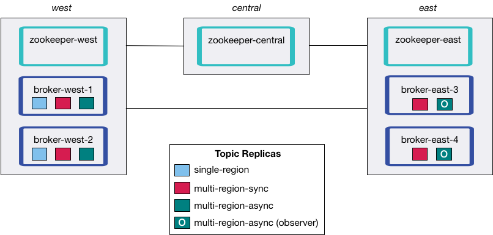

# Overview

This demo showcases Confluent Platform's Multi-Region Replication capability built directly into Confluent Server.

It uses Confluent Platform 5.4 features that are in preview and not intended for production. Some of the interfaces might change to improve the user experience. For more information, read the [blog post](https://www.confluent.io/blog/multi-region-data-replication).

NOTE: There is a [different demo](../multi-datacenter/README.md) for a multi-datacenter design with two instances of Confluent Replicator copying data bidirectionally between the datacenters.

## Multi-region Architecture

This demo has the following architecture.
There are three regions `west`, `central`, and `east`.
The naming convention of the brokers are `broker-[region]-[broker_id]`.


## Configurations

The full broker configurations are in the [docker-compose.yml](docker-compose.yml) file.

### Broker
* `broker.rack`: identifies the location of the broker. For the demo, it represents a region, either `east` or `west`
* `confluent.observer.feature=true`: enables the observer functionality built directly into `confluent-server`, which is a commercial feature
* `replica.selector.class=org.apache.kafka.common.replica.rackawarereplicaselector`: allows clients to read from followers (in contrast, clients are typically only allowed to read from leaders)

### Client
* `client.rack`: identifies the location of the client. For the demo, it represents a region, either `east` or `west`

### Topic
* `--replica-placement <path-to-replica-placement-policy-json>`: at topic creation, this defines the replica placement policy for a given topic

## Concepts

`Replicas` are brokers assigned to a topic-partition, and they can be a leader, follower, or observer.
A `leader` is the broker/replica accepting produce messages.
A `follower` is a broker/replica that can join an ISR list and participate in the calculation of the high watermark (used by the leader when acknowledging messages back to the producer).

An `ISR` list (in-sync replicas) includes brokers that have a given topic-partition.
The data is copied from the leader to every member of the ISR before the producer gets an acknowledgement.
The followers in an ISR can become the leader if the current leader fails.

An `observer` is a broker/replica that also has a copy of data for a given topic-partition, and consumers are allowed to read from them even though it's not the leader (known as "Follower Fetching").
However, the data is copied asynchronously from the leader such that a producer does not wait on observers to get back an acknowledgement.
Observers can never participate in the ISR list and cannot become the leader if the current leader fails.


# Run the Demo

## Install the demo

Clone the [confluentinc/examples GitHub repo](https://github.com/confluentinc/examples) and checkout the `master` branch:

```
git clone https://github.com/confluentinc/examples
cd examples
git checkout master
cd multiregion
```

## Start Docker Compose

Run the following command.

```
docker-compose up -d
```

You should see the following running containers with `docker-compose ps`:

```
      Name                   Command            State                          Ports                        
------------------------------------------------------------------------------------------------------------
broker-east-3        /etc/confluent/docker/run   Up      0.0.0.0:9093->9093/tcp
broker-east-4        /etc/confluent/docker/run   Up      0.0.0.0:9094->9094/tcp
broker-west-1        /etc/confluent/docker/run   Up      0.0.0.0:9091->9091/tcp
broker-west-2        /etc/confluent/docker/run   Up      0.0.0.0:9092->9092/tcp
zookeeper-central   /etc/confluent/docker/run   Up      2181/tcp, 0.0.0.0:2182->2182/tcp, 2888/tcp, 3888/tcp
zookeeper-east      /etc/confluent/docker/run   Up      2181/tcp, 0.0.0.0:2183->2183/tcp, 2888/tcp, 3888/tcp
zookeeper-west      /etc/confluent/docker/run   Up      0.0.0.0:2181->2181/tcp, 2888/tcp, 3888/tcp
```

## Inject latency and packet loss

This demo injects latency and packet loss to simulate the distances between the regions.
It uses [Pumba](https://github.com/alexei-led/pumba).


Run the Dockerized Pumba scripts:

```
./scripts/latency_docker.sh
```

You should see the following three Docker containers when running `docker container ls --filter "name=pumba"`:

```
CONTAINER ID        IMAGE                 COMMAND                  CREATED                  STATUS              PORTS               NAMES
e85c45b3546b        gaiaadm/pumba:0.6.4   "/pumba netem --dura…"   Less than a second ago   Up 3 seconds                            pumba-zk-central
ff79b8609aba        gaiaadm/pumba:0.6.4   "/pumba netem --dura…"   Less than a second ago   Up 5 seconds                            pumba-rate-limit
ccdaf7791844        gaiaadm/pumba:0.6.4   "/pumba netem --dura…"   Less than a second ago   Up 4 seconds                            pumba-delay
```

View IP addresses in the demo:

```
docker inspect -f '{{.Name}} - {{range .NetworkSettings.Networks}}{{.IPAddress}}{{end}}' $(docker ps -aq)
```

## Create Topics

Create three Kafka topics by running the following script.

```
./scripts/create-topics.sh
```

The script creates each topic with a different replica placement policy that specifies a set of matching constraints, i.e., `count` and `rack` for `replicas` and `observers`.
The replica placement policy file is defined with the argument `--replica-placement <path-to-replica-placement-policy-json>` mentioned earlier (these files are in the [config](config/) directory).
Each placement also has a minimum count associated with it that allows users to guarantee a certain spread of replicas throughout the cluster.

| Topic name         | Leader  | Followers (sync replicas) | Observers (async replicas) | ISR list  |
|--------------------|---------|---------------------------|----------------------------|-----------|
| single-region      | 1x west | 1x west                   | n/a                        | {1,2}     |
| multi-region-async | 1x west | 1x west                   | 2x east                    | {1,2}     |
| multi-region-sync  | 1x west | 1x west, 2x east          | n/a                        | {1,2,3,4} |

These three variations will highlight performance differences depending on the relative location of clients and brokers.



Verify topic replica placement:

```
./scripts/describe-topics.sh
```

## Producer Testing
This section tests the differences in replication policies on producers.  Run the producer perf test:

```
./scripts/start-producer.sh
```

Sample results

```
==> Produce: Single-region Replication (topic: single-region) 
5000 records sent, 240.453977 records/sec (1.15 MB/sec), 10766.48 ms avg latency, 17045.00 ms max latency, 11668 ms 50th, 16596 ms 95th, 16941 ms 99th, 17036 ms 99.9th.

==> Produce: Multi-region Async Replication to Observers (topic: multi-region-async) 
5000 records sent, 228.258388 records/sec (1.09 MB/sec), 11296.69 ms avg latency, 18325.00 ms max latency, 11866 ms 50th, 17937 ms 95th, 18238 ms 99th, 18316 ms 99.9th.

==> Produce: Multi-region Sync Replication (topic: multi-region-sync) 
100 records sent, 2.145923 records/sec (0.01 MB/sec), 34018.18 ms avg latency, 45705.00 ms max latency, 34772 ms 50th, 44815 ms 95th, 45705 ms 99th, 45705 ms 99.9th.

```

The first two cases with `single-region` and `multi-region-async` have nearly the same throughput performance.
The observers in the second case didn't affect the overall producer throughput because the `west` region is sending an `ack` back to the producer after it has been replicated twice in the `west` region, and it is not waiting for the async copy to the `east` region. 

On the other hand, because of the poor network bandwidth between the `east` and `west` region's, the third case (topic: `multi-region-sync`) with an ISR made up of brokers in both regions took a big throughput hit because the producer is waiting for an `ack` from all members of the ISR before continuing, including those in `west` and `east`.

## Consumer Testing

This section tests the differences in follower fetching in the consumers.  Run the consumer perf test where the consumer is in `east`:

```
./scripts/start-consumer.sh
```

Sample results

```
==> Consume from east: Multi-region Async Replication from Leader in west (topic: multi-region-async)

start.time, end.time, data.consumed.in.MB, MB.sec, data.consumed.in.nMsg, nMsg.sec, rebalance.time.ms, fetch.time.ms, fetch.MB.sec, fetch.nMsg.sec
2019-09-25 17:10:27:266, 2019-09-25 17:10:53:683, 23.8419, 0.9025, 5000, 189.2721, 1569431435702, -1569431409285, -0.0000, -0.0000


==> Consume from east: Multi-region Async Replication from Follower in east (topic: multi-region-async)

start.time, end.time, data.consumed.in.MB, MB.sec, data.consumed.in.nMsg, nMsg.sec, rebalance.time.ms, fetch.time.ms, fetch.MB.sec, fetch.nMsg.sec
2019-09-25 17:10:56:844, 2019-09-25 17:11:02:902, 23.8419, 3.9356, 5000, 825.3549, 1569431461383, -1569431455325, -0.0000, -0.0000
```

In the first case, the consumer running in `east` reads from the leader in `west`, and so it is negatively impacted by the low bandwidth between `east` and `west`.  It's throughput is lower.

In the second case, the consumer running in `east` reads from the follower that is also in `east`, and so its throughput is higher.

## Failover and Failback

### Fail region west

```
docker-compose stop broker-west-1 broker-west-2 zookeeper-west
```

Verify the new topic replica placement:

```
./scripts/describe-topics.sh
```

Note that the third case (topic: `multi-region-sync`) automatically elects a new leader in `east` and clients failover, whereas `multi-region-async` and `single-region` have no leader. Sample output:

```
==> Describe topic single-region

Topic: single-region	PartitionCount: 1	ReplicationFactor: 2	Configs: min.insync.replicas=1,confluent.placement.constraints={"version":1,"replicas":[{"count":2,"constraints":{"rack":"west"}}],"observers":[]}
	Topic: single-region	Partition: 0	Leader: none	Replicas: 2,1	Isr: 1	Offline: 2,1	LiveObservers: 


==> Describe topic multi-region-async

Topic: multi-region-async	PartitionCount: 1	ReplicationFactor: 4	Configs: min.insync.replicas=1,confluent.placement.constraints={"version":1,"replicas":[{"count":2,"constraints":{"rack":"west"}}],"observers":[{"count":2,"constraints":{"rack":"east"}}]}
	Topic: multi-region-async	Partition: 0	Leader: none	Replicas: 2,1,3,4	Isr: 1	Offline: 2,1	LiveObservers: 3,4


==> Describe topic multi-region-sync

Topic: multi-region-sync	PartitionCount: 1	ReplicationFactor: 4	Configs: min.insync.replicas=1,confluent.placement.constraints={"version":1,"replicas":[{"count":2,"constraints":{"rack":"west"}},{"count":2,"constraints":{"rack":"east"}}],"observers":[]}
	Topic: multi-region-sync	Partition: 0	Leader: 4	Replicas: 2,1,4,3	Isr: 4,3	Offline: 2,1	LiveObservers: 
```

To fail over the observers in the topic `multi-region-async`:

```
docker-compose exec broker-east-3 kafka-leader-election --bootstrap-server broker-east-3:9093 --election-type UNCLEAN --all-topic-partitions
```

Describe the topics again, and notice now that `multi-region-async` has a leader:

```
...
==> Describe topic multi-region-async

Topic: multi-region-async	PartitionCount: 1	ReplicationFactor: 4	Configs: min.insync.replicas=1,confluent.placement.constraints={"version":1,"replicas":[{"count":2,"constraints":{"rack":"west"}}],"observers":[{"count":2,"constraints":{"rack":"east"}}]}
	Topic: multi-region-async	Partition: 0	Leader: 3	Replicas: 2,1,3,4	Isr: 3,4	Offline: 2,1	LiveObservers: 
...
```

### Failback region west

```
docker-compose start broker-west-1 broker-west-2 zookeeper-west
```

Verify the new topic replica placement:

```
./scripts/describe-topics.sh
```

Note: On failback from a failover to observers, any data that was not replicated to observers will be lost because logs are truncated before catching up and joining the ISR.  The engineering team plans to add a feature in the future that would make it easier for operators to get closer to at least once semantics when using observers and failing over.

## Run end-to-end demo

All the individual steps above can be run in on shot:

```
./scripts/start.sh
```

## Stop demo

Stop the demo and all Docker containers.

```
./scripts/stop.sh
```

## Troubleshooting

1. If containers fail to ping each other (failures seen in running `./scripts/validate_connectivity.sh`), clean up the Docker environment before running the demo again.

```
./scripts/stop.sh
docker container stop $(docker container ls -a -q) ; docker container rm $(docker container ls -a -q) ; docker volume prune -f
./scripts/start.sh
```
