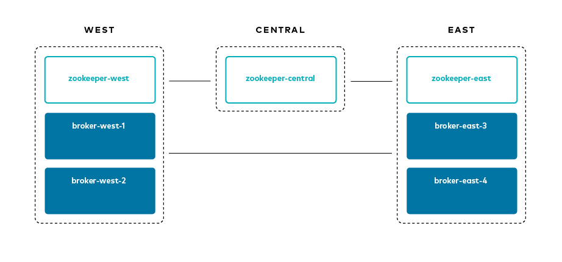
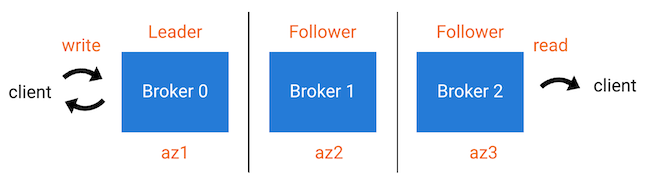
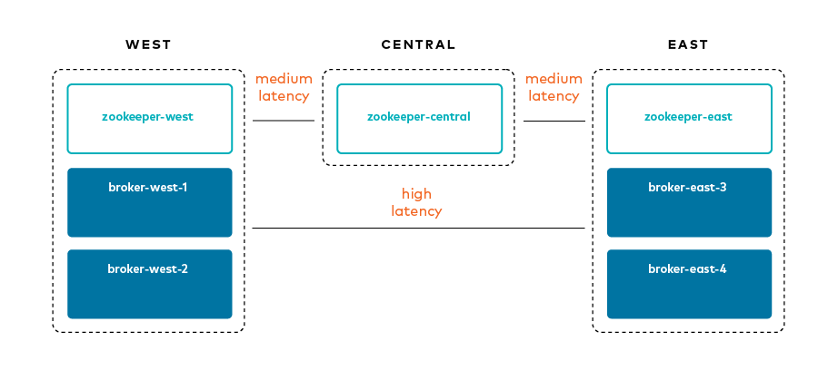

.. _mrc-tutorial:

Tutorial: Multi-Region Clusters
===============================

Overview
--------

This tutorial describes the |mrrep| capability that is built directly into |cs|.

|mrrep| allow customers to run a single |ak-tm| cluster across multiple datacenters.
Often referred to as a stretch cluster, |mrrep| replicate data between datacenters across regional availability zones.
You can choose how to replicate data, synchronously or asynchronously, on a per |ak| topic basis.
It provides good durability guarantees and makes disaster recovery (DR) much easier.

Benefits:

- Supports multi-site deployments of synchronous and asynchronous replication between datacenters
- Consumers can leverage data locality for reading |ak| data, which means better performance and lower cost
- Ordering of |ak| messages is preserved across datacenters
- Consumer offsets are preserved
- In event of a disaster in a datacenter, new leaders are automatically elected in the other datacenter for the topics configured for synchronous replication, and applications proceed without interruption, achieving very low RTOs and RPO=0 for those topics.

Concepts
--------

``Replicas`` are brokers assigned to a topic-partition, and they can be a
*Leader*, *Follower*, or *Observer*. A *Leader* is the broker/replica
accepting producer messages. A *Follower* is a broker/replica that can
join an ISR list and participate in the calculation of the high
watermark (used by the leader when acknowledging messages back to the
producer).

An ``ISR`` list (in-sync replicas) includes brokers that have a given
topic-partition. The data is copied from the leader to every member of
the ISR before the producer gets an acknowledgement. The followers in an
ISR can become the leader if the current leader fails.

An ``Observer`` is a broker/replica that also has a copy of data for a given
topic-partition, and consumers are allowed to read from them even though the
*Observer* isn't the leader–this is known as “Follower Fetching”. However, the
data is copied asynchronously from the leader such that a producer doesn't wait
on observers to get back an acknowledgement. By default, observers don't
participate in the ISR list and can't become the leader if the current leader
fails, but if a user manually changes leader assignment then they can
participate in the ISR list.

|Follower_Fetching|

Configuration
--------------

The scenario for this tutorial is as follows:

- Three regions: ``west``, ``central``, and ``east``
- Broker naming convention: ``broker-[region]-[broker_id]``

|Multi-region Architecture|

Here are some relevant configuration parameters:

Broker
~~~~~~

You can find full broker configurations in the
:devx-examples:`docker-compose.yml file|multiregion/docker-compose.yml`. The
most important configuration parameters include:

-  ``broker.rack``: identifies the location of the broker. For the example,
   it represents a region, either ``east`` or ``west``
-  ``replica.selector.class=org.apache.kafka.common.replica.RackAwareReplicaSelector``:
   allows clients to read from followers (in contrast, clients are
   typically only allowed to read from leaders)
-  ``confluent.log.placement.constraints``: sets the default replica
   placement constraint configuration for newly created topics.

Client
~~~~~~

-  ``client.rack``: identifies the location of the client. For the example,
   it represents a region, either ``east`` or ``west``
-  ``replication.factor``: at the topic level, replication factor is mutually
   exclusive to replica placement constraints, so for |kstreams| applications,
   set ``replication.factor=-1`` to let replica placement constraints take
   precedence
-  ``min.insync.replicas``: durability guarantees are driven by replica
   placement and ``min.insync.replicas``. The number of followers
   `in each region` should be sufficient to meet ``min.insync.replicas``,
   for example, if ``min.insync.replicas=3``, then ``west`` should have 3
   replicas and ``east`` should have 3 replicas.

Topic
~~~~~

-  ``--replica-placement <path-to-replica-placement-policy-json>``: at
   topic creation, this argument defines the replica placement policy for a given
   topic

Download and run the tutorial
-----------------------------

#. Clone the `confluentinc/examples <https://github.com/confluentinc/examples>`__ GitHub repository, and check out the :litwithvars:`|release|-post` branch.

   .. codewithvars:: bash

      git clone https://github.com/confluentinc/examples
      cd examples
      git checkout |release|-post

#. Go to the directory with the |mrrep| by running the following command:

   .. code-block:: text

      cd multiregion

#. If you want to manually step through this tutorial, which is advised for new
   users who want to gain familiarity with |mrrep|, skip ahead to the next section.
   Alternatively, you can run the full tutorial end-to-end with the following
   script, which automates all the steps in the tutorial:

   .. code:: bash

       ./scripts/start.sh

Startup
-------

#. Run the following command:

   .. code-block:: bash

      docker-compose up -d

#. You should see the following Docker containers with ``docker-compose ps``:

   .. code-block:: text

            Name                   Command            State                            Ports
      ----------------------------------------------------------------------------------------------------------------
      broker-east-3       /etc/confluent/docker/run   Up      0.0.0.0:8093->8093/tcp, 9092/tcp, 0.0.0.0:9093->9093/tcp
      broker-east-4       /etc/confluent/docker/run   Up      0.0.0.0:8094->8094/tcp, 9092/tcp, 0.0.0.0:9094->9094/tcp
      broker-west-1       /etc/confluent/docker/run   Up      0.0.0.0:8091->8091/tcp, 0.0.0.0:9091->9091/tcp, 9092/tcp
      broker-west-2       /etc/confluent/docker/run   Up      0.0.0.0:8092->8092/tcp, 0.0.0.0:9092->9092/tcp
      zookeeper-central   /etc/confluent/docker/run   Up      2181/tcp, 0.0.0.0:2182->2182/tcp, 2888/tcp, 3888/tcp
      zookeeper-east      /etc/confluent/docker/run   Up      2181/tcp, 0.0.0.0:2183->2183/tcp, 2888/tcp, 3888/tcp
      zookeeper-west      /etc/confluent/docker/run   Up      0.0.0.0:2181->2181/tcp, 2888/tcp, 3888/tcp

Inject latency and packet loss
------------------------------

This example uses Traffic Control (``tc``) to inject latency between the regions and packet loss to simulate the
WAN link.

|Multi-region latencies|

#. View the IP addresses used by Docker for the example:

   .. code-block:: text

      docker inspect -f '{{.Name}} - {{range .NetworkSettings.Networks}}{{.IPAddress}}{{end}}' $(docker ps -aq)

#. Run the script :devx-examples:`latency_docker.sh|multiregion/scripts/latency_docker.sh` that installs and configures
   ``tc`` on the Docker containers to simulate the latency and packet loss:

   .. code-block:: bash

      ./scripts/latency_docker.sh

Replica Placement
-----------------

This tutorial demonstrates the principles of |mrrep| through various topics.

|Multi-region topic replicas|

Each topic has a replica placement policy that specifies a set of matching
constraints (for example, ``count`` and ``rack`` for ``replicas`` and
``observers``). The replica placement policy file is defined with the argument
``--replica-placement <path-to-replica-placement-policy-json>`` mentioned
earlier (these files are in the :devx-examples:`config|multiregion/config/` directory). Each placement
also has an associated minimum ``count`` that guarantees a
certain spread of replicas throughout the cluster.

In this tutorial, you will create the following topics.
You could create all the topics by running the script :devx-examples:`create-topics.sh|multiregion/scripts/create-topics.sh`, but we will step through each topic creation to demonstrate the required arguments.

.. list-table::
   :widths: 20 15 20 20 10 15
   :header-rows: 1

   * - Topic name
     - Leader
     - Followers (sync replicas)
     - Observers (async replicas)
     - ISR list
     - Use default placement constraints

   * - single-region
     - 1x west
     - 1x west
     - n/a
     - {1,2}
     - no

   * - multi-region-sync
     - 1x west
     - 1x west, 2x east
     - n/a
     - {1,2,3,4}
     - no

   * - multi-region-async
     - 1x west
     - 1x west
     - 2x east
     - {1,2}
     - no

   * - multi-region-default
     - 1x west
     - 1x west
     - 2x east
     - {1,2}
     - yes

#. Create the |ak| topic ``single-region``.

   .. literalinclude:: ../scripts/create-topics.sh
      :lines: 5-10

   Here is the topic's replica placement policy :devx-examples:`placement-single-region.json|multiregion/config/placement-single-region.json`:

   .. literalinclude:: ../config/placement-single-region.json

#. Create the |ak| topic ``multi-region-sync``.

   .. literalinclude:: ../scripts/create-topics.sh
      :lines: 14-19

   Here is the topic's replica placement policy :devx-examples:`placement-multi-region-sync.json|multiregion/config/placement-multi-region-sync.json`:

   .. literalinclude:: ../config/placement-multi-region-sync.json

#. Create the |ak| topic ``multi-region-async``.

   .. literalinclude:: ../scripts/create-topics.sh
      :lines: 23-28

   Here is the topic's replica placement policy :devx-examples:`placement-multi-region-async.json|multiregion/config/placement-multi-region-async.json`:

   .. literalinclude:: ../config/placement-multi-region-async.json

#. Create the |ak| topic ``multi-region-default``. Note that the ``--replica-placement`` argument is not used in order to demonstrate the default placement constraints.

   .. literalinclude:: ../scripts/create-topics.sh
      :lines: 34-38

#. View the topic replica placement by running the script :devx-examples:`describe-topics.sh|multiregion/scripts/describe-topics.sh`:

   .. code-block:: bash

      ./scripts/describe-topics.sh

   You should see output similar to the following:

   .. code-block:: text

         ==> Describe topic single-region

         Topic: single-region    PartitionCount: 1   ReplicationFactor: 2    Configs: min.insync.replicas=1,confluent.placement.constraints={"version":1,"replicas":[{"count":2,"constraints":{"rack":"west"}}],"observers":[]}
            Topic: single-region    Partition: 0    Leader: 2   Replicas: 2,1   Isr: 2,1    Offline:

         ==> Describe topic multi-region-sync

         Topic: multi-region-sync    PartitionCount: 1   ReplicationFactor: 4    Configs: min.insync.replicas=1,confluent.placement.constraints={"version":1,"replicas":[{"count":2,"constraints":{"rack":"west"}},{"count":2,"constraints":{"rack":"east"}}],"observers":[]}
            Topic: multi-region-sync    Partition: 0    Leader: 1   Replicas: 1,2,3,4   Isr: 1,2,3,4    Offline:

         ==> Describe topic multi-region-async

         Topic: multi-region-async   PartitionCount: 1   ReplicationFactor: 4    Configs: min.insync.replicas=1,confluent.placement.constraints={"version":1,"replicas":[{"count":2,"constraints":{"rack":"west"}}],"observers":[{"count":2,"constraints":{"rack":"east"}}]}
            Topic: multi-region-async   Partition: 0    Leader: 2   Replicas: 2,1,3,4   Isr: 2,1    Offline:    Observers: 3,4

         ==> Describe topic multi-region-default

         Topic: multi-region-default PartitionCount: 1   ReplicationFactor: 4    Configs: min.insync.replicas=1,confluent.placement.constraints={"version":1,"replicas":[{"count":2,"constraints":{"rack":"west"}}],"observers":[{"count":2,"constraints":{"rack":"east"}}]}
            Topic: multi-region-default Partition: 0    Leader: 2   Replicas: 2,1,3,4   Isr: 2,1    Offline:    Observers: 3,4

#. Observe the following:

   - The ``multi-region-async`` and ``multi-region-default`` topics have replicas
     across ``west`` and ``east`` regions, but only 1 and 2 are in the ISR, and 3 and
     4 are observers.

Client Performance
------------------

Producer
~~~~~~~~

#. Run the producer perf test script :devx-examples:`run-producer.sh|multiregion/scripts/run-producer.sh`:

   .. code-block:: bash

      ./scripts/run-producer.sh

#. Verify that you see performance results similar to the following:

   .. code-block:: text

      ==> Produce: Single-region Replication (topic: single-region)
      5000 records sent, 240.453977 records/sec (1.15 MB/sec), 10766.48 ms avg latency, 17045.00 ms max latency, 11668 ms 50th, 16596 ms 95th, 16941 ms 99th, 17036 ms 99.9th.

      ==> Produce: Multi-region Sync Replication (topic: multi-region-sync)
      100 records sent, 2.145923 records/sec (0.01 MB/sec), 34018.18 ms avg latency, 45705.00 ms max latency, 34772 ms 50th, 44815 ms 95th, 45705 ms 99th, 45705 ms 99.9th.

      ==> Produce: Multi-region Async Replication to Observers (topic: multi-region-async)
      5000 records sent, 228.258388 records/sec (1.09 MB/sec), 11296.69 ms avg latency, 18325.00 ms max latency, 11866 ms 50th, 17937 ms 95th, 18238 ms 99th, 18316 ms 99.9th.

#. Observe the following:

   - In the first and third cases, the ``single-region`` and
     ``multi-region-async`` topics have nearly the same throughput performance
     (for examples, ``1.15 MB/sec`` and ``1.09 MB/sec``, respectively, in the
     previous example), because only the replicas in the ``west`` region need to
     acknowledge.

   - In the second case for the ``multi-region-sync`` topic, due to the poor
     network bandwidth between the ``east`` and ``west`` regions and to an ISR
     made up of brokers in both regions, it took a big throughput hit (for
     example, ``0.01 MB/sec`` in the previous example). This is because the
     producer is waiting for an ``ack`` from all members of the ISR before
     continuing, including those in ``west`` and ``east``.

   - The observers in the third case for topic ``multi-region-async``
     didn’t affect the overall producer throughput because the ``west`` region
     is sending an ``ack`` back to the producer after it has been replicated
     twice in the ``west`` region, and it is not waiting for the async copy to
     the ``east`` region.

   - This example doesn’t produce to ``multi-region-default`` because the
     behavior is the same as ``multi-region-async`` since the
     configuration is the same.

Consumer
~~~~~~~~

#. Run the consumer perf test script :devx-examples:`run-consumer.sh|multiregion/scripts/run-consumer.sh`, where the consumer is in ``east``:

   .. code-block:: bash

      ./scripts/run-consumer.sh

#. Verify that you see performance results similar to the following:

   .. code-block:: text

         ==> Consume from east: Multi-region Async Replication reading from Leader in west (topic: multi-region-async)

         start.time, end.time, data.consumed.in.MB, MB.sec, data.consumed.in.nMsg, nMsg.sec, rebalance.time.ms, fetch.time.ms, fetch.MB.sec, fetch.nMsg.sec
         2019-09-25 17:10:27:266, 2019-09-25 17:10:53:683, 23.8419, 0.9025, 5000, 189.2721, 1569431435702, -1569431409285, -0.0000, -0.0000

         ==> Consume from east: Multi-region Async Replication reading from Observer in east (topic: multi-region-async)

         start.time, end.time, data.consumed.in.MB, MB.sec, data.consumed.in.nMsg, nMsg.sec, rebalance.time.ms, fetch.time.ms, fetch.MB.sec, fetch.nMsg.sec
         2019-09-25 17:10:56:844, 2019-09-25 17:11:02:902, 23.8419, 3.9356, 5000, 825.3549, 1569431461383, -1569431455325, -0.0000, -0.0000

#. Observe the following:

   - In the first scenario, the consumer running in ``east`` reads from the
     leader in ``west`` and is impacted by the low bandwidth between ``east``
     and ``west``–the throughput of the throughput is lower in this case (for
     example, ``0.9025`` MB per sec in the previous example).

   - In the second scenario, the consumer running in ``east`` reads from the
     follower that is also in ``east``–the throughput of the consumer is higher
     in this case (for example, ``3.9356`` MBps in the previous example).

   - This example doesn’t consume from ``multi-region-default`` as the
     behavior should be the same as ``multi-region-async`` since the
     configuration is the same.

Monitoring
----------

In |cs| there are a few JMX metrics you should monitor for determining the
health and state of a topic partition. The tutorial describes the following JMX
metrics. For a description of other relevant JMX metrics, see
:ref:`mrr_metrics`.

- ``ReplicasCount`` - In JMX the full object name is ``kafka.cluster:type=Partition,name=ReplicasCount,topic=<topic-name>,partition=<partition-id>``. It reports the
  number of replicas (sync replicas and observers) assigned to the topic partition.
- ``InSyncReplicasCount`` - In JMX the full object name is ``kafka.cluster:type=Partition,name=InSyncReplicasCount,topic=<topic-name>,partition=<partition-id>``.
  It reports the number of replicas in the ISR.
- ``CaughtUpReplicasCount`` - In JMX the full object name is ``kafka.cluster:type=Partition,name=CaughtUpReplicasCount,topic=<topic-name>,partition=<partition-id>``.
  It reports the number of replicas that are consider caught up to the topic partition leader. Note that this may be greater than the size of the ISR as observers may be caught up but are not part of ISR.

There is a script you can run to collect the JMX metrics from the command line, but the general form is:

.. code-block:: bash

    docker-compose exec broker-west-1 kafka-run-class kafka.tools.JmxTool --jmx-url service:jmx:rmi:///jndi/rmi://localhost:8091/jmxrmi --object-name kafka.cluster:type=Partition,name=<METRIC>,topic=<TOPIC>,partition=0 --one-time true

#. Run the script
   :devx-examples:`jmx_metrics.sh|multiregion/scripts/jmx_metrics.sh` to get the
   JMX metrics for ``ReplicasCount``,  ``InSyncReplicasCount``, and
   ``CaughtUpReplicasCount`` from each of the brokers:

   .. code-block:: bash

      ./scripts/jmx_metrics.sh

#. Verify you see output similar to the following:

   .. code-block:: text

      ==> Monitor ReplicasCount

      single-region: 2
      multi-region-sync: 4
      multi-region-async: 4
      multi-region-default: 4

      ==> Monitor InSyncReplicasCount

      single-region: 2
      multi-region-sync: 4
      multi-region-async: 2
      multi-region-default: 2

      ==> Monitor CaughtUpReplicasCount

      single-region: 2
      multi-region-sync: 4
      multi-region-async: 4
      multi-region-default: 4

Failover and Failback
---------------------

Fail Region
~~~~~~~~~~~

In this section, you will simulate a region failure by bringing down the ``west`` region.

#. Run the following command to stop the Docker containers corresponding to the ``west`` region:

   .. code-block:: bash

      docker-compose stop broker-west-1 broker-west-2 zookeeper-west

#. Verify the new topic replica placement by running the script :devx-examples:`describe-topics.sh|multiregion/scripts/describe-topics.sh`:

   .. code-block:: bash

      ./scripts/describe-topics.sh

   You should see output similar to the following:

   .. code-block:: text

      ==> Describe topic single-region

      Topic: single-region    PartitionCount: 1   ReplicationFactor: 2    Configs: min.insync.replicas=1,confluent.placement.constraints={"version":1,"replicas":[{"count":2,"constraints":{"rack":"west"}}],"observers":[]}
         Topic: single-region    Partition: 0    Leader: none    Replicas: 2,1   Isr: 1  Offline: 2,1

      ==> Describe topic multi-region-sync

      Topic: multi-region-sync    PartitionCount: 1   ReplicationFactor: 4    Configs: min.insync.replicas=1,confluent.placement.constraints={"version":1,"replicas":[{"count":2,"constraints":{"rack":"west"}},{"count":2,"constraints":{"rack":"east"}}],"observers":[]}
         Topic: multi-region-sync    Partition: 0    Leader: 3   Replicas: 1,2,3,4   Isr: 3,4    Offline: 1,2

      ==> Describe topic multi-region-async

      Topic: multi-region-async   PartitionCount: 1   ReplicationFactor: 4    Configs: min.insync.replicas=1,confluent.placement.constraints={"version":1,"replicas":[{"count":2,"constraints":{"rack":"west"}}],"observers":[{"count":2,"constraints":{"rack":"east"}}]}
         Topic: multi-region-async   Partition: 0    Leader: none    Replicas: 2,1,3,4   Isr: 1  Offline: 2,1    Observers: 3,4

      ==> Describe topic multi-region-default

      Topic: multi-region-default PartitionCount: 1   ReplicationFactor: 4    Configs: min.insync.replicas=1,confluent.placement.constraints={"version":1,"replicas":[{"count":2,"constraints":{"rack":"west"}}],"observers":[{"count":2,"constraints":{"rack":"east"}}]}
         Topic: multi-region-default Partition: 0    Leader: none    Replicas: 2,1,3,4   Isr: 1  Offline: 2,1    Observers: 3,4

#. Observe the following:

   - In the first scenario, the ``single-region`` topic has no leader, because
     it had only two replicas in the ISR, both of which were in the ``west``
     region and are now down.

   - In the second scenario, the ``multi-region-sync`` topic automatically
     elected a new leader in ``east`` (for example, replica 3 in the previous
     output). Clients can failover to those replicas in the ``east`` region.

   - In the last two scenarios, the ``multi-region-async`` and
     ``multi-region-default`` topics have no leader, because they had only two
     replicas in the ISR, both of which were in the ``west`` region and are now
     down. The observers in the ``east`` region are not eligible to become
     leaders automatically because they were not in the ISR.

Failover Observers
~~~~~~~~~~~~~~~~~~

To explicitly fail over the observers in the ``multi-region-async`` and
``multi-region-default`` topics to the ``east`` region, complete the following
steps:

#. Trigger unclean leader election (note: ``unclean`` leader election may result in data loss):

   .. code-block:: bash

      docker-compose exec broker-east-4 kafka-leader-election --bootstrap-server broker-east-4:19094 --election-type UNCLEAN --topic multi-region-async --partition 0

      docker-compose exec broker-east-4 kafka-leader-election --bootstrap-server broker-east-4:19094 --election-type UNCLEAN --topic multi-region-default --partition 0

#. Describe the topics again with the script :devx-examples:`describe-topics.sh|multiregion/scripts/describe-topics.sh`.

   .. code-block:: bash

      ./scripts/describe-topics.sh

   You should see output similar to the following:

   .. code-block:: text

      ...
      ==> Describe topic multi-region-async

      Topic: multi-region-async   PartitionCount: 1   ReplicationFactor: 4    Configs: min.insync.replicas=1,confluent.placement.constraints={"version":1,"replicas":[{"count":2,"constraints":{"rack":"west"}}],"observers":[{"count":2,"constraints":{"rack":"east"}}]}
         Topic: multi-region-async   Partition: 0    Leader: 3   Replicas: 2,1,3,4   Isr: 3,4    Offline: 2,1    Observers: 3,4

      ==> Describe topic multi-region-default

      Topic: multi-region-default PartitionCount: 1   ReplicationFactor: 4    Configs: min.insync.replicas=1,confluent.placement.constraints={"version":1,"replicas":[{"count":2,"constraints":{"rack":"west"}}],"observers":[{"count":2,"constraints":{"rack":"east"}}]}
         Topic: multi-region-default Partition: 0    Leader: 3   Replicas: 2,1,3,4   Isr: 3,4    Offline: 2,1    Observers: 3,4

#. Observe the following:

   - The topics ``multi-region-async`` and ``multi-region-default`` have leaders again (for example, replica 3 in the previous output)

   - The topics ``multi-region-async`` and ``multi-region-default`` had observers that are now in the ISR list (for example, replicas 3,4 in the previous output)

Permanent Failover
~~~~~~~~~~~~~~~~~~

At this point in the example, if the brokers in the ``west`` region come back
online, the leaders for the  ``multi-region-async`` and ``multi-region-default``
topics will automatically be elected back to a replica in ``west``–that is,
replica 1 or 2. This may be desirable in some circumstances, but if you don’t
want the leaders to automatically failback to the ``west`` region, change the
topic placement constraints configuration and replica assignment by completing
the following steps:

#. For the topic ``multi-region-default``, view a modified replica placement policy :devx-examples:`placement-multi-region-default-reverse.json|multiregion/config/placement-multi-region-default-reverse.json`:

   .. literalinclude:: ../config/placement-multi-region-default-reverse.json

#. Change the replica placement constraints configuration and replica assignment
   for ``multi-region-default``, by running the script
   :devx-examples:`permanent-fallback.sh|multiregion/scripts/permanent-fallback.sh`.

   .. code-block:: bash

      ./scripts/permanent-fallback.sh

   The script uses ``kafka-configs`` to change the replica placement policy and then it runs ``confluent-rebalancer`` to move the replicas.

   .. literalinclude:: ../scripts/permanent-fallback.sh

#. Describe the topics again with the script :devx-examples:`describe-topics.sh|multiregion/scripts/describe-topics.sh`.

   .. code-block:: bash

      ./scripts/describe-topics.sh

   You should see output similar to the following:

   .. code-block:: text

      ...
      ==> Describe topic multi-region-default

      Topic: multi-region-default PartitionCount: 1   ReplicationFactor: 4    Configs: min.insync.replicas=1,confluent.placement.constraints={"version":1,"replicas":[{"count":2,"constraints":{"rack":"east"}}],"observers":[{"count":2,"constraints":{"rack":"west"}}]}
         Topic: multi-region-async   Partition: 0    Leader: 3   Replicas: 3,4,2,1   Isr: 3,4    Offline: 2,1    Observers: 2,1
      ...

#. Observe the following:

   - For topic ``multi-region-default``, replicas 2 and 1, which were previously sync replicas, are now
     observers and are still offline

   - For topic ``multi-region-default``, replicas 3 and 4, which were previously observers, are now sync
     replicas.

Failback
~~~~~~~~

Now you will bring region ``west`` back online.

#. Run the following command to bring the ``west`` region back online:

   .. code-block:: bash

       docker-compose start broker-west-1 broker-west-2 zookeeper-west

   Wait for 5 minutes–the default duration for
   ``leader.imbalance.check.interval.seconds``–until the leadership election
   restores the preferred replicas. You can also trigger it with
   ``docker-compose exec broker-east-4 kafka-leader-election --bootstrap-server
   broker-east-4:19094 --election-type PREFERRED --all-topic-partitions``.

#. Verify the new topic replica placement is restored with the script
   :devx-examples:`describe-topics.sh|multiregion/scripts/describe-topics.sh`.

   .. code-block:: bash

      ./scripts/describe-topics.sh

   You should see output similar to the following:

   .. code-block:: text

      Topic: single-region    PartitionCount: 1   ReplicationFactor: 2    Configs: min.insync.replicas=1,confluent.placement.constraints={"version":1,"replicas":[{"count":2,"constraints":{"rack":"west"}}],"observers":[]}
         Topic: single-region    Partition: 0    Leader: 2   Replicas: 2,1   Isr: 1,2    Offline:

      ==> Describe topic multi-region-sync

      Topic: multi-region-sync    PartitionCount: 1   ReplicationFactor: 4    Configs: min.insync.replicas=1,confluent.placement.constraints={"version":1,"replicas":[{"count":2,"constraints":{"rack":"west"}},{"count":2,"constraints":{"rack":"east"}}],"observers":[]}
         Topic: multi-region-sync    Partition: 0    Leader: 1   Replicas: 1,2,3,4   Isr: 3,4,2,1    Offline:

      ==> Describe topic multi-region-async

      Topic: multi-region-async   PartitionCount: 1   ReplicationFactor: 4    Configs: min.insync.replicas=1,confluent.placement.constraints={"version":1,"replicas":[{"count":2,"constraints":{"rack":"west"}}],"observers":[{"count":2,"constraints":{"rack":"east"}}]}
         Topic: multi-region-async   Partition: 0    Leader: 2   Replicas: 2,1,3,4   Isr: 2,1    Offline:    Observers: 3,4

      ==> Describe topic multi-region-default

      Topic: multi-region-default PartitionCount: 1   ReplicationFactor: 4    Configs: min.insync.replicas=1,confluent.placement.constraints={"version":1,"replicas":[{"count":2,"constraints":{"rack":"east"}}],"observers":[{"count":2,"constraints":{"rack":"west"}}]}
         Topic: multi-region-async   Partition: 0    Leader: 3   Replicas: 3,4,2,1   Isr: 3,4    Offline:    Observers: 2,1

#. Observe the following:

   - All topics have leaders again, in particular ``single-region`` which lost its
     leader when the ``west`` region failed.

   - The leaders for ``multi-region-sync`` and ``multi-region-async`` are restored
     to the ``west`` region. If they are not, then wait a full 5 minutes (duration
     of ``leader.imbalance.check.interval.seconds``).

   - The leader for ``multi-region-default`` stayed in the ``east`` region
     because you performed a permanent failover.

.. note::

   On failback from a failover to observers, any data that wasn't replicated to
   observers will be lost because logs are truncated before catching up and
   joining the ISR.

Stop the Tutorial
-----------------

#. To stop the example environment and all Docker containers, run the following command:

   .. code-block:: bash

      ./scripts/stop.sh

Troubleshooting
---------------

Containers fail to ping each other
~~~~~~~~~~~~~~~~~~~~~~~~~~~~~~~~~~

If containers fail to ping each other (for example, failures when running the script
:devx-examples:`validate_connectivity.sh|multiregion/scripts/validate_connectivity.sh`),
complete the following steps:

#. Stop the example.

   .. code-block:: bash

      ./scripts/stop.sh

#. Clean up the Docker environment.

   .. code-block:: bash

      docker-compose down -v --remove-orphans

      # More aggressive cleanup
      docker volume prune

#. Restart the example.

   .. code-block:: bash

      ./scripts/start.sh

   If the containers still fail to ping each other, restart Docker and run again.

No detectable latency and jitter
~~~~~~~~~~~~~~~~~~~~~~~~~~~~~~~~

If there is no performance difference between the sync replication for the ``multi-region-sync`` and the other topics,
it is possible Docker networking not working or cleaning up properly between runs.

#. Restart Docker. You can restart it via the UI, or:

   If you are running macOS:

   .. code-block:: bash

      osascript -e 'quit app "Docker"' && open -a Docker

   If you are running Docker Toolbox:

   .. code-block:: bash

      docker-machine restart

.. |Multi-region topic replicas|
   image:: images/multi-region-topic-replicas-v2.png
   :alt: Multi-region topic replicas

Additional Resources
--------------------

-  `Blog post: Multi-Region Clusters with Confluent Platform 5.4 <https://www.confluent.io/blog/multi-region-data-replication>`__

