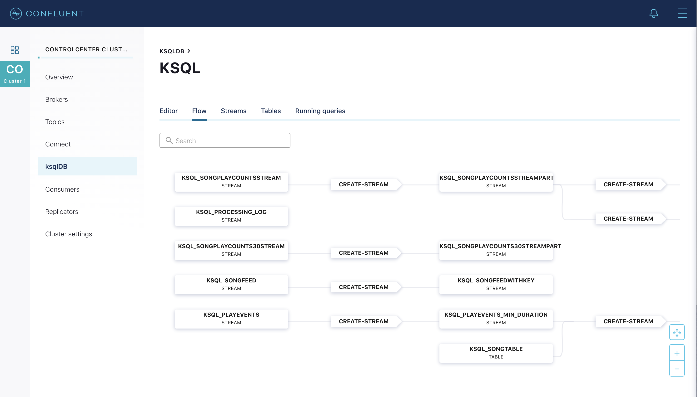

# Overview

The music demo is the ksqlDB version of the [Kafka Streams Demo Application](https://docs.confluent.io/current/streams/kafka-streams-examples/docs/index.html?utm_source=github&utm_medium=demo&utm_campaign=ch.examples_type.community_content.music).
This isn't an exact replica of that demo because some features in Kafka Streams API are not available yet in ksqlDB (coming soon!).
Some of these differences are noted in the [ksqlDB commands](statements.sql).

Follow along with the video [Demo: Build a Streaming Application with ksqlDB](https://www.youtube.com/watch?v=ExEWJVjj-RA).

# Prerequisites

## Local

You may run the entire demo end-to-end with `./start.sh`, and it runs on your local Confluent Platform install.  This requires the following:

* [Confluent Platform 5.5](https://www.confluent.io/download/?utm_source=github&utm_medium=demo&utm_campaign=ch.examples_type.community_content.music)
* Java 1.8 to compile the data generator, i.e. the `KafkaMusicExampleDriver` class
* Maven to compile the data generator, i.e. the `KafkaMusicExampleDriver` class

## Docker

Follow the [step-by-step guide](live-coding-ksql-music.adoc). This requires the following:

* Docker version 17.06.1-ce
* Docker Compose version 1.14.0 with Docker Compose file format 2.1

# What Should I see?

* If you are running Confluent Platform, use Confluent Control Center to view and manage ksqlDB queries.  Using Google Chrome, navigate to http://localhost:9021/

* Instead of using the music demos's REST endpoints, use ksqlDB to inspect the data.
