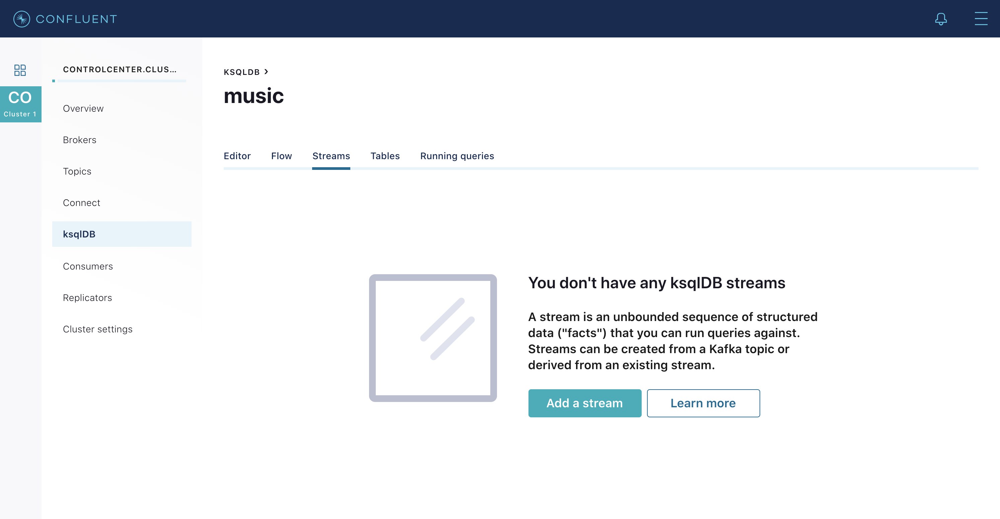

= Live Coding the ksqlDB Music demo
:source-highlighter: pygments
:doctype: book
v1.00, 4 Sept 2018

:toc:

== Introduction

In this tutorial, we show you how to build a demo streaming application with ksqlDB.
This application continuously computes, in real-time, top music charts based on a stream of song play events.
It is the near equivalent demo to a https://docs.confluent.io/current/streams/kafka-streams-examples/docs/index.html[similar demo application] using the Kafka Streams API.
Users can choose between Kafka Streams or ksqlDB depending on the use case.
Both enable developers to build real-time, scalable, fault-tolerant applications with exactly once capabilities, for Confluent Cloud and on-premises Kafka deployments.
Here we take the same music application concept and rewrite it using ksqlDB so you can compare and contrast the experience.

image::images/ksql-music-demo-overview.jpg[Diagram]

This tutorial accompanies:

- https://www.youtube.com/watch?v=ExEWJVjj-RA[KSQL Streaming Application for Music Charts screencast]
- https://github.com/confluentinc/examples/tree/latest/music[automated ksqlDB demo]

For help, check out the #ksql channel on our https://slackpass.io/confluentcommunity[Community Slack group]

== Setup

=== Docker

NOTE: This tutorial assumes you are running the ksqlDB music demo application in Docker. You may alternatively run this demo on a Confluent Platform local install just by running the https://github.com/confluentinc/examples/tree/latest/music/start.sh[start script].

Clone this https://github.com/confluentinc/examples[examples repo].

[source,bash]
----
$ git clone https://github.com/confluentinc/examples
----

In Docker's advanced https://docs.docker.com/docker-for-mac/#advanced[settings], increase the memory dedicated to Docker to at least 8GB (default is 2GB).

From the `examples/music` directory, start the demo by running a single command that brings up the Docker containers.  This will take less than 2 minutes to complete.

[source,bash]
----
$ cd examples/music
$ docker-compose up -d
----

Do not proceed until you see the below output in the logs of Confluent Control Center.

[source,bash]
----
$ docker-compose logs -f control-center | grep -i "Started NetworkTrafficServerConnector"
control-center                | [2019-12-11 14:07:40,094] INFO Started NetworkTrafficServerConnector@5533dc72{HTTP/1.1,[http/1.1]}{0.0.0.0:9021} (org.eclipse.jetty.server.AbstractConnector)
----

== Demo

=== Inspect the source Kafka data

The Docker compose file includes a container that auto-generates source data to two topics, in Avro format:

* `play-events` : stream of play events (“song X was played”)
* `song-feed` : stream of song metadata (“song X was written by artist Y”)

image::images/ksql-music-demo-source-data.jpg[source-data]

After you bring up the demo, use Google Chrome to navigate to http://localhost:9021[Confluent Control Center].  From `Topics`, select any topic and then view its messages.

image::images/inspect_topic.png[inspect-topic]

Or use the ksqlDB query editor in Control Center to inspect the topic:

[source,bash]
----
PRINT 'play-events';
----

image::images/topic_ksql_play_events.png[play-events-ksql]

Inspect the topic `song-feed` : 

At this time, you cannot inspect data in the topic `song-feed` using the topic inspection capability in Confluent Control Center because topic inspection only works on new data, not previous data already produced to the topic, as is the case here.  Instead, from the ksqlDB query editor in Control Center, print the topic with the `FROM BEGINNING` clause:

[source,bash]
----
PRINT 'song-feed' FROM BEGINNING;
----

So the source data looks as follows

image::images/ksql-music-demo-source-data-explore.jpg[source-data-explore]

=== Create a new stream

Let's create a new stream from the Kafka topic, beginning with the `play-events` topic. Register the topic `play-events` as a ksqlDB stream and specify that it is Avro format.

* Configure the new stream name as `ksql_playevents`
* Change the message value encoding to `AVRO` (default: `JSON`)

NOTE: Prefix the names of the ksqlDB streams and tables with `ksql_`.  This is not required but do it so that you can run these ksqlDB queries alongside the Kafka Streams API version of this music demo and avoid naming conflicts.

To register the topic `play-events`, from the ksqlDB query editor:

[source,bash]
----
CREATE STREAM ksql_playevents WITH (KAFKA_TOPIC='play-events', VALUE_FORMAT='AVRO');
----

Or from Control Center in the ksqlDB Streams view, select *Add a stream*.

 

Select the topic `play-events`  and then fill out the fields as shown below.  Because of Control Center integration with Confluent Schema Registry, ksqlDB automatically detects the fields `song_id` and `duration` and their respective data types.

image::images/ksql_playevents.png[play-events]

=== Filter data

Do some basic filtering on the newly created stream `ksql_playevents`, e.g. to qualify songs that were played for at least 30 seconds.  From the ksqlDB query editor:

[source,bash]
----
SELECT * FROM ksql_playevents WHERE DURATION > 30000 EMIT CHANGES;
----

The above query is not persistent -- it will stop if this screen is closed. To make the query persistent and stay running until explicitly terminated, prepend the previous query with `CREATE STREAM <new stream name> AS`.  From the ksqlDB query editor:

[source,bash]
----
CREATE STREAM ksql_playevents_min_duration AS SELECT * FROM ksql_playevents WHERE DURATION > 30000;
----

Now this persistent query will show in the queries list.

=== Create a new table

Next let's work on the `song-feed` topic, which effectively represents a table of songs.

The original Kafka topic has a key of type `Long`, which maps to ksqlDB's `BIGINT` sql type.
While ksqlDB can retrieve the list of columns in the value automatically, the key column must currently be specified.
To register the topic `song-feed`, from the ksqlDB query editor:
 
* Create a `TABLE` from the original Kafka topic `song-feed`:

[source,bash]
----
CREATE TABLE ksql_song (SONG_ID BIGINT PRIMARY KEY) WITH (KAFKA_TOPIC='song-feed', VALUE_FORMAT='AVRO');
----

* View the contents of this table and confirm that the entries in this ksqlDB table have a `ROWKEY` that matches the String ID of the song.
 
[source,bash]
----
SELECT * FROM ksql_song EMIT CHANGES limit 5;
----

Then `DESCRIBE` the table to see the fields associated with this topic and notice that the field `ID` is of type `BIGINT`.
 
[source,bash]
----
DESCRIBE ksql_song;
----

You can also `Describe` the table via the C3 GUI to see the same output:

image::images/describe_songfeed.png[describe-song-feed]
 
=== Join play events with the table of songs

At this point we have created a stream of filtered play events called `ksql_playevents_min_duration` and a table of song metadata called `ksql_song`.

Enrich the stream of play events with song metadata using a Stream-Table `JOIN`. This will result in a new stream of play events enriched with descriptive song information like song title along with each play event.

[source,bash]
----
CREATE STREAM ksql_songplays AS SELECT plays.SONG_ID AS ID, ALBUM, ARTIST, NAME, GENRE, DURATION FROM ksql_playevents_min_duration plays LEFT JOIN ksql_song songs ON plays.SONG_ID = songs.SONG_ID;
----

=== Create Top Music Charts

Now you can create a top music chart for all time to see which songs get played the most. Use the `COUNT` function on the stream `ksql_songplays` that we created above.

[source,bash]
----
CREATE TABLE ksql_songplaycounts WITH (PARTITIONS=1) AS SELECT ID AS K1, NAME AS K2, GENRE AS K3, AS_VALUE(ID) AS ID, AS_VALUE(NAME) AS NAME, AS_VALUE(GENRE) AS GENRE, COUNT(*) AS COUNT FROM ksql_songplays GROUP BY ID, NAME, GENRE;
----

The columns used in the GROUP BY clause will become key columns in the created table. As we need the aggregate columns in the value we first alias the key columns so their names won't clash, then copy the key columns into the value using AS_VALUE.

Notice, we also set the partition count to 1. This is so that later our aggregations are done on a global basis.

While the all-time greatest hits are cool, it would also be good to see stats for just the last 30 seconds. Create another query, adding in a `WINDOW` clause, which gives counts of play events for all songs, in 30-second intervals.

[source,bash]
----
CREATE TABLE ksql_songplaycounts30 WITH (PARTITIONS=1) AS SELECT ID AS K1, NAME AS K2, GENRE AS K3, AS_VALUE(ID) AS ID, AS_VALUE(NAME) AS NAME, AS_VALUE(GENRE) AS GENRE, COUNT(*) AS COUNT FROM ksql_songplays WINDOW TUMBLING (size 30 second) GROUP BY ID, NAME, GENRE;
----

== Here is what you built

Congratulations, you built a streaming application that processes data in real-time!  The application enriched a stream of play events with song metadata and generated top counts. Any downstream systems can consume results from your ksqlDB queries for further processing.  If you were already familiar with SQL semantics, hopefully this tutorial wasn't too hard to follow.

[source,bash]
----
SELECT * FROM ksql_songplaycounts30 EMIT CHANGES;
----

image::images/counts_results.png[results]

== Appendix

=== Compare ksqlDB Queries and Kafka Streams Java

Compare the music applications written with link:statements.sql[ksqlDB queries] and the https://github.com/confluentinc/kafka-streams-examples/blob/5.5.0-post/src/main/java/io/confluent/examples/streams/interactivequeries/kafkamusic/KafkaMusicExample.java[Kafka Streams java code].

=== ksqlDB CLI

We recommend using Confluent Control Center to manage your Kafka cluster, inspect your topics, and use the built-in ksqlDB functionality with Schema Registry integration. Alternatively, you can use the ksqlDB CLI Docker container. Run the following from the command line:

[source,bash]
----
$ docker-compose exec ksqldb-cli ksql http://ksqldb-server:8088
----

=== Troubleshooting Control Center 

Confluent Control Center typicially only displays output messages from topics, streams, and tables as new records arrive.  In this demo the data is sourced from an application called `kafka-music-data-generator`.  If you notice that Control Center is not displaying records, you can try restarting this application.  If you're using the docker-compose solution, you can generate new data by running `docker-compose restart kafka-music-data-generator`.

=== ksqlDB Command File

For learning purposes, we suggest you walk through this tutorial step-by-step.

However, if you choose to jump ahead to the end state, run the ksqlDB command file that automatically configures the ksqlDB queries.

[source,bash]
----
$ docker-compose exec ksqldb-cli ksql http://ksqldb-server:8088
....
ksql> run script '/tmp/statements.sql';
ksql> exit
----
