= Live Coding the KSQL Music demo
:source-highlighter: pygments
:doctype: book
v1.00, 4 Sept 2018

:toc:

== Introduction

In this tutorial, we show you how to build a demo streaming application with KSQL.  This application continuously computes, in real-time, top music charts based on a stream of song play events.

Does this demo sound familiar?  It should.  Last year Confluent produced a https://docs.confluent.io/current/streams/kafka-streams-examples/docs/index.html[similar demo application] using the Kafka Streams API.  Since then, Confluent has released production-ready https://www.confluent.io/product/ksql/[KSQL], the streaming SQL engine for Apache Kafka.  Users can choose between Kafka Streams or KSQL depending on the use case.  Both enable developers to build real-time, scalable, fault-tolerant applications with exactly once capabilities, for Confluent Cloud and on-premises Kafka deployments. Here we take the same music application concept and rewrite it using KSQL so you can compare and contrast the experience.

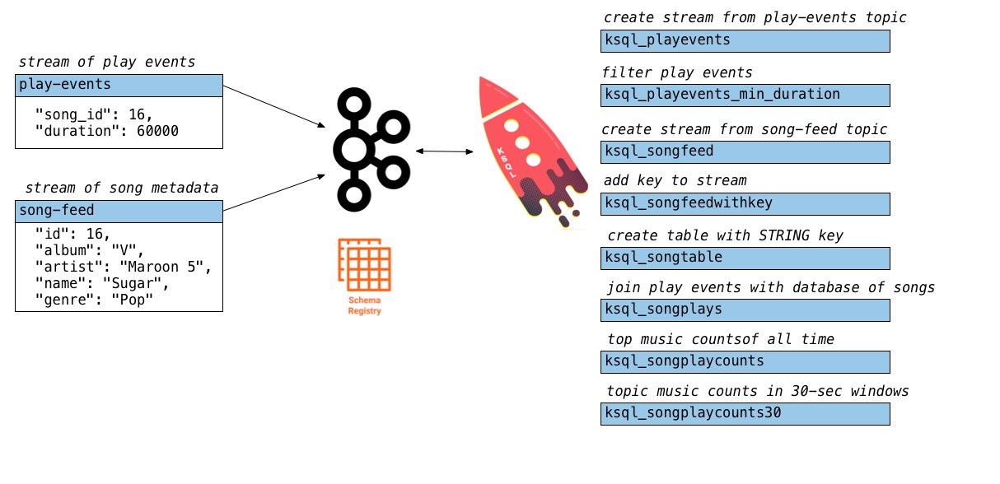

This tutorial accompanies:

- https://www.youtube.com/watch?v=ExEWJVjj-RA[KSQL Streaming Application for Music Charts screencast]
- https://github.com/confluentinc/examples/tree/5.1.0-post/music[automated KSQL demo]

Don't forget to check out the #ksql channel on our https://slackpass.io/confluentcommunity[Community Slack group]

== Setup

=== Docker

NOTE: This tutorial assumes you are running the KSQL music demo application in Docker. You may alternatively run this demo on a Confluent Platform local install just by running the https://github.com/confluentinc/examples/blob/5.1.0-post/music/start.sh[start script].

Clone this https://github.com/confluentinc/examples[examples repo].

[source,bash]
----
$ git clone https://github.com/confluentinc/examples
----

In Docker's advanced https://docs.docker.com/docker-for-mac/#advanced[settings], increase the memory dedicated to Docker to at least 8GB (default is 2GB).

From the `examples/music` directory, start the demo by running a single command that brings up the Docker containers.  This will take less than 2 minutes to complete.

[source,bash]
----
$ cd examples/music
$ docker-compose up -d
----

Do not proceed until you see the below output in the logs of Confluent Control Center.

[source,bash]
----
$ docker-compose logs -f control-center | grep -i "Started NetworkTrafficServerConnector"
control-center                | [2018-09-06 15:03:22,518] INFO Started NetworkTrafficServerConnector@4d48bd85{HTTP/1.1,[http/1.1]}{0.0.0.0:9021} (org.eclipse.jetty.server.AbstractConnector)
----

== Demo

=== Inspect the source Kafka data

The Docker compose file includes a container that auto-generates source data to two topics, in Avro format:

* `play-events` : stream of play events (“song X was played”)
* `song-feed` : stream of song metadata (“song X was written by artist Y”)

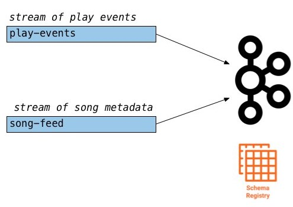

After you bring up the demo, use Google Chrome to navigate to http://localhost:9021[Confluent Control Center]. Under `MANAGEMENT` select `Topics`, then scroll down and click on the topic and select `Inspect`.

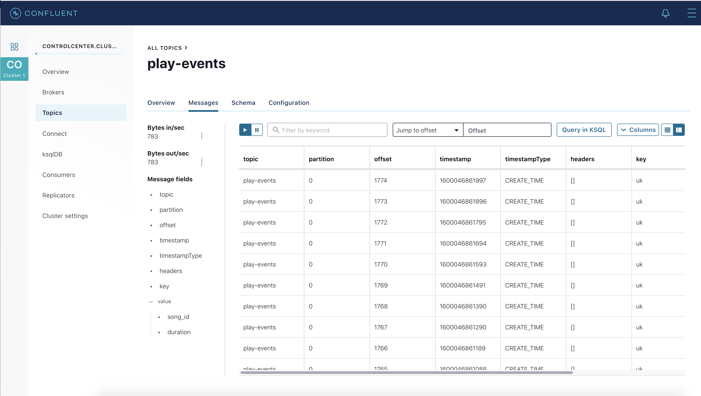

* Inspect the topic `play-events` :

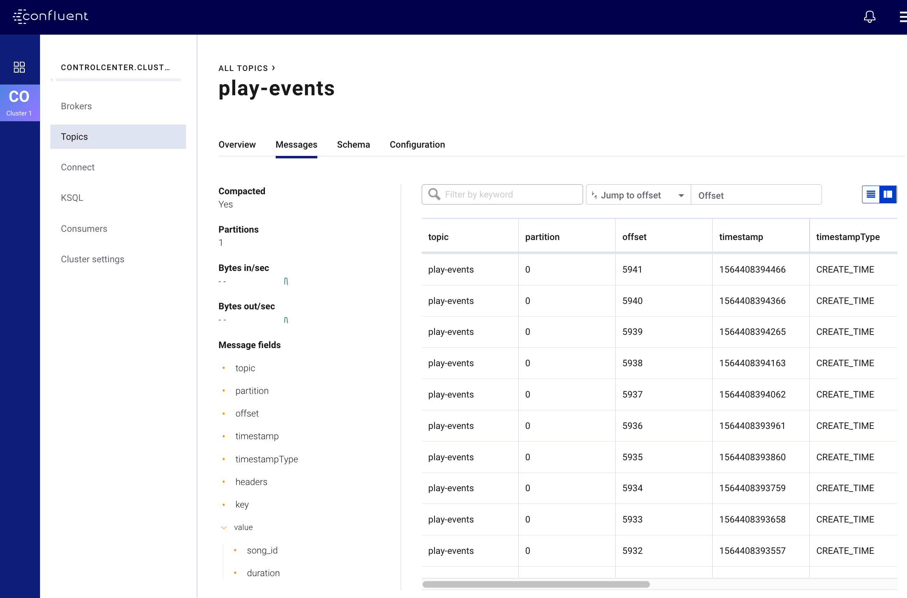

Or use the http://localhost:9021/development/ksql/localhost%3A8088/editor[KSQL query editor] in Control Center to inspect the topic:

[source,bash]
----
PRINT "play-events";
----

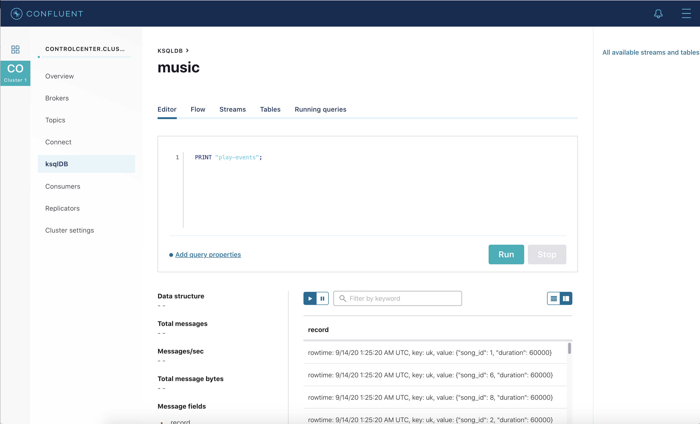

* Inspect the topic `song-feed` : 

At this time, you cannot inspect data in the topic `song-feed` using the topic inspection capability in Confluent Control Center because topic inspection only works on new data, not previous data already produced to the topic, as is the case here.  Instead, from the http://localhost:9021/development/ksql/localhost%3A8088/editor[KSQL query editor] in Control Center, print the topic with the `FROM BEGINNING` clause:

[source,bash]
----
PRINT "song-feed" FROM BEGINNING;
----

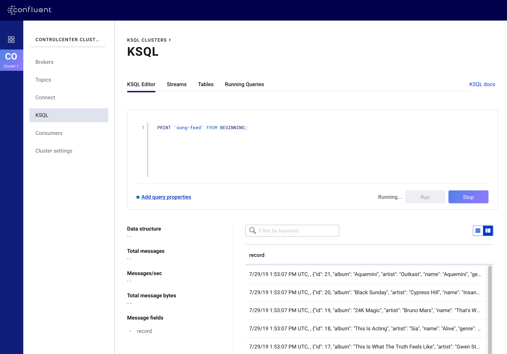

So the source data looks as follows

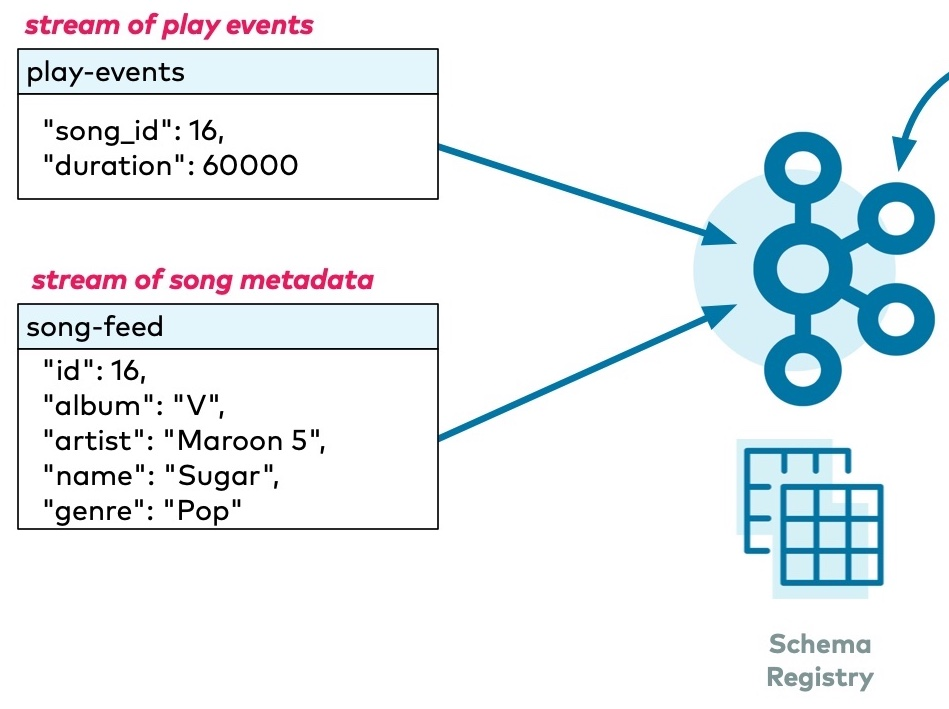

=== Create a new stream

Let's create a new stream from the Kafka topic, beginning with the `play-events` topic. Register the topic `play-events` as a KSQL stream and specify that it is Avro format.

* Configure the new stream name as `ksql_playevents`
* Change the message value encoding to `AVRO` (default: `JSON`)

NOTE: Prefix the names of the KSQL streams and tables with `ksql_`.  This is not required but do it so that you can run these KSQL queries alongside the Kafka Streams API version of this music demo and avoid naming conflicts.

To register the topic `play-events`, from the KSQL query editor:

[source,bash]
----
CREATE STREAM ksql_playevents WITH (KAFKA_TOPIC='play-events', VALUE_FORMAT='AVRO');
----

Or from Control Center in the KSQL Streams view, select "Create Stream" and fill out the fields as shown below.  Because of Control Center integration with Confluent Schema Registry, it automatically detects the fields `song_id` and `duration` and their respective data types.

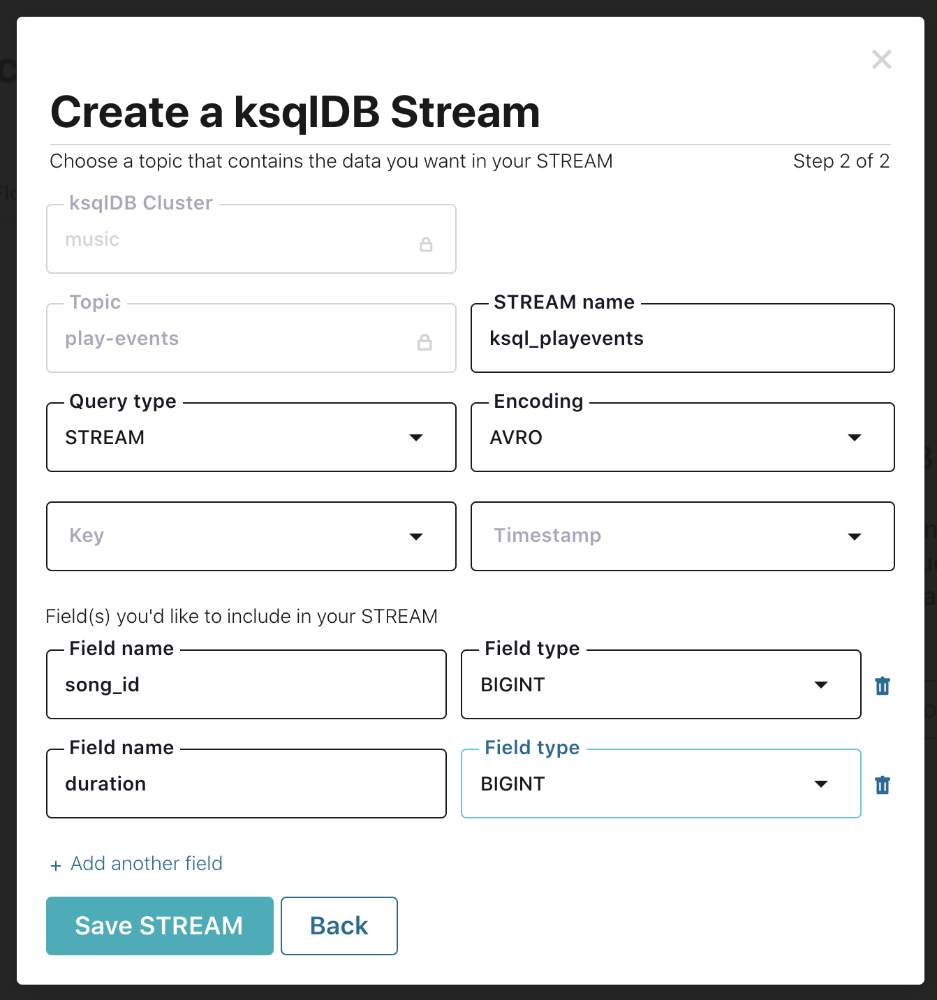

=== Filter data

Do some basic filtering on the newly created stream `ksql_playevents`, e.g. to qualify songs that were played for at least 30 seconds.  From the KSQL query editor:

[source,bash]
----
SELECT * FROM ksql_playevents WHERE DURATION > 30000;
----

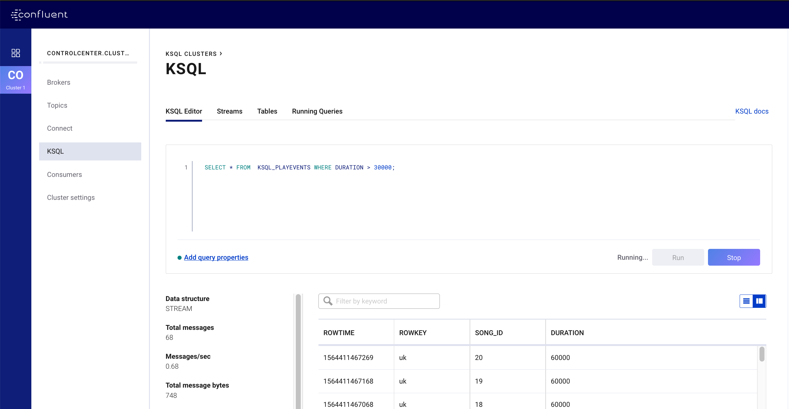

The above query is not persistent -- it will stop if this screen is closed. To make the query persistent and stay running until explicitly terminated, prepend the previous query with `CREATE STREAM <new stream name> AS`.  From the KSQL query editor:

[source,bash]
----
CREATE STREAM ksql_playevents_min_duration AS SELECT * FROM ksql_playevents WHERE DURATION > 30000;
----

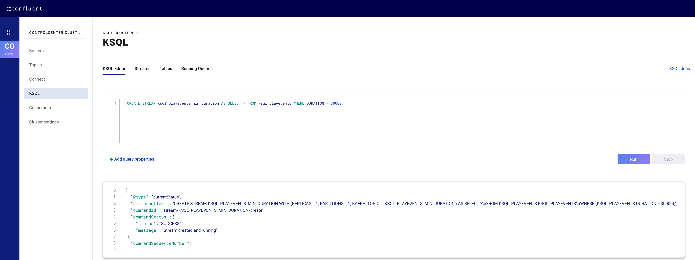

Now this persistent query will show in the queries list.

=== Create a new table

Next let's work on the `song-feed` topic, which effectively represents a table of songs. Data in a KSQL `TABLE` are required to have key of type `String`. In this demo, the table can be keyed on the song's ID for joins and aggregations to work on that table.

However the original Kafka topic has a key of type `Long` and the ID field is of type `BIGINT`. You can still create a `TABLE` with a few https://docs.confluent.io/current/ksql/docs/syntax-reference.html#what-to-do-if-your-key-is-not-set-or-is-in-a-different-format[simple steps]:
 
* Create a `STREAM` from the original Kafka topic `song-feed`:

[source,bash]
----
CREATE STREAM ksql_songfeed WITH (KAFKA_TOPIC='song-feed', VALUE_FORMAT='AVRO');
----
 
[source,bash]
----
SELECT * FROM ksql_songfeed limit 5;
----
 
Then `DESCRIBE` the stream to see the fields associated with this topic and notice that the field `ID` is of type `BIGINT`.
 
[source,bash]
----
DESCRIBE ksql_songfeed;
----

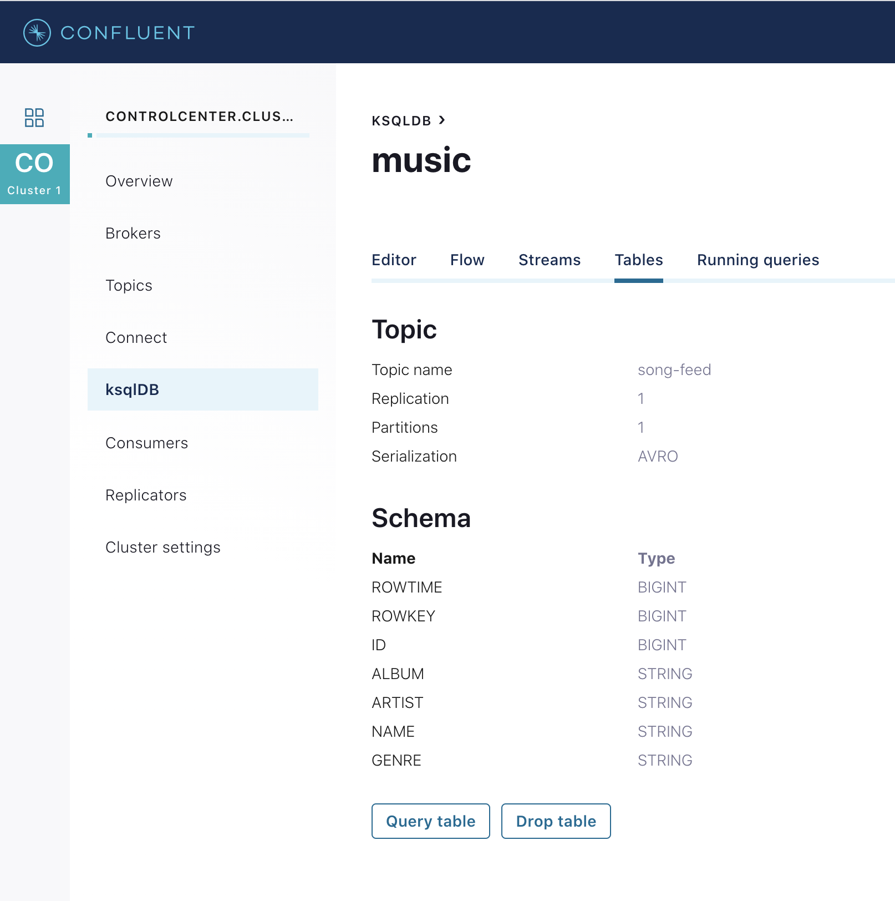
 
* Use the `PARTITION BY` clause to assign a key and use the `CAST` function to change the field type to `String`.
 
[source,bash]
----
CREATE STREAM ksql_songfeedwithkey WITH (KAFKA_TOPIC='KSQL_SONGFEEDWITHKEY', VALUE_FORMAT='AVRO') AS SELECT CAST(ID AS STRING) AS ID, ALBUM, ARTIST, NAME, GENRE FROM ksql_songfeed PARTITION BY ID;
----
 
* Convert the above stream into a TABLE with the `ID` field as its key, which is now of type `String`. This TABLE is a materialized view of events with only the latest value for each key, which represents an up-to-date table of songs.
 
[source,bash]
----
CREATE TABLE ksql_songtable WITH (KAFKA_TOPIC='KSQL_SONGFEEDWITHKEY', VALUE_FORMAT='Avro', KEY='ID');
----

Confirm that the entries in this KSQL table have a `ROWKEY` that matches the String ID of the song.

[source,bash]
----
SELECT * FROM ksql_songtable limit 5;
----

=== Join play events with the table of songs

At this point we have created a stream of filtered play events called `ksql_playevents_min_duration` and a table of song metadata called `ksql_songtable`.

Enrich the stream of play events with song metadata using a Stream-Table `JOIN`. This will result in a new stream of play events enriched with descriptive song information like song title along with each play event.

[source,bash]
----
CREATE STREAM ksql_songplays AS SELECT plays.SONG_ID AS ID, ALBUM, ARTIST, NAME, GENRE, DURATION, 1 AS KEYCOL FROM ksql_playevents_min_duration plays LEFT JOIN ksql_songtable songtable ON plays.SONG_ID = songtable.ID;
----

Notice the addition of a clause `1 AS KEYCOL.` For every row, this creates a new field `KEYCOL` that has a value of 1. `KEYCOL` can be later used in other derived streams and tables to do aggregations on a global basis.

=== Create Top Music Charts

Now you can create a top music chart for all time to see which songs get played the most. Use the `COUNT` function on the stream `ksql_songplays` that we created above.

[source,bash]
----
CREATE TABLE ksql_songplaycounts AS SELECT ID, NAME, GENRE, KEYCOL, COUNT(*) AS COUNT FROM ksql_songplays GROUP BY ID, NAME, GENRE, KEYCOL;
----

While the all-time greatest hits are cool, it would also be good to see stats for just the last 30 seconds. Create another query, adding in a `WINDOW` clause, which gives counts of play events for all songs, in 30-second intervals.

[source,bash]
----
CREATE TABLE ksql_songplaycounts30 AS SELECT ID, NAME, GENRE, KEYCOL, COUNT(*) AS COUNT FROM ksql_songplays WINDOW TUMBLING (size 30 seconds) GROUP BY ID, NAME, GENRE, KEYCOL;
----

== Here is what you built

Congratulations, you built a streaming application that processes data in real-time!  The application enriched a stream of play events with song metadata and generated top counts. Any downstream systems can consume results from your KSQL queries for further processing.  If you were already familiar with SQL semantics, hopefully this tutorial wasn't too hard to follow.

[source,bash]
----
SELECT * FROM ksql_songplaycounts30 LIMIT 5;
----

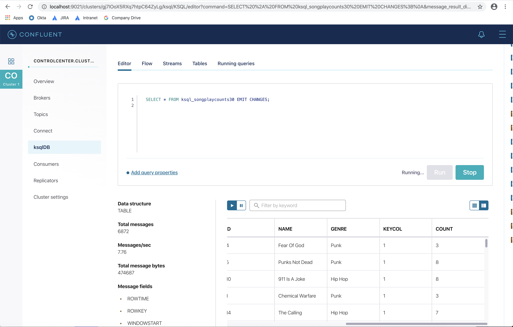

== Appendix

=== Compare KSQL Queries and Kafka Streams Java

Compare the music applications written with link:ksql.commands[KSQL queries] and the https://github.com/confluentinc/kafka-streams-examples/blob/5.0.x/src/main/java/io/confluent/examples/streams/interactivequeries/kafkamusic/KafkaMusicExample.java[Kafka Streams java code].

=== KSQL CLI

We recommend using Confluent Control Center to manage your Kafka cluster, inspect your topics, and use the built-in KSQL functionality with Schema Registry integration. Alternatively, you can use the KSQL CLI Docker container. Run the following from the command line:

[source,bash]
----
$ docker-compose exec ksql-cli ksql http://ksql-server:8088
----

=== KSQL Command File

For learning purposes, we suggest you walk through this tutorial step-by-step.

However, if you choose to jump ahead to the end state, run the KSQL command file that automatically configures the KSQL queries.

[source,bash]
----
$ docker-compose exec ksql-cli ksql http://ksql-server:8088
....
ksql> run script '/tmp/ksql.commands';
ksql> exit
----
