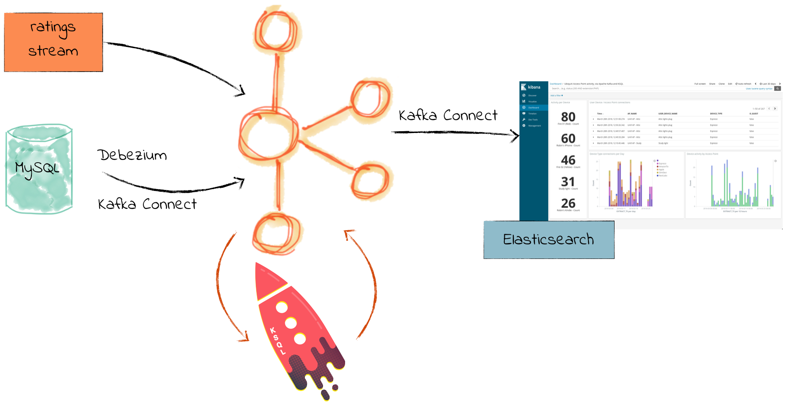

# Overview

The MySQL Debezium demo shows an end-to-end streaming ETL with KSQL for stream processing. This demo uses the [Debezium Connector for MySQL](http://debezium.io/docs/connectors/mysql/)

# Prerequisites

* [Common demo prerequisites](https://github.com/confluentinc/examples#prerequisites)
* [Confluent Platform 5.1](https://www.confluent.io/download/)
* MySQL
  * [Binary log should be enabled](http://debezium.io/docs/connectors/mysql/)
* [Elasticsearch 5.6.5](https://www.elastic.co/downloads/past-releases/elasticsearch-5-6-5) to export data from Kafka
  * If you do not want to use Elasticsearch, comment out ``check_running_elasticsearch`` in the ``start.sh`` script
* [Kibana 5.5.2](https://www.elastic.co/downloads/past-releases/kibana-5-5-2) to visualize data
  * If you do not want to use Kibana, comment out ``check_running_kibana`` in the ``start.sh`` script

N.B. _[there is also a Docker-based version of this demo](https://github.com/confluentinc/demo-scene/blob/master/mysql-debezium-ksql-elasticsearch/)_.

# What Should I see?

After you run `./start.sh`:

* If you are running Confluent Platform, open your browser and navigate to the Control Center web interface Monitoring -> Data streams tab at http://localhost:9021/monitoring/streams to see throughput and latency performance of the KSQL queries
* If you are running Confluent Platform, use Control Center to view and create KSQL queries. Otherwise, run the KSQL CLI `ksql http://localhost:8088`.
* Navigate to the Kibana dashboard at http://localhost:5601/app/kibana#/dashboard/Ratings

