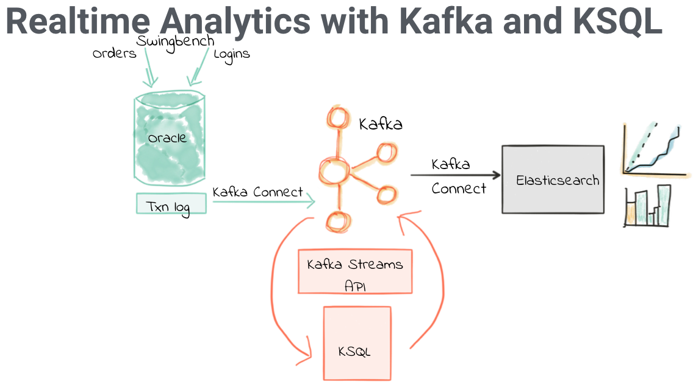
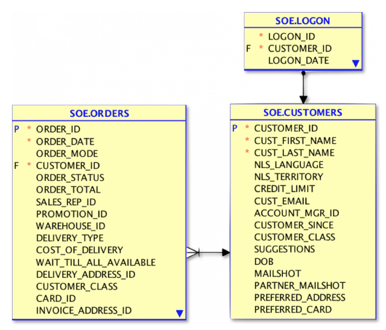
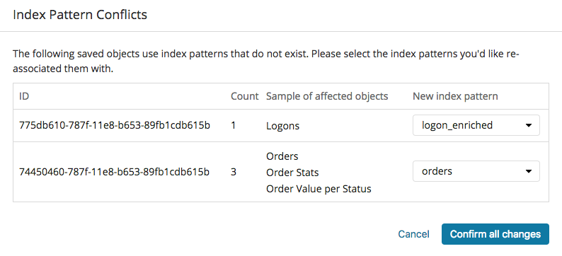
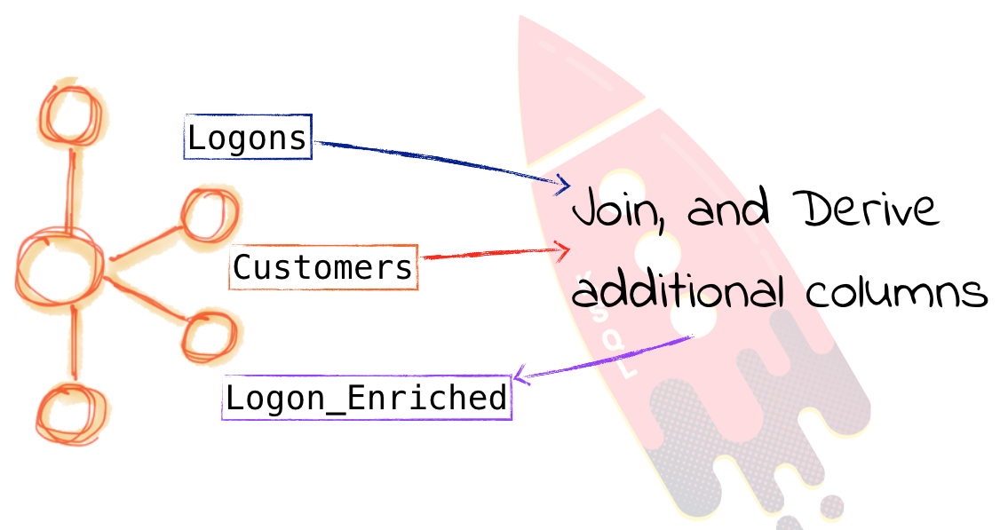
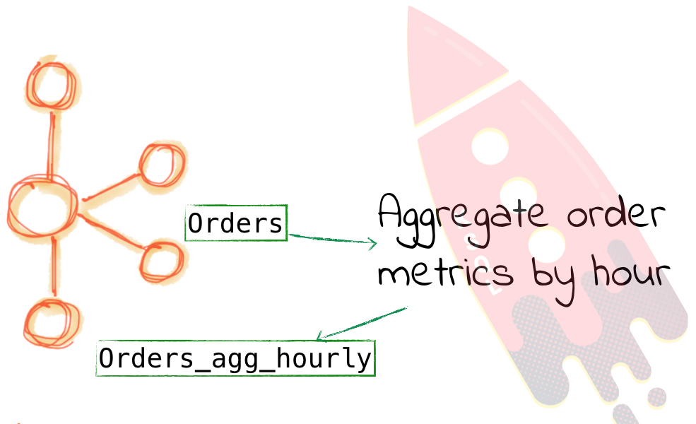
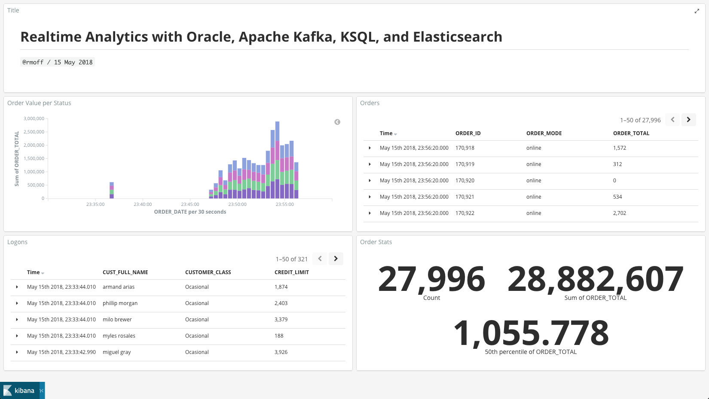

= Demo: Oracle CDC -> Kafka -> KSQL -> Kafka Connect -> Elasticsearch

:source-highlighter: pygments
:doctype: book
:sectnums:
Robin Moffatt <robin@confluent.io>
v0.11, 05 Jul 2018

:toc:

== Overview

Streaming data from Oracle in real time, into Kafka, enriching it with KSQL, streaming it to Elasticsearch

*Slides: https://speakerdeck.com/rmoff/oracle-developer-meetup-streaming-etl-in-practice-with-oracle-apache-kafka-and-ksql[Streaming ETL in Practice with Oracle, Apache Kafka, and KSQL]*

Data in Oracle is generated by Swingbench, on a version of the Order Entry schema:

== Pre-requisites

On your host machine you need:

* 8GB+ RAM
* `curl`
* `jq`
* Docker
* Docker Compose
* This github repository cloned locally

=== Build the Oracle Docker image

You need to build the Oracle Docker image manually.

Clone the repository:

[source,bash]
----
git clone git@github.com:oracle/docker-images.git
----

and then follow instructions in `OracleDatabase/SingleInstance/README.md` to build the Docker image.

Once done, you should see the image listed in your local Docker environment:

[source,bash]
----
$ docker images|grep oracle/database
oracle/database                                 12.2.0.1-ee         dc4ab29cfca2        4 days ago          13.2GB
----

=== Start the stack

IMPORTANT: It's important that you're in this folder, as the volumes mounted by the containers rely on the relative path (`$PWD`)

[source,bash]
----
cd oracle-ksql-elasticsearch

docker-compose up -d
----

Note that there are setup scripts for the Oracle container that are run to download and initialise Swingbench, and reset the SYS password to `Password01`.

[source,bash]
----
docker-compose logs -f oracle|grep "DATABASE IS READY TO USE!"
----

IMPORTANT: Wait until logs say "DATABASE IS READY TO USE!" then press Ctrl-C twice to cancel and return to the command prompt

=== Elasticsearch

Create dynamic mapping and dummy docs:

[source,bash]
----
./scripts/create_es_mapping.sh
./scripts/create_es_docs.sh
----

Add Elasticsearch index to Kibana:

[source,bash]
----
curl 'http://localhost:5601/api/saved_objects/index-pattern' -H 'kbn-version: 6.3.0' -H 'Content-Type: application/json;charset=UTF-8' -H 'Accept: application/json, text/plain, */*' --data-binary '{"attributes":{"title":"orders","timeFieldName":"EXTRACT_TS"}}' --compressed
curl 'http://localhost:5601/api/saved_objects/index-pattern' -H 'kbn-version: 6.3.0' -H 'Content-Type: application/json;charset=UTF-8' -H 'Accept: application/json, text/plain, */*' --data-binary '{"attributes":{"title":"logon_enriched","timeFieldName":"EXTRACT_TS"}}' --compressed
----

Go to the http://localhost:5601/app/kibana#/management/kibana/indices/[Index Patterns] page and mark one of them (doesn't matter which) as the default index.

Import dashboard `kibana_objects.json` using the **Import** button at http://localhost:5601/app/kibana#/management/kibana/objects

Map the `Logons` object to `logon_enriched` and the others to `orders`

Load the Kibana dashboard http://localhost:5601/app/kibana#/dashboard/02028f30-424c-11e8-af19-1188a9332246

=== Kafka Connect

==== Create JDBC connectors

Make sure Kafka Connect has started:

[source,bash]
----
docker-compose logs -f kafka-connect-cp|grep "Kafka Connect started"
----

Press Ctrl-C twice to exit to the shell prompt

Load the Oracle JDBC connector configs:

[source,bash]
----
docker-compose exec kafka-connect-cp "/scripts/create_jdbc_connectors.sh"
----

This should create three connectors, and for each you should see:

[source,bash]
----
HTTP/1.1 100 Continue

HTTP/1.1 201 Created

[...]
----

Load the Elasticsearch connector configs:

[source,bash]
----
docker-compose exec kafka-connect-cp "/scripts/create_es_connectors.sh"
----

Check connectors are running:

[source,bash]
----
$ curl -s "http://localhost:18083/connectors"| jq '.[]'| xargs -I{connector_name} curl -s "http://localhost:18083/connectors/"{connector_name}"/status"| jq -c -M '[.name,.connector.state,.tasks[].state]|join(":|:")'| column -s : -t| sed 's/\"//g'| sort

es_sink_LOGON_ENRICHED            |  RUNNING  |  RUNNING
es_sink_ora-soe-ORDERS            |  RUNNING  |  RUNNING
jdbc_source_oracle_soe_customers  |  RUNNING  |  RUNNING
jdbc_source_oracle_soe_logon      |  RUNNING  |  RUNNING
jdbc_source_oracle_soe_orders     |  RUNNING  |  RUNNING
----

== Demo setup

Optional, explore data in sql*plus:

[source,bash]
----
docker-compose exec oracle bash -c 'sqlplus soe/soe@localhost:1521/ORCLPDB1'
----

=== Run Swingbench to generate activity on Oracle

[source,bash]
----
docker-compose exec oracle bash -c 'export JAVA_HOME=/opt/oracle/product/12.2.0.1/dbhome_1/jdk/jre/ && \
                                    export PATH=$PATH:$JAVA_HOME/bin:/home/oracle/swingbench/bin && \
                                    charbench -cs localhost:1521/ORCLPDB1 -u soe -p soe -v trans,users -c /home/oracle/swingbench/configs/SOE_Client_Side.xml -uc 1 -min 10000'
----

=== Launch KSQL CLI

[source,bash]
----
docker-compose exec ksql-cli ksql http://ksql-server:8088
----

== KSQL : Inspect

[source,sql]
----
-- Only need this if not running on live data
SET 'auto.offset.reset' = 'earliest';
CREATE STREAM LOGON WITH (KAFKA_TOPIC='ora-soe-LOGON', VALUE_FORMAT='AVRO', TIMESTAMP='LOGON_DATE');
SELECT * FROM LOGON LIMIT 5;
----

[source,sql]
----
CREATE STREAM CUST_SRC WITH (KAFKA_TOPIC='ora-soe-CUSTOMERS', VALUE_FORMAT='AVRO');
--SELECT CUSTOMER_ID, CUST_FIRST_NAME, CUST_LAST_NAME FROM CUST_SRC LIMIT 5;
CREATE STREAM CUST_REKEYED WITH (PARTITIONS=1) AS SELECT * FROM CUST_SRC PARTITION BY CUSTOMER_ID;
-- Wait a few moments for the stream to be created, or retry this command until it works
CREATE TABLE CUSTOMERS WITH (KAFKA_TOPIC='CUST_REKEYED', VALUE_FORMAT='AVRO', KEY='CUSTOMER_ID');
SELECT CUSTOMER_ID, CUST_FIRST_NAME, CUST_LAST_NAME, CUSTOMER_CLASS  FROM CUSTOMERS WHERE CUSTOMER_ID=42;
----

== KSQL : Join

[source,sql]
----
SELECT L.LOGON_ID, C.CUSTOMER_ID, CONCAT(CONCAT(C.CUST_FIRST_NAME,' '), C.CUST_LAST_NAME) AS CUST_FULL_NAME, \
       C.CUSTOMER_SINCE, C.CUSTOMER_CLASS, C.CREDIT_LIMIT \
FROM LOGON L \
     LEFT OUTER JOIN CUSTOMERS C \
     ON L.CUSTOMER_ID = C.CUSTOMER_ID \
WHERE C.CUSTOMER_ID IS NOT NULL;
----

[source,sql]
----
CREATE STREAM LOGON_ENRICHED WITH (PARTITIONS=1) AS \
SELECT L.LOGON_ID, C.CUSTOMER_ID, CONCAT(CONCAT(C.CUST_FIRST_NAME,' '), C.CUST_LAST_NAME) AS CUST_FULL_NAME, \
       C.CUSTOMER_SINCE, C.CUSTOMER_CLASS, C.CREDIT_LIMIT \
FROM LOGON L \
     LEFT OUTER JOIN CUSTOMERS C \
     ON L.CUSTOMER_ID = C.CUSTOMER_ID \
WHERE C.CUSTOMER_ID IS NOT NULL;

SELECT TIMESTAMPTOSTRING(ROWTIME, 'yyyy-MM-dd HH:mm:ss'), LOGON_ID, CUST_FULL_NAME, TIMESTAMPTOSTRING(CUSTOMER_SINCE,'yyyy-MM-dd HH:mm:ss'), CUSTOMER_CLASS, CREDIT_LIMIT FROM LOGON_ENRICHED;
----

Inspect output topic:

[source,bash]
----
docker-compose exec kafka-connect-cp bash -c 'kafka-avro-console-consumer \
                                             --bootstrap-server kafka:29092 \
                                             --property schema.registry.url=http://schema-registry:8081 \
                                             --topic LOGON_ENRICHED --max-messages 1 --from-beginning'
----

=== KSQL : Filter

[source,sql]
----
SELECT TIMESTAMPTOSTRING(ROWTIME, 'yyyy-MM-dd HH:mm:ss'), LOGON_ID, CUST_FULL_NAME, \
       TIMESTAMPTOSTRING(CUSTOMER_SINCE,'yyyy-MM-dd HH:mm:ss'), CUSTOMER_CLASS, CREDIT_LIMIT \
FROM  LOGON_ENRICHED \
WHERE CREDIT_LIMIT > 4000;
----

[source,sql]
----
CREATE STREAM PRIME_LOGON AS \
SELECT * FROM LOGON_ENRICHED \
WHERE CUSTOMER_CLASS='Prime';

SELECT TIMESTAMPTOSTRING(ROWTIME, 'yyyy-MM-dd HH:mm:ss'), LOGON_ID, CUST_FULL_NAME, TIMESTAMPTOSTRING(CUSTOMER_SINCE,'yyyy-MM-dd HH:mm:ss'), CUSTOMER_CLASS FROM PRIME_LOGON;
----

== KSQL : Aggregate

[source,sql]
----
CREATE STREAM ORDERS WITH (KAFKA_TOPIC='ora-soe-ORDERS', VALUE_FORMAT='AVRO', TIMESTAMP='ORDER_DATE');

CREATE TABLE ORDERS_AGG_HOURLY AS \
SELECT ORDER_STATUS, COUNT(*) AS ORDER_COUNT, MAX(ORDER_TOTAL) AS MAX_ORDER_TOTAL, \
MIN(ORDER_TOTAL) AS MIN_ORDER_TOTAL, SUM(ORDER_TOTAL) AS SUM_ORDER_TOTAL, \
SUM(ORDER_TOTAL)/COUNT(*) AS AVG_ORDER_TOTAL \
FROM ORDERS WINDOW TUMBLING (SIZE 1 HOUR) \
GROUP BY ORDER_STATUS;

SELECT TIMESTAMPTOSTRING(ROWTIME, 'yyyy-MM-dd HH:mm:ss') , ORDER_COUNT, AVG_ORDER_TOTAL  \
FROM ORDERS_AGG_HOURLY \
WHERE ORDER_STATUS=2;
----

Reserve idea:
[source,sql]
----
SELECT CUSTOMER_CLASS, MAX(CREDIT_LIMIT) MAX_CREDIT_LIMIT, SUM(CREDIT_LIMIT)/COUNT(CREDIT_LIMIT) AS AVG_CREDIT_LIMIT \
FROM LOGON_ENRICHED WINDOW TUMBLING (SIZE 1 MINUTE) \
GROUP BY CUSTOMER_CLASS;
----

== Analyse data in Kibana

