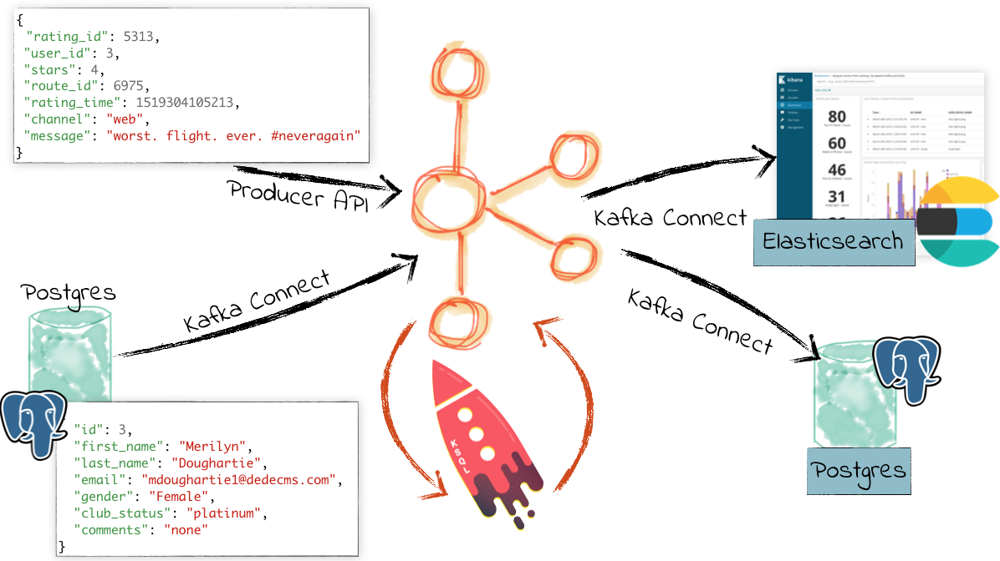
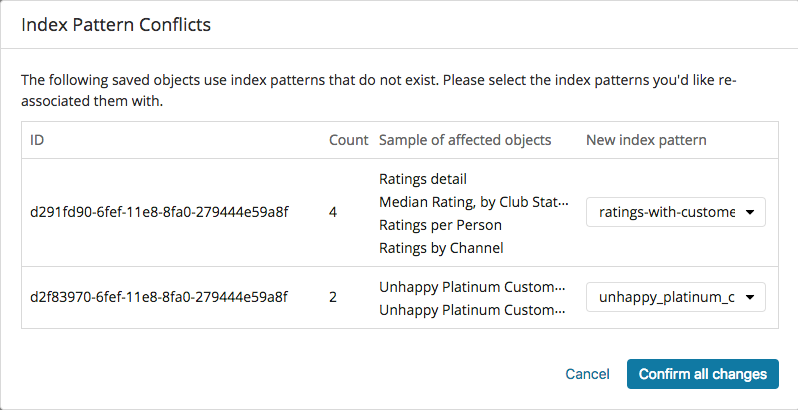
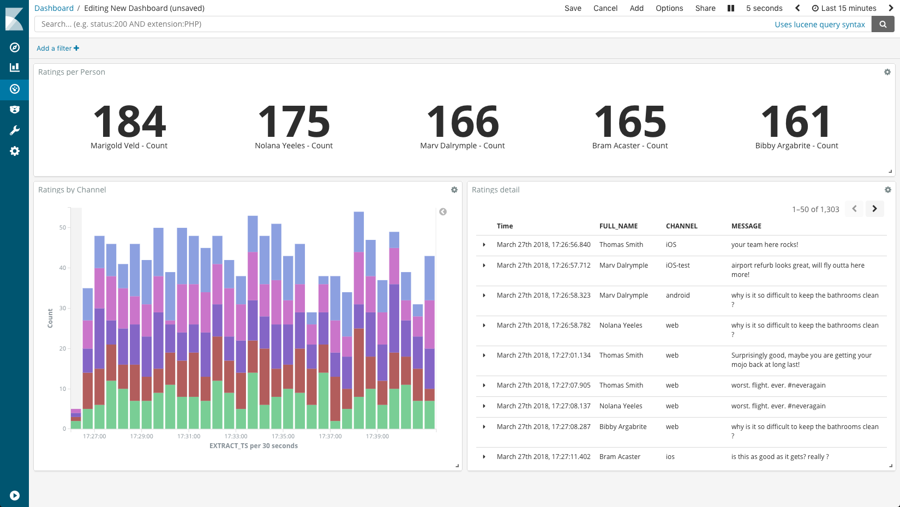

= Streaming ETL demo
Robin Moffatt <robin@confluent.io>
v1.03, 05 Jul 2018
:revdate: 2019-03-22 11:14:37 -0600
:revby: viktor at confluent dot io 

Enriching event stream data with CDC data from Postgres, stream into Elasticsearch

toc::[]

This is designed to be run as a step-by-step demo. 
The `ksql_commands.sql` should match those run in this doc end-to-end and in theory you can just run the file, but I have not tested it. 
PRs welcome for a one-click script that just demonstrates the end-to-end running demo :)

c.10 minutes

== Slides

* https://speakerdeck.com/rmoff/streaming-etl-in-practice-with-postgresql-apache-kafka-and-ksql[Streaming ETL in Practice with PostgreSQL, Apache Kafka, and KSQL] by https://twitter.com/rmoff/[Robin Moffat]

== Pre-reqs

Local:

* `curl`
* `jq`
* Docker

== Pre-Flight Setup

Start the environment:

[source,bash]
----
cd docker-compose
docker-compose up -d
docker-compose logs -f kafka-connect-cp|grep "Kafka Connect started"
----

Run setup:

[source,bash]
----
$ scripts/setup.sh
----

. In a browser, go to Kibana at http://localhost:5601/app/kibana#/management/kibana/indices/ and set an index (any index) as default
. Import dashboard `kibana_objects.json` using the **Import** button at http://localhost:5601/app/kibana#/management/kibana/objects

Load the Kibana dashboard http://localhost:5601/app/kibana#/dashboard/02028f30-424c-11e8-af19-1188a9332246

=== Run KSQL CLI and Postgres CLI

Optionally, use something like `screen` or `tmux` to have these both easily to hand. Or multiple Terminal tabs. 
Whatever works for you :)

.KSQL CLI
[source,bash]
----
cd docker-compose
docker-compose exec ksql-cli ksql http://ksql-server:8088
----

.Postgres CLI
[source,bash]
----
docker-compose exec postgres bash -c 'psql --username postgres'
----

== Pre-flight checklist

=== Is the stack up?

[source,bash]
----
$ docker-compose ps

Name                             Command               State                          Ports
---------------------------------------------------------------------------------------------------------------------------------
docker-compose_connect-debezium_1   /docker-entrypoint.sh start      Up      0.0.0.0:8083->8083/tcp, 8778/tcp, 9092/tcp, 9779/tcp
docker-compose_datagen-ratings_1    bash -c echo Waiting for K ...   Up
docker-compose_kafka-connect-cp_1   /etc/confluent/docker/run        Up      0.0.0.0:18083->18083/tcp, 8083/tcp, 9092/tcp
docker-compose_kafka_1              /etc/confluent/docker/run        Up      0.0.0.0:9092->9092/tcp
docker-compose_ksql-cli_1           /bin/sh                          Up
docker-compose_ksql-server_1        /etc/confluent/docker/run        Up      8088/tcp
docker-compose_postgres_1           docker-entrypoint.sh postgres    Up      5432/tcp
docker-compose_schema-registry_1    /etc/confluent/docker/run        Up      8081/tcp
docker-compose_zookeeper_1          /etc/confluent/docker/run        Up      2181/tcp, 2888/tcp, 3888/tcp
elasticsearch                       /usr/local/bin/docker-entr ...   Up      0.0.0.0:9200->9200/tcp, 0.0.0.0:9300->9300/tcp
kibana                              /usr/local/bin/kibana-docker     Up      0.0.0.0:5601->5601/tcp
----

=== Are the connectors running?

[source,bash]
----
$ curl -s "http://localhost:8083/connectors" | jq '.[]'| xargs -I{connector_name} curl -s "http://localhost:8083/connectors/"{connector_name}"/status" | jq -c -M '[.name,.connector.state,.tasks[].state]|join(":|:")'| column -s : -t| sed 's/\"//g'| sort

pg-source  |  RUNNING  |  RUNNING

$ curl -s "http://localhost:18083/connectors" | jq '.[]'| xargs -I{connector_name} curl -s "http://localhost:18083/connectors/"{connector_name}"/status" | jq -c -M '[.name,.connector.state,.tasks[].state]|join(":|:")'| column -s : -t| sed 's/\"//g'| sort

es_sink_ratings-with-customer-data  |  RUNNING  |  RUNNING
es_sink_unhappy_platinum_customers  |  RUNNING  |  RUNNING
jdbc_sink_postgres                  |  RUNNING  |  RUNNING
----

=== Is ratings data being produced?

[source,bash]
----
docker-compose exec kafka-connect-cp \
                   kafka-avro-console-consumer \
                    --bootstrap-server kafka:29092 \
                    --property schema.registry.url=http://schema-registry:8081 \
                    --topic ratings
----

[source,json]
----
{"rating_id":{"long":13323},"user_id":{"int":19},"stars":{"int":3},"route_id":{"int":5676},"rating_time":{"long":1528279580480},"channel":{"string":"iOS"},"message":{"string":"your team here rocks!"}}
----

=== Is Elasticsearch running?

[source,bash]
----
curl http://localhost:9200
----

.Response
[source,json]
----
{
  "name" : "0-JgLQj",
  "cluster_name" : "elasticsearch_Robin",
  "cluster_uuid" : "XKkAsum3QL-ECyZlP8z-rA",
  "version" : {
    "number" : "6.2.3",
    "build_hash" : "c59ff00",
    "build_date" : "2018-03-13T10:06:29.741383Z",
    "build_snapshot" : false,
    "lucene_version" : "7.2.1",
    "minimum_wire_compatibility_version" : "5.6.0",
    "minimum_index_compatibility_version" : "5.0.0"
  },
  "tagline" : "You Know, for Search"
}
----

* Load Kibana dashboard: http://localhost:5601/app/kibana#/dashboard/02028f30-424c-11e8-af19-1188a9332246
* Create iTerm windows, using the `screencapture` profile
* Load this instructions doc into Chrome
* Close all other apps

=== Prep KSQL

[source,sql]
----
SET 'auto.offset.reset' = 'earliest';
CREATE STREAM RATINGS WITH (KAFKA_TOPIC='ratings',VALUE_FORMAT='AVRO');
CREATE STREAM CUSTOMERS_SRC WITH (KAFKA_TOPIC='asgard.public.customers', VALUE_FORMAT='AVRO');
CREATE STREAM CUSTOMERS_SRC_REKEY WITH (PARTITIONS=1) AS SELECT * FROM CUSTOMERS_SRC PARTITION BY ID;
-- Wait for a moment here; if you run the CTAS _immediately_ after the CSAS it may fail
-- with error `Could not fetch the AVRO schema from schema registry. Subject not found.; error code: 40401`
CREATE TABLE CUSTOMERS WITH (KAFKA_TOPIC='CUSTOMERS_SRC_REKEY', VALUE_FORMAT ='AVRO', KEY='ID');
----

== Demo

=== Filter live stream of data

Examine Stream

[source,sql]
----
DESCRIBE RATINGS;
----

Filter data
[source,sql]
----
SELECT STARS, CHANNEL, MESSAGE FROM RATINGS WHERE STARS<3;
----

=== Show Postgres table + contents

[source,sql]
----
postgres=# \dt
           List of relations
 Schema |   Name    | Type  |  Owner
--------+-----------+-------+----------
 public | customers | table | postgres
(1 row)

postgres=# select * from customers ;
 id | first_name  | last_name  |           email            | gender | club_status |                    comments                    |         create_ts
   |         update_ts
----+-------------+------------+----------------------------+--------+-------------+------------------------------------------------+-------------------------
---+----------------------------
  1 | Rica        | Blaisdell  | rblaisdell0@rambler.ru     | Female | bronze      | Universal optimal hierarchy                    | 2018-07-02 14:05:43.0489
85 | 2018-07-02 14:05:43.048985
  2 | Ruthie      | Brockherst | rbrockherst1@ow.ly         | Female | platinum    | Reverse-engineered tangible interface          | 2018-07-02 14:05:43.0592
63 | 2018-07-02 14:05:43.059263
  3 | Mariejeanne | Cocci      | mcocci2@techcrunch.com     | Female | bronze      | Multi-tiered bandwidth-monitored capability    | 2018-07-02 14:05:43.0606
76 | 2018-07-02 14:05:43.060676
[...]
----

=== Show postgres data in Kafka

[source,sql]
----
SELECT ID, FIRST_NAME, LAST_NAME, EMAIL FROM CUSTOMERS_SRC;
----

=== Show CDC in action

==== Insert a row in Postgres, observe it in Kafka

[source,sql]
----
insert into CUSTOMERS (id,first_name,last_name) values (42,'Rick','Astley');
----

==== Update a row in Postgres, observe it in Kafka

[source,sql]
----
update CUSTOMERS set first_name='Bob' where id=1;
----

=== Persist stream-table join

[source,sql]
----
CREATE STREAM ratings_with_customer_data WITH (PARTITIONS=1) AS \
SELECT R.RATING_ID, R.CHANNEL, R.STARS, R.MESSAGE, \
       C.ID, C.CLUB_STATUS, C.EMAIL, \
       CONCAT(CONCAT(C.FIRST_NAME, ' '),C.LAST_NAME) AS FULL_NAME \
FROM RATINGS R \
     LEFT JOIN CUSTOMERS C \
       ON R.USER_ID = C.ID \
WHERE C.FIRST_NAME IS NOT NULL ;
----

The `WITH (PARTITIONS=1)` is only necessary if the Elasticsearch connector has already been defined, as it will create the topic before KSQL does, and using a single partition (not 4, as KSQL wants to by default).

Show data:

[source,sql]
----
SELECT CLUB_STATUS, EMAIL, STARS, MESSAGE \
FROM   ratings_with_customer_data \
WHERE  STARS < 3 \
  AND  CLUB_STATUS = 'platinum';
----

=== Create stream of unhappy VIPs

[source,sql]
----
CREATE STREAM UNHAPPY_PLATINUM_CUSTOMERS  \
       WITH (VALUE_FORMAT='JSON',PARTITIONS=1) AS \
SELECT CLUB_STATUS, EMAIL, STARS, MESSAGE \
FROM   ratings_with_customer_data \
WHERE  STARS < 3 \
  AND  CLUB_STATUS = 'platinum';
----

== View in Elasticsearch and Kibana

Tested on Elasticsearch 6.3.0

`#EOF`

== Optional

=== Postgres as a sink

From the Postgres command line (`docker-compose exec postgres bash -c 'psql --username postgres'`):

Show the span of data loaded:

[source,sql]
----
postgres=# select min("EXTRACT_TS"), max("EXTRACT_TS") from "RATINGS_WITH_CUSTOMER_DATA";
           min           |           max
-------------------------+-------------------------
 2018-07-02 15:47:14.939 | 2018-07-02 16:16:05.428
(1 row)
----

Query the data for recent time period:

[source,sql]
----
postgres=# select "EXTRACT_TS", "FULL_NAME" , "MESSAGE" from "RATINGS_WITH_CUSTOMER_DATA" where "EXTRACT_TS" > NOW() - interval '5 seconds' ORDER BY "EXTRACT_TS";
       EXTRACT_TS        |     FULL_NAME     |                                MESSAGE
-------------------------+-------------------+-----------------------------------------------------------------------
 2018-07-02 16:14:13.247 | Ruthie Brockherst | more peanuts please
 2018-07-02 16:14:13.424 | Clair Vardy       | more peanuts please
 2018-07-02 16:14:13.687 | Clair Vardy       | your team here rocks!
 2018-07-02 16:14:13.837 | Brena Tollerton   | Surprisingly good, maybe you are getting your mojo back at long last!
 2018-07-02 16:14:14.299 | Clair Vardy       | (expletive deleted)
 2018-07-02 16:14:14.665 | Isabelita Talboy  | airport refurb looks great, will fly outta here more!
 2018-07-02 16:14:14.822 | Sheryl Hackwell   | more peanuts please
 2018-07-02 16:14:14.87  | Brianna Paradise  | Surprisingly good, maybe you are getting your mojo back at long last!
(8 rows)
----

See that the table has been created:

[source,sql]
----
postgres=# \dt
                   List of relations
 Schema |            Name            | Type  |  Owner
--------+----------------------------+-------+----------
 public | RATINGS_WITH_CUSTOMER_DATA | table | postgres
 public | customers                  | table | postgres
(2 rows)
----

List the columns (note `EXTRACT_TS` which has been added by Kafka Connect using Single Message Transform):

[source,sql]
----
postgres=# \d+ "RATINGS_WITH_CUSTOMER_DATA"
                                     Table "public.RATINGS_WITH_CUSTOMER_DATA"
   Column    |            Type             | Collation | Nullable | Default | Storage  | Stats target | Description
-------------+-----------------------------+-----------+----------+---------+----------+--------------+-------------
 MESSAGE     | text                        |           |          |         | extended |              |
 CHANNEL     | text                        |           |          |         | extended |              |
 CLUB_STATUS | text                        |           |          |         | extended |              |
 FULL_NAME   | text                        |           |          |         | extended |              |
 STARS       | integer                     |           |          |         | plain    |              |
 ID          | integer                     |           |          |         | plain    |              |
 EMAIL       | text                        |           |          |         | extended |              |
 RATING_ID   | bigint                      |           |          |         | plain    |              |
 EXTRACT_TS  | timestamp without time zone |           |          |         | plain    |              |
----

=== Aggregations

Simple aggregation - count of ratings per person, per minute:

[source,sql]
----
ksql> SELECT FULL_NAME,COUNT(*) FROM ratings_with_customer_data WINDOW TUMBLING (SIZE 1 MINUTE) GROUP BY FULL_NAME;
----

Persist this and show the timestamp:

[source,sql]
----
CREATE TABLE RATINGS_PER_CUSTOMER_PER_MINUTE AS SELECT FULL_NAME,COUNT(*) AS RATINGS_COUNT FROM ratings_with_customer_data WINDOW TUMBLING (SIZE 1 MINUTE) GROUP BY FULL_NAME;
SELECT TIMESTAMPTOSTRING(ROWTIME, 'yyyy-MM-dd HH:mm:ss') , FULL_NAME, RATINGS_COUNT FROM RATINGS_PER_CUSTOMER_PER_MINUTE;
----

=== Slack notifications

_This bit will need some config of your own, as you'll need your own Slack workspace and API key (both free). With this though, you can demo the idea of an event-driven app subscribing to a KSQL-populated stream of filtered events._

:image:images/slack_ratings.png[Slack push notifications driven from Kafka and KSQL]

To run, first export your API key as an environment variable:

[source,bash]
----
export SLACK_API_TOKEN=xyxyxyxyxyxyxyxyxyxyxyx
----

then run the code:

[source,bash]
----
python python_kafka_notify.py
----

You will need to install `slackclient` and `confluent_kafka` libraries.

== Teardown

Stop the environment:

[source,bash]
----
docker-compose down
----
