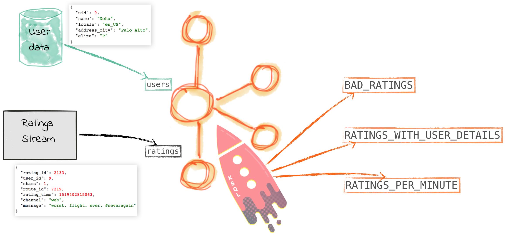

# Overview

The Ratings demo showcases Kafka stream processing using KSQL. Check out the [step-by-step explanation](live-coding-ksql.adoc) of this demo.

# Prerequisites

* [Common demo prerequisites](https://github.com/confluentinc/quickstart-demos#prerequisites)
* [Confluent Platform 5.0](https://www.confluent.io/download/)

# What Should I see?

After you run `./start.sh`:

* If you are running Confluent Enterprise, open your browser and navigate to the Control Center web interface Monitoring -> Data streams tab at http://localhost:9021/monitoring/streams to see throughput and latency performance of the KSQL queries
* If you are running Confluent Enterprise, use Control Center to view and create KSQL queries. Otherwise, run the KSQL CLI `ksql http://localhost:8088`.
* Run `./listen.sh` to see sample messages from Kafka topics created by KSQL
