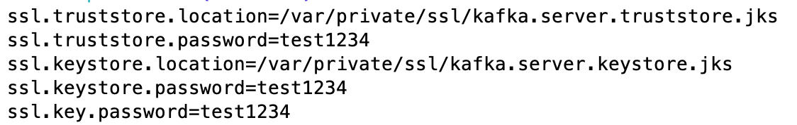
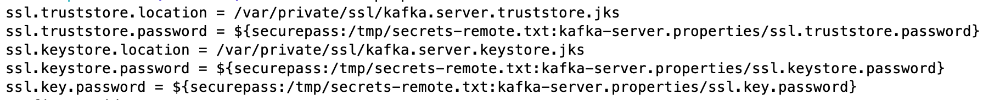

= Tutorial: Secret Protection

== Introduction

Compliance requirements often dictate that services should not store sensitive data as clear text in files.
This sensitive data may include passwords, such as in the configuration parameters `ssl.key.password`, `ssl.keystore.password`, `ssl.truststore.password`, or any other sensitive data in configuration files.
For Apache Kafka^®^ in which services read configuration files on startup, the question arises—how should you protect sensitive data?

Before Confluent Platform 5.3, you would have considered:

* Restricting network access to the hosts running the services
* Setting permissions on the configuration files using standard linux `ugo/rwx` settings
* Adding OS-level ACLs for more user granularity

There was still a risk that a bad actor—a rogue employee, shoulder surfer, or hacker—could gain access to those files that contain that clear text sensitive data.
Taking on a bit more complexity, you could encrypt data at the storage layer with encrypted volumes using specialized kernel modules that support process-based ACLs.
If needed, you could also use the capabilities in link:https://cwiki.apache.org/confluence/display/KAFKA/KIP-226+-+Dynamic+Broker+Configuration#KIP-226-DynamicBrokerConfiguration-SecuringpasswordsinZooKeeper[KIP-226] to store encrypted passwords in ZooKeeper.

Confluent Platform 5.3 now introduces a much simpler solution with data encryption at the application layer.
The Secret Protection feature encrypts sensitive data within the configuration file itself.
Instead of storing passwords or other sensitive data as clear text, Secret Protection encrypts it within the configuration file itself.
Secret Protection uses _envelope encryption_, which is a standard way to protect encrypted sensitive data in a highly secure method.
First, a user specifies a master passphrase that is used, along with a cryptographic salt value, to derive a master encryption key.
In turn, it is then used to generate a separate data encryption key.
Both the master encryption key and the data encryption key are then used to encrypt the sensitive data in the configuration files, which the service can later decrypt thanks to link:https://cwiki.apache.org/confluence/pages/viewpage.action?pageId=100829515[KIP-421], which supports automatic resolution of indirect variables.
Even if someone gains access to a configuration file, all they would be able to see are encrypted values, and they have no way to decrypt them without knowing the master encryption key.

We will step through a few examples to get you started with this feature.
For a list of all relevant commands, please review the link:https://docs.confluent.io/current/security/secrets.html[CLI reference].

== Setup

Before you start:

. Download link:https://www.confluent.io/download/[Confluent Platform 5.3] or higher
. Get the new link:https://docs.confluent.io/current/cli/installing.html[Confluent CLI] (v0.103.0 or above)

== Workflow

In the most common use case, you would want to encrypt passwords.
We have a link:https://docs.confluent.io/current/tutorials/security_tutorial.html[Security tutorial] that provides an example of how to enable security features on Confluent Platform, but that takes extra steps to generate the keys and certificates and add the TLS configurations.
Therefore, instead of encrypting a password, we will encrypt a basic configuration parameter, but the steps are exactly the same.

=== Generate the master encryption key based on a passphrase

First choose your master encryption key passphrase, a phrase that is much longer than a typical password and is easily remembered as a string of words, and enter this passphrase into a file to be passed into the CLI, to avoid logging history showing the passphrase.
Then choose the location of where the secrets file will reside on your local host (not where the Confluent Platform services run).
The secrets file will contain encrypted secrets for the master encryption key, data encryption key, and configuration parameters, along with their metadata such as which cipher was used for encryption.
Now you are ready to generate the master encryption key:

[source,bash]
----
# passphrase: /path/to/passphrase.txt
# local-secrets-file: /path/to/secrets.txt
$ confluent secret master-key generate --local-secrets-file /path/to/secrets.txt --passphrase @/path/to/passphrase.txt

Save the master key. It cannot be retrieved later.
+------------+----------------------------------------------+
| Master Key | Nf1IL2bmqRdEz2DO//gX2C+4PjF5j8hGXYSu9Na9bao= |
+------------+----------------------------------------------+
----

As the output indicates, the master encryption key cannot be retrieved later so save it somewhere.
Export this key into the environment on the local host, as well as every host that will have a configuration file with secret protection:

[source,bash]
----
$ export CONFLUENT_SECURITY_MASTER_KEY=Nf1IL2bmqRdEz2DO//gX2C+4PjF5j8hGXYSu9Na9bao=
----

=== Encrypt the value of a configuration parameter

Let's use a configuration parameter available in a configuration file example that ships with Confluent Platform.
We will encrypt the parameter `config.storage.topic` in `$CONFLUENT_HOME/etc/schema-registry/connect-avro-distributed.properties`.

First make a backup of this file, because the CLI currently does in-place modification on the original file.
Then choose the exact path for where the secrets file will reside on the remote hosts where the Confluent Platform services run.
Now you are ready to encrypt this field:

[source,bash]
----
# Value before encryption
$ grep "config\.storage\.topic" connect-avro-distributed.properties
config.storage.topic=connect-configs

# Encrypt it
# remote-secrets-file: /path/to/secrets-remote.txt
confluent secret file encrypt --local-secrets-file /path/to/secrets.txt --remote-secrets-file /path/to/secrets-remote.txt --config-file connect-avro-distributed.properties --config config.storage.topic

# Value after encryption
$ grep "config\.storage\.topic" connect-avro-distributed.properties
config.storage.topic = ${securepass:/path/to/secrets-remote.txt:connect-avro-distributed.properties/config.storage.topic}
----

As you can see, the configuration parameter `config.storage.topic` setting was changed from `connect-configs` to `${securepass:/path/to/secrets-remote.txt:connect-avro-distributed.properties/config.storage.topic}`.
This is a tuple that directs the service to use to look up the encrypted value of the file/parameter pair `connect-avro-distributed.properties/config.storage.topic` from the secrets file `/path/to/secrets-remote.txt`.

View the contents of the local secrets file `/path/to/secrets.txt`, which now contains the encrypted secret for this file/parameter pair along with the metadata, e.g. which cipher was used for encryption:

[source,bash]
----
$ cat /path/to/secrets.txt
...
connect-avro-distributed.properties/config.storage.topic = ENC[AES/CBC/PKCS5Padding,data:CUpHh5lRDfIfqaL49V3iGw==,iv:vPBmPkctA+yYGVQuOFmQJw==,type:str]
----

You can also decrypt the value into a file:

[source,bash]
----
$ confluent secret file decrypt --local-secrets-file /path/to/secrets.txt --config-file connect-avro-distributed.properties --output-file decrypted.txt
$ cat decrypted.txt
config.storage.topic = connect-configs
----

=== Update the value of the configuration parameter

You may have a requirement to update sensitive data on a regular basis, to help them from getting stale.
The configuration parameter `config.storage.topic` was originally set to `connect-configs`.
If you need to change the value in the future, you can update it directly using the CLI.
In the CLI below, pass in a file `/path/to/updated-config-and-value` that has written `config.storage.topic=newTopicName`, to avoid logging history showing the new value.

[source,bash]
----
$ confluent secret file update --local-secrets-file /path/to/secrets.txt --remote-secrets-file /path/to/secrets-remote.txt --config-file connect-avro-distributed.properties --config @/path/to/updated-config-and-value
----

The configuration file `connect-avro-distributed.properties` does not change because it's just a pointer to the secrets file.
However the secrets file has a new value for the encrypted value for this file/parameter pair:

[source,bash]
----
$ cat /path/to/secrets.txt
...
connect-avro-distributed.properties/config.storage.topic = ENC[AES/CBC/PKCS5Padding,data:CblF3k1ieNkFJzlJ51qAAA==,iv:dnZwEAm1rpLyf48pvy/T6w==,type:str]
----

=== Trust but verify

That's cool, but does it work?
Try it out yourself.
Run Kafka and start the modified connect worker with the encrypted value of `config.storage.topic=newTopicName`

[source,bash]
----
# Start ZooKeeper and a Kafka broker
$ confluent local start kafka

# Run the modified connect worker
$ connect-distributed connect-avro-distributed.properties > connect.stdout 2>&1 &

# List the topics
$ kafka-topics --bootstrap-server localhost:9092 --list
__confluent.support.metrics
__consumer_offsets
_confluent-metrics
connect-offsets
connect-statuses
newTopicName   <<<<<<<
----

=== Going to production

So far we have covered how to create the master encryption key and encrypt sensitive data in the configuration files.
We recommend that you operationalize this workflow by augmenting your orchestration tooling to distribute everything that you need for secret protection to work to the destination hosts.
These hosts may include Kafka brokers, Connect workers, Confluent Schema Registry instances, KSQL servers, Confluent Control Center, etc., any service using password encryption.
The CLI is flexible to accommodate whatever secret distribution model you prefer: you can either do the secret generation and configuration modification on each destination host directly, or do it all a single host and then distribute the secret data to the destination hosts.
There are four required tasks:

. Export the master encryption key into the environment on every host that will have a configuration file with secret protection.
. Distribute the secrets file: copy the secrets file `/path/to/secrets.txt` from the local host on which you have been working to `/path/to/secrets-remote.txt` on the destination hosts.
. Propagate the necessary configuration file changes: update the configuration file on all hosts so that the configuration parameter now has the tuple for secrets.
. Restart the services if they were already running.

You may also have a requirement to rotate the master encryption key or data encryption key on a regular basis.
You can do either of these with the CLI, and the example below is for rotating just the data encryption key.

[source,bash]
----
$ confluent secret file rotate --data-key --local-secrets-file /path/to/secrets.txt --passphrase @/path/to/passphrase.txt
----

== Next Steps

Explore our security tutorials to help you gain a deeper understanding:

* link:https://docs.confluent.io/current/tutorials/security_tutorial.html[Security tutorial]: step-by-step example to enable SSL encryption, SASL authentication, and authorization on the Confluent Platform with monitoring via Confluent Control Center
* link:https://github.com/confluentinc/examples/blob/master/security/secret-protection/README.adoc[Secret Protection Tutorial]: up-to-date tutorial with similar coverage to this blog post, along with an link:https://github.com/confluentinc/examples/blob/master/security/secret-protection/demo-secret-protection.sh[automated demo] that programmatically runs through these steps

Get started by link:https://www.confluent.io/download/[downloading Confluent Platform 5.3] today!
