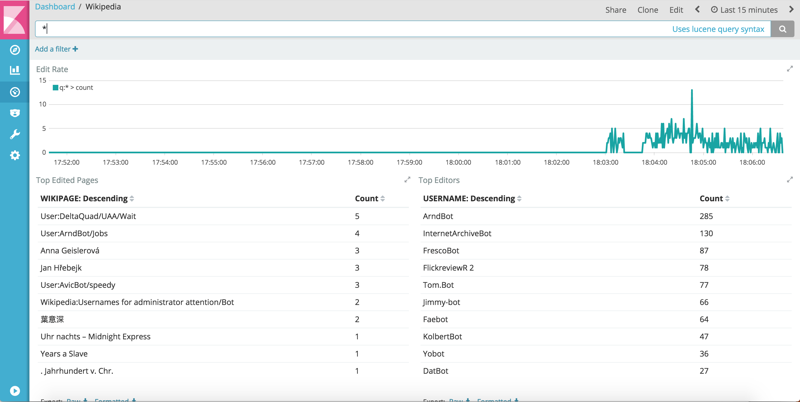

# Overview

The Wikipedia demo is the non-Docker version of the [Confluent Platform Demo](https://docs.confluent.io/current/tutorials/cp-demo/docs/index.html).

# Prerequisites

* [Common demo prerequisites](https://github.com/confluentinc/examples#prerequisites)
* [Confluent Platform 5.1](https://www.confluent.io/download/)
* [Elasticsearch 5.6.5](https://www.elastic.co/downloads/past-releases/elasticsearch-5-6-5) to export data from Kafka
  * If you do not want to use Elasticsearch, comment out ``check_running_elasticsearch`` in the ``start.sh`` script
* [Kibana 5.5.2](https://www.elastic.co/downloads/past-releases/kibana-5-5-2) to visualize data
  * If you do not want to use Kibana, comment out ``check_running_kibana`` in the ``start.sh`` script

# Documentation

After you run `./start.sh`, follow the Confluent Platform Demo [playbook](https://docs.confluent.io/current/tutorials/cp-demo/docs/index.html)

